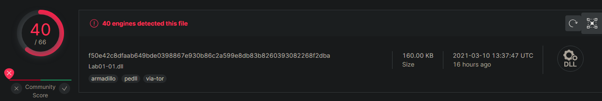
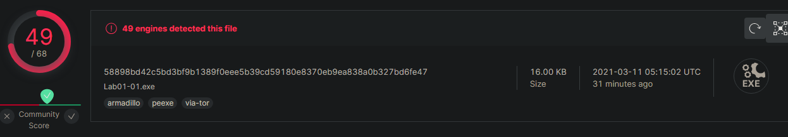
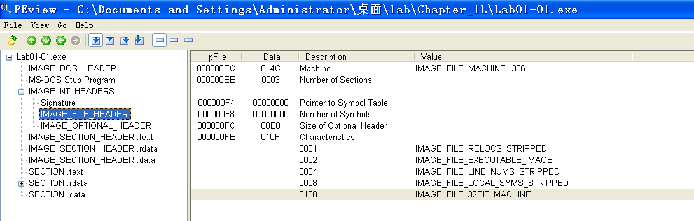
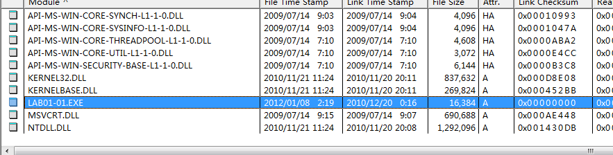
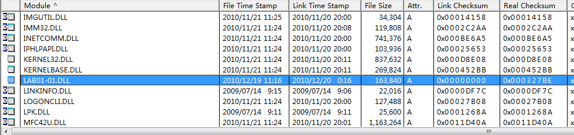
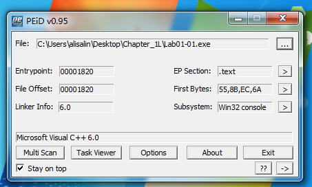
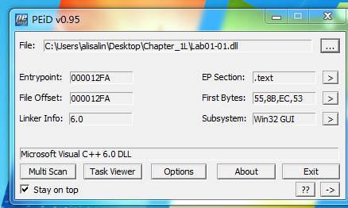
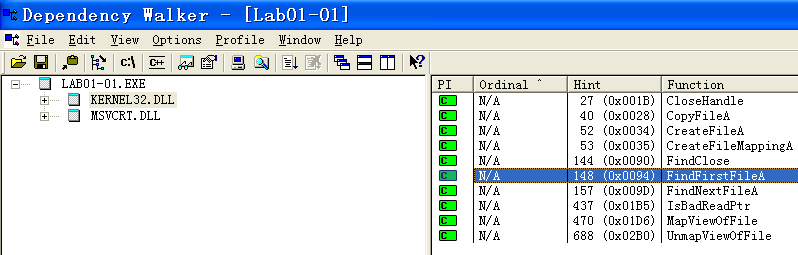
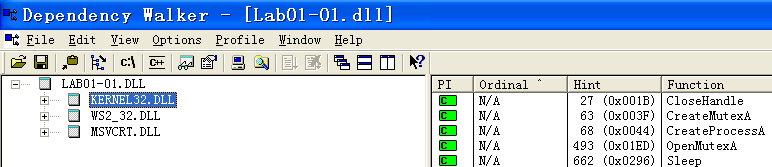
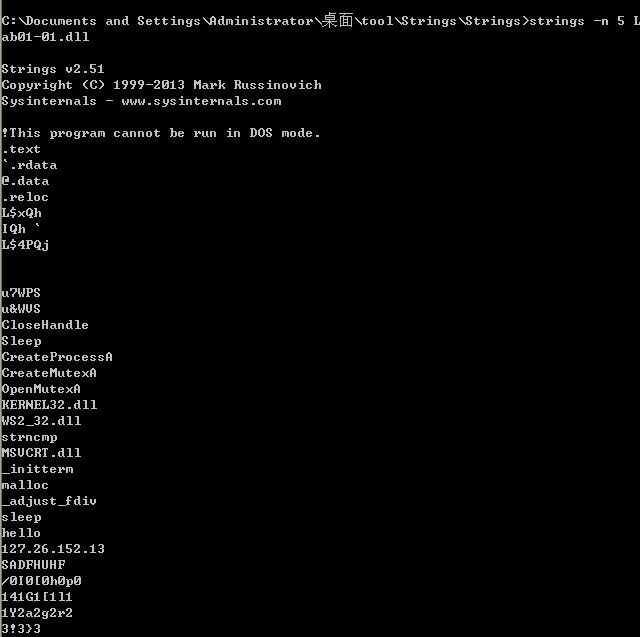

## lab 1-1

> 1811464 郑佶 信息安全单学位

#### 问题1:`virustotal`网站分析

将文件`Lab1-1.dll`、`Lab1-1.exe`上传至该网站,分别得到以下信息

由此可知,给定的两个文件均与已存在的反病毒特征码相对应

#### 问题2:文件编译时间

方法1:使用`PEview`

为得知文件的编译时间,使用`PEview`软件查看,查找`IMAGE_NT_HEADERS`/`IMAGE_FILE_HEADER`的项目,发现时间戳一栏(第三行)为空

由此可知,通过`PEview`无法得知时间戳

方法2:使用`Dependency Walker`

使用`Dependency Walker`打开文件`Lab1-1.exe`和`Lab1-1.dll`,得到以下信息

其中高亮的一行的`Link Time Stamp`项即为编译时间,为`2010/12/20/0:16`

#### 问题3:寻找程序被加壳或混淆的线索

正常情况下,`PEiD`表示该程序的编写语言,即代表该程序未加壳.使用`PEiD`打开`Lab1-1.exe`和`Lab1-1.dll`,得到以下内容

最下栏显示了本程序使用的编写语言为微软的`C++ 6.0`.

显示`Lab1-1.exe`和`Lab1-1.dll`的编写语言为微软的`C++ 6.0`,说明该程序未加壳

#### 问题4:从导入函数判断恶意软件功能

使用`Dependency Walker`打开`Lab1-1.exe`和`Lab1-1.dll`,分别得到以下结果

在文件`Lab1-1.exe`中,导入了函数`FindFirstFileA`和`FindNextFileA`,这两个函数常用于寻找系统文件并篡改

在文件`Lab1-1.dll`中,导入了函数`CreateProcessA`和`Sleep`,这两个函数常用于创建后台进程.而创建互斥量的函数`CreateMutexA`和`OpenMutexA`也常用于实现进程的独占运行,与上述的两个函数配合使用

同时也可以发现,文件`Lab1-1.dll`导入了`WS2_32.dll`依赖库文件,这个库文件实现基本的联网功能

#### 问题5:基于主机的感染迹象特征

使用`Dependency Walker`打开`Lab1-1.exe`,可以发现`Lab1-1.exe`导入了`Lab1-1.dll`.

使用`Strings`指令处理`Lab1-1.exe`,可以查找到用于混淆的字符串`kerne132.dll`而不是`kernel32.dll`.

所以若在系统的指定的`kernel32.dll`的同一路径找到混淆的文件`kerne132.dll`,就说明这台主机已经被感染了

#### 问题6:基于网络的感染迹象特征

使用`Strings`指令处理`Lab1-1.dll`,可以得到以下内容

可以发现一个明显的`ip`地址`127.26.152.13`,结合之前发现的导入的`WS2_2.dll`库,可以确认该程序有网络通信功能

#### 问题7:猜测文件目的

该程序明显是个后门程序,使用可执行文件装载库文件运行,实现后台程序运行和系统文件篡改以及网络通信功能