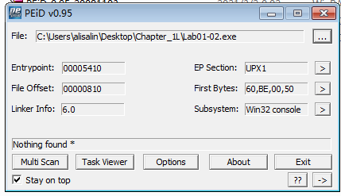
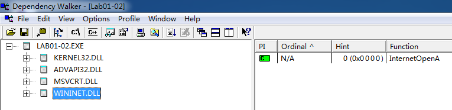
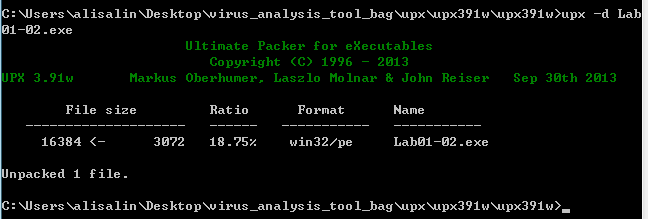

## lab 1-2

> 1811464 郑佶 信息安全单学位

#### 问题1:`virustotal`网站分析

将文件`Lab1-2.exe`上传至该网站,分别得到以下信息

由此可知,给定的文件均与已存在的反病毒特征码相对应

#### 问题2:寻找程序被加壳或混淆的线索并寻求去壳

使用`PEiD`打开`Lab1-2.exe`,得到以下内容

最下栏显示了`nothing found`,`EP段`显示`UPX1`.

无法得到编程语言信息,说明该程序为已加壳程序,且使用的加壳程序为`UPX1`

#### 问题3:从导入函数判断恶意软件功能

使用`Dependency Walker`打开`Lab1-2.exe`,分别得到以下结果

这里只能发现导入了函数`LoadLibrary`和`GetProcAddress`,这两个函数是加壳程序的最小导入函数.

该文件同时导入了函数`CreateServiceA`和`InternetOpenA`,这两个函数的功能是创建服务以及为该服务提供网络通讯功能,这表明该恶意代码将会创建一个带通讯功能的服务在系统中运行.

接下来为该程序去壳,如下,使用指令`upx -d lab1-2.exe`

再次使用`Dependency Walker`打开`Lab1-2.exe`,分别得到以下结果

去壳后,新得知程序中引入的一些主要函数.导入的函数`InternetOpenUrlA`表示函数的确通过访问特定地址进行通信

#### 问题4:感染迹象特征

从对上面的分析,我们明白该恶意代码会产生一个服务并实现了与某一网址进行通信的功能,为得到这个网址,使用`strings`指令,得到以下结果

可以发现字符串`Malservice`,这明显是创建的服务的名称.

我们可以发现字符串`www.malwareanalysisbook.com`,这就是进行网络通信的网址,而字符串`Internet Explorer 8.0`表明访问网址的方式为`IE 8.0`浏览器

所以,只要分析服务`Malware`通过网站`www.malwareanalysisbook.com`的流量即可.