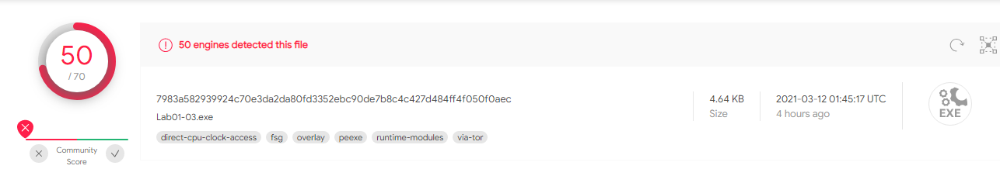
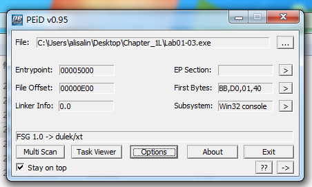
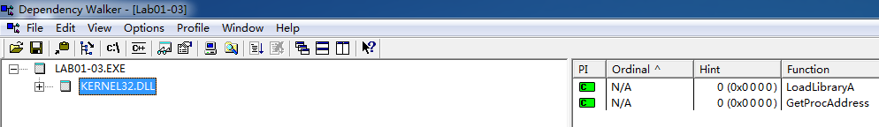

## lab 1-3

> 1811464 郑佶 信息安全单学位

#### 问题1:`virustotal`网站分析

将文件`Lab1-3.exe`上传至该网站,分别得到以下信息

由此可知,给定的文件均与已存在的反病毒特征码相对应

#### 问题2:寻找程序被加壳或混淆的线索并寻求去壳

使用`PEiD`打开该程序,得到以下信息

`PEiD`将其标识为`FSG 1.0 -> dulek/xt`, 表明该程序是由`FSG 1.0`进行加壳,但是目前没有合适的手段进行去壳

#### 问题3:从导入函数判断恶意软件功能

使用`Dependency Walker`打开该程序,得到以下信息

这里只能发现导入了函数`LoadLibrary`和`GetProcAddress`,这两个函数是加壳程序的最小导入函数,由于无法去壳,无法得到更进一步的信息

#### 问题4:感染迹象特征

无法去壳,难以得知程序的具体功能,因此无法分析