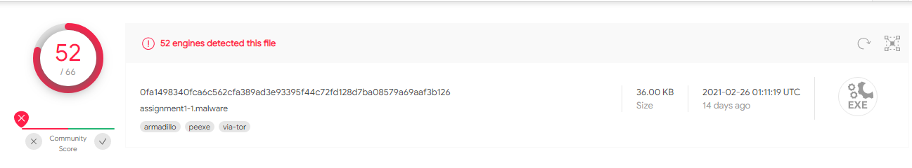
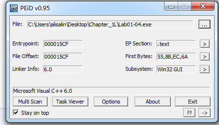
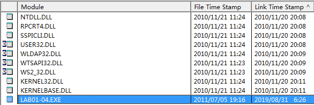
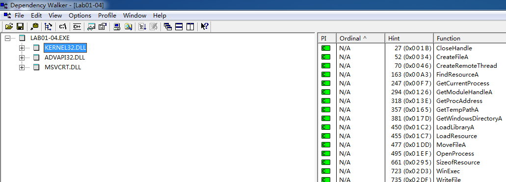
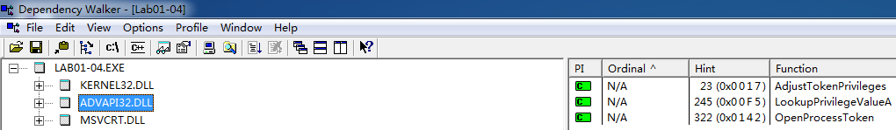
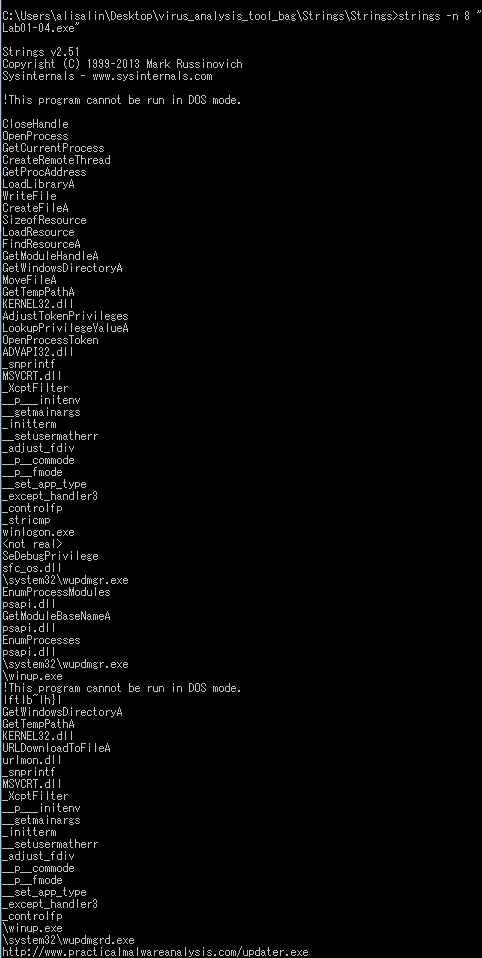
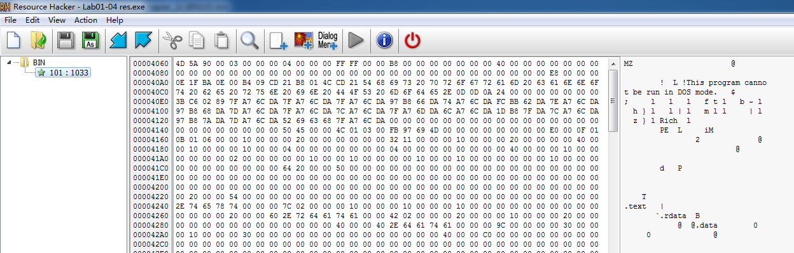
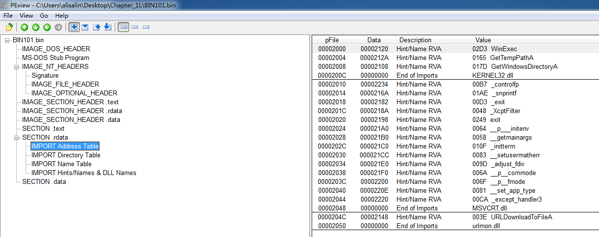

## lab 1-4

> 1811464 郑佶 信息安全单学位

#### 问题1:`virustotal`网站分析

将文件`Lab1-4.exe`上传至该网站,分别得到以下信息

由此可知,给定的文件均与已存在的反病毒特征码相对应

#### 问题2:寻找程序被加壳或混淆的线索并寻求去壳

正常情况下,`PEiD`表示该程序的编写语言,即代表该程序未加壳.使用`PEiD`打开`Lab1-4.exe`得到以下内容

最下栏显示了本程序使用的编写语言为微软的`C++ 6.0`.

显示`Lab1-4.exe`的编写语言为微软的`C++ 6.0`,说明该程序未加壳

#### 问题3:文件编译时间

使用`Dependency Walker`打开该文件,得到以下信息

从高亮的一行的`Link Time Stamp`项可以得知,程序编译的时间为`2019/8/31/6:26`

#### 问题4:从导入函数判断恶意软件功能

使用`Dependency Walker`打开该文件,得到以下信息

导入了函数`CreateFileA`和`WriteFile`,这表明恶意代码会进行文件的创建和写入.

而导入的函数`WinExec`,表明恶意代码会进行文件的执行.

导入的函数`AdjustTokenPrivileges`和`LookupPrivilegeValueA`表明程序会进行权限的变更.

导入的函数`FindResourceA`、`LoadResource`和`SizeofResource`,表明程序会进行资源的查找和载入等相关的操作

#### 问题5:感染迹象特征

使用`Strings`指令处理该程序,得到以下信息

从中,可以发现字符串`\system32\wupdmgr.exe`、`\system32\wupdmgrd.exe`和`\winup.exe`,这表明文件可能在这些位置创建文件.

而字符串`http://www.practicalmalwareanalysis.com/updater.exe`这表明该程序可能会进行联网通信下载文件`updater.exe`,但是根据`Dependency Walker`的分析结果,程序中导入没有实现联网功能的函数,由此可以推测实现该功能的代码存在于资源文件中.

总之,只要在该指定文件查找是否有文件创建,以及主机与网址`http://www.practicalmalwareanalysis.com/updater.exe`的通信即可得到相关线索.

#### 问题6:检查和分析引用的资源文件

使用`Resource Hacker`打开该程序,得到如下信息

将其中的`BIN`文件夹中的`101:1033`保存为`.bin`文件

使用`PEview`打开`.bin`,打开`SECTION .rdata/IMPORT Address Table`得到以下信息

可以发现,程序中导入了函数`URLDownloadToFileA`,这表示资源文件中的确实现了从指定网址下载数据的功能.