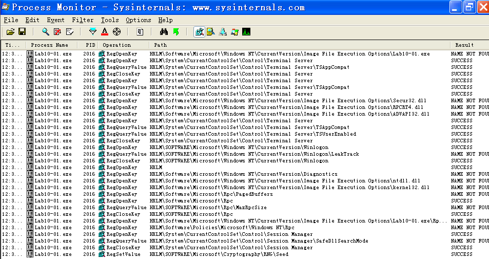
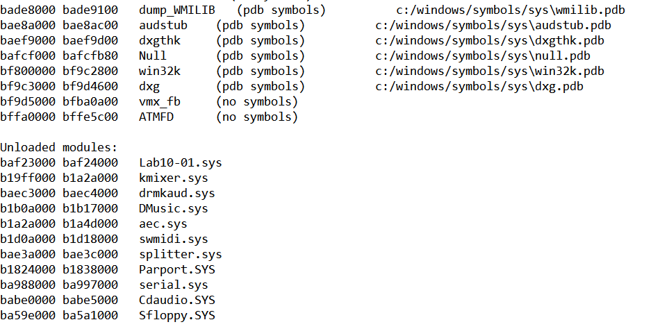
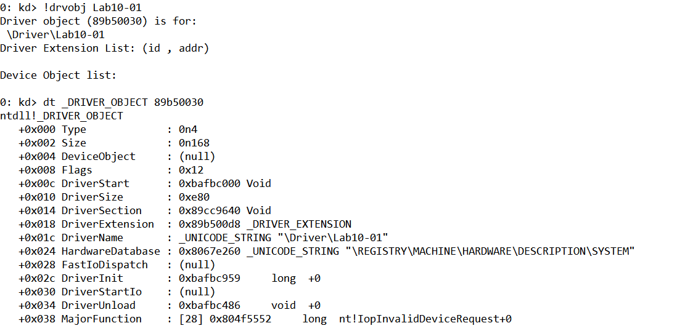

## lab 10-1

> 1811464 郑佶 信息安全单学位

#### 问题1:`Procmon`检查注册表修改情况

为使程序`Lab10-01.exe`能够正常运行,首先将驱动程序`Lab10-01.sys`复制到路径`C://WINDOWS//System32`下.

打开程序监视器`Procmon`即`Process Monitor`,点击`Filter`选择筛选条件为`Process Name = Lab10-01.exe`,点击关闭菜单栏的其他记录类别,仅选择选项`Show Registry Activity`记录注册表操作记录.点击`Clear`删除先前的记录.

点击`Lab10-01.exe`运行该程序,得到如下信息

可以看到唯一的一次对注册表的修改,即函数`RegSetValue`的唯一一次调用,是在注册表路径`HKLM\\SOFTWARE\\Microsoft\\Cryptography\\RNG\\`下,新值的名称为`Seed`.

另外,使用`Regshot`分析程序运行前后的注册表快照,可以发现该程序创建了服务`Lab10-01`,但这无法通过`Procmon`得知

#### 问题2:使用`WinDbg`分析可执行程序中指定函数的调用

> 可执行程序:`Lab10-01.exe`
>
> 指定函数:函数`ControlService`

先使用`IDA Pro`分析`Lab.exe`程序中的函数调用

可知,该程序依次调用了函数`CreateService`、`OpenService`、`StartService`、`ControlService`,其功能依次为

- `CreateService`创建服务`Lab10-01`
  - 文件路径`C:\\Windows\\System32\\Lab10-01.sys`
  - 服务类型`0x1`,即`SERVICE_KERNEL_DRIVER`,驱动服务
  - 启动类型`0x3`,即`SERVICE_DEMAND_START`,使用函数`StartService`启动
- `OpenService`返回服务`Lab10-01`的句柄
- `StartService`以句柄启动服务`Lab10-01`
- `ControlService`对以句柄对服务`Lab10-01`发送控制指令
  - 控制指令`0x1`,即`SERVICE_CONTROL_STOP`,即关闭服务指令

为分析`ControlService`对内核运行的影响,使用`WinDbg`分析.

使用调试模式打开虚拟机和宿主机上的`WinDbg`,将虚拟机和宿主机上的`WinDbg`通过指定命名管道连接.

将文件`Lab10-01.sys`放在`C:\\Windows\\System32\\`,或是直接使用`OSR DRIVER LOADER`注册服务乃至启动`Lab10-01`.

使用虚拟机中的`WinDbg`打开程序`Lab10-01.exe`,设置断点于函数`ControlService`处,即`0x00401080`,使用的指令为`bp 0x00401080`

输入指令`g`使程序继续运行,直至击中断点

跳出虚拟机,使用宿主机的`WinDbg`的`Break`功能触发虚拟机的中断.

这时,在宿主机的`WinDbg`中使用指令`lm`查看所有载入模块,可以发现模块`Lab10-01`,即下图中的起始位置为`0xbaf23000`,结束位置为`0xbaf23e80`的模块`Lab10-01`.

使用指令`!object \Driver`查看已存在的驱动对象,可以发现驱动对象`Lab10-01`(句柄为`0x89f1f1c8`)

这时,在宿主机的`WinDbg`中使用`g`指令使虚拟机继续运行.然后,回到虚拟机中的`WinDbg`,使用`g`指令使程序`Lab10-01.exe`在`ControlService`处的断点后继续运行.

程序`Lab10-01.exe`运行结束后,使用宿主机的`WinDbg`的`Break`功能再次触发虚拟机的中断.

这次再次使用指令`lm`查看所有载入模块,可以发现模块`Lab10-01.sys`,但是已经被卸载,归为`Unloaded module`

使用指令`!object \Driver`查看已存在的驱动对象,已经无法找到驱动对象`Lab10-01`.

为分析服务`Lab10-01`的卸载函数,使用指令`dt _DRIVER_OBJECT + 驱动Lab10-01句柄`查看驱动相关信息

其中`DriverUnload`的值`0xbafbc486`相对`DriverStart`的偏移量为`0x486`.所以服务`Lab10-01`的写在函数位于`Lab10-01.sys`相对基地址偏移量为`0x486`处,如下.

这个卸载函数在内核态下依次调用了三次`RtlCreateRegistryKey`函数,两次`RtlWriteRegistryValue`,归纳如下

- 三次`RtlCreateRegistryKey`函数调用,创建注册表键`\Registry\Machine\SOFTWARE\Policies\Microsoft`

  、`...\Microsoft\WindowsFire\wall`、`...\Microsoft\WindowsFire\wall\DomainProfile`、`...\Microsoft\WindowsFire\wall\StandardProfile`

- 两次`RtlWriteRegistryValue`函数调用,修改`...\Microsoft\WindowsFire\wall\DomainProfile`、`...\Microsoft\WindowsFire\wall\StandardProfile`的键值

经过资料查询,`\Registry\Machine`等注册表路径前缀是内核态下的特殊路径前缀,等效于`HKEY_LOCAL_MACHINE`.而`\Registry\Machine\SOFTWARE\Policies\Microsoft\WindowsFire\wall`下的注册表项与防火墙设置相关,且卸载函数中的键值设置表示关闭防火墙.

综上可以知道,`ControlService`函数通知服务管理器关闭服务`Lab10-01`,卸载了驱动对象`Lab10-01`和驱动模块`Lab10-01.sys`,并在内核中调用卸载函数时关闭了防火墙.

#### 问题3:分析程序的行为

根据上述的分析,可以知道程序`lab10-01.exe`与`lab10-01.sys`的运行流程如下

- 创建服务`Lab10-01`
- 取得服务`Lab10-01`的句柄
- 启动服务`Lab10-01`
- 对服务`Lab10-01`发送关闭服务指令,内核中调用该服务的卸载函数
- 服务`Lab10-01`的卸载函数修改注册表,关闭防火墙
- 服务`lab10-01`被卸载

综上,程序的行为是

- 创建并启动服务`lab10-01`
- 卸载服务`lab10-01`,同时关闭防火墙
