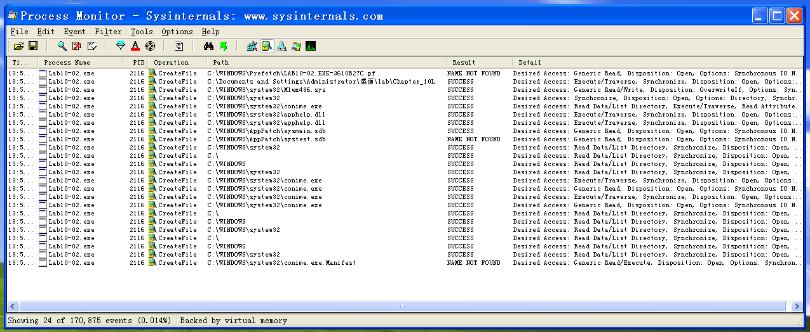
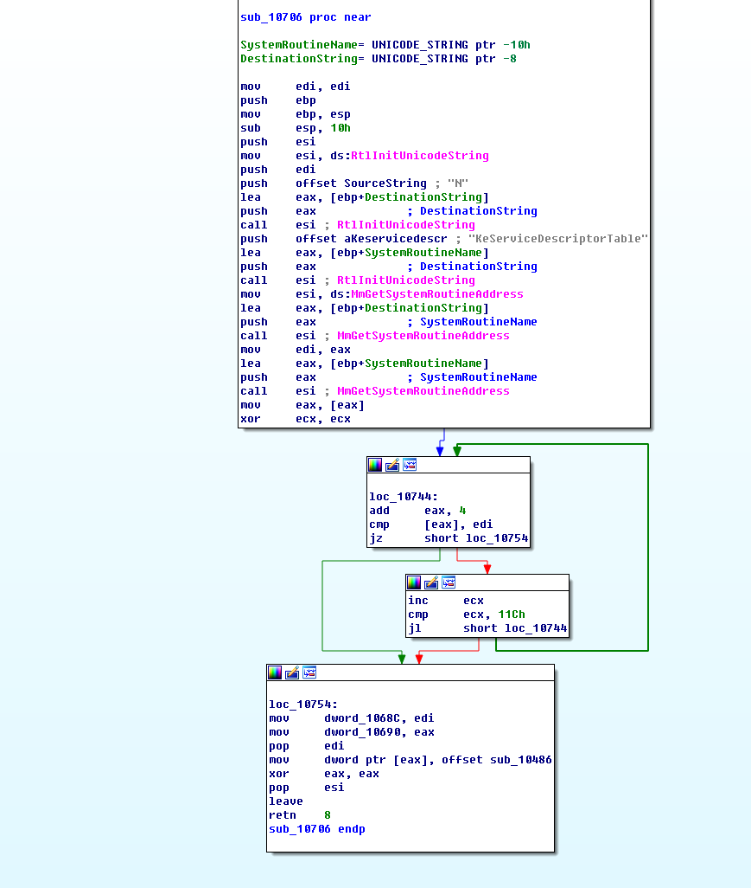
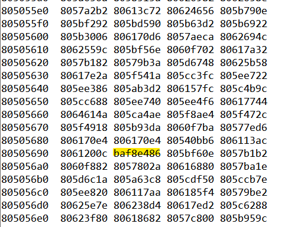
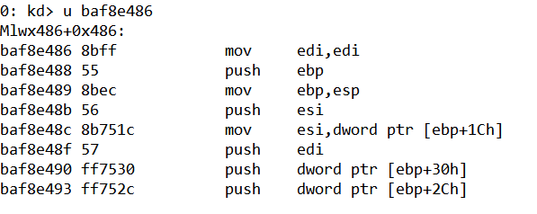

## lab 10-2

> 1811464 郑佶 信息安全单学位

#### 问题1:程序创建文件的情况

打开程序监视器`Procmon`,点击`Filter`选择筛选条件为`Process Name = Lab10-02.exe`和`Operation = CreateFile`,点击关闭菜单栏的其他记录类别,仅选择选项`Show File System Activity`记录文件系统活动记录.点击`Clear`删除先前的记录.

点击`Lab10-02.exe`运行该程序,得到如下信息

可知其创建文件主要有`apphelp.dll`、`conime.exe`、`sysmain.sdb`、`Mlwx486.sys`,都在文件夹`C:\\Windows\\System32`下

接下来通过`IDA Pro`的反汇编分析文件创建操作.可知程序流程如下

- 调用并装载`FILE`资源
- 创建文件`C:\\Windows\\System32\\Mlwx486.sys`
- 将`FILE`资源写入`Mlwx486.sys`文件
- 创建服务`486 WS Driver`,路径为`C:\\Windows\\System32\\Mlwx486.sys`
- 启动服务`486 WS Driver`

接下来使用`Resource Hacker`工具从程序文件中分离出`bin`格式的`FILE`资源文件,并使用`IDA Pro`分析,得到如下信息

可知这些此文件里的导入函数表中的函数都不涉及文件的创建,可以忽略.

综上,程序创建的文件是`C:\\Windows\\System32\\Mlwx486.sys`

#### 问题2:程序的内核组件

经过上述分析可知,程序文件的`FILE`资源文件在运行中实际被存进驱动文件`Mlwx486.sys`.

为分析程序的内核组件,接下来分析`FILE`资源文件的代码.

经过`IDA Pro`的静态分析,可知`FILE`资源文件中的主要子函数由子过程`sub_10486`、子过程`sub_10706`、子过程`sub_10772`.

首先分析子过程`sub_10706`,其函数流程图如下

该子过程的主要运行流程如下

- 调用内核函数`RtlInitUnicodeString`建立`字符串1`(`IDA Pro`标记为`SourceString`)和`字符串2`(`IDA Pro`标记为`aKeservicedescr`)
  - `字符串1`即`NtQueryDirectoryFile`
  - `字符串2`即`KeServiceDescriptorTable`
- 调用内核函数`MmGetSystemRoutineAddress`,取得`字符串1`和`字符串2`的内存地址
- 由于`字符串2`的地址即为`SSDT`开始地址,所以从`字符2`的地址开始在`SSDT`表地址范围内遍历内存空间,直至找到调用`NtQueryDirectoryFile`的位置
- 在`SSDT`表中找到`字符串1`后,用自带的子函数`sub_10486`替换`SSDT`表中`NtQueryDirectoryFile`原本预期指向的函数

接下来分析自带的替换函数`sub_10486`,其主流程如下

- 调用原生的内核函数`NtQueryDirectoryFile`创建文件
- 检查在调用上述函数时的参数`FileInformationClass`为`3`,确认返回结构体为`FILE_BOTH_DIR_INFORMATION`类型
- 检查在调用上述函数时的参数`ReturnSingleEntry`是否为`0`
- 当找到文件名前缀为`Mlwx`(称此文件为`文件A`)时,将`文件A`的前一个文件`FILE_BOTH_DIR_INFORMATION`结构体的`NextEntryOffset`(指向当前文件的下一文件)直接指向`文件A`的下个文件,依此隐藏文件`文件A`

简而言之,子过程`sub_10486`的功能就是在创建文件的同时隐藏文件.

接下来为验证这一点,使用`WinDbg`对`SSDT`进行分析.

首先运行恶意代码`Lab10-02.exe`感染系统,然后在宿主机的`WinDbg`中点击`Break`触发虚拟机系统的中断.

使用指令`dd dwo(KeServiceDescriptorTable) L100`,输出全局描述符表的内容,可以发现显然有一项的表值越过了`NT`模块函数的内存区域,如下

键入指令`u baf8e486`,查看该地址的指令

可以看到该地址被标记为`Mlwx486 + 0x486`,可知这的确是子过程`sub_10406`对`SSDT`表项的修改.

综上,该程序的确有内核组件,其功能如下

- 使用`hook`技术,修改`SSDT`表,在内核中调用自带的文件创建函数
- 创建并隐藏文件`Mlwx486.sys`
- 创建服务`486 WS Driver`

#### 问题3:程序的行为

根据`问题2`中内核组件的驱动文件`Mlwx486.sys`中子过程`sub_10486`、`sub_10706`、`sub_10772`的分析可知该程序完整流程如下

- 用户态下,将程序文件的资源节数据存入`system32`文件夹的新建文件`Mlwx486.sys`
- 内核态下,修改`SSDT`表,修改默认的`NtQueryDirectoryFile`调用,使其指向自写的替代函数,该替代函数会在调用原函数后隐藏前缀为`Mlwx`的文件
- 用户态下,调用`CreateFile`函数,触发对替代函数的调用,隐藏创建的`Mlwx486.sys`
- 用户态下,创建并启动服务`486 WS Driver`

综上,程序的行为是创建文件`Mlwx486.sys`并隐藏,然后以此文件创建服务`486 WS Driver`并启动

