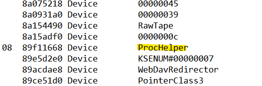
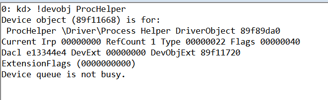
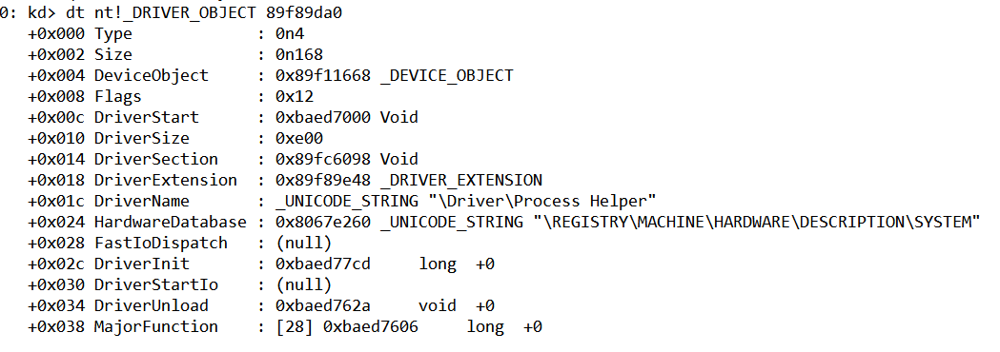
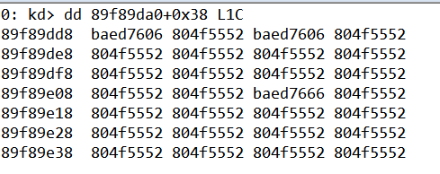
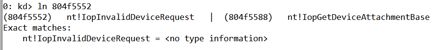
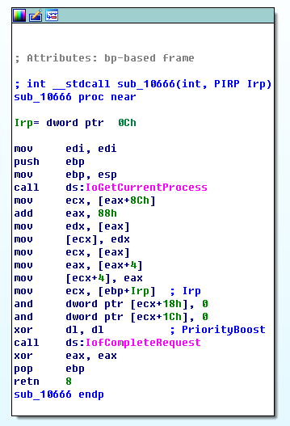
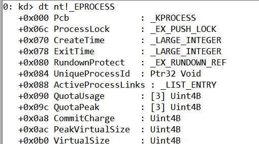
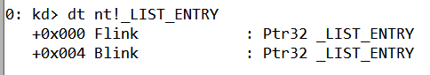
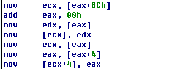

## lab 10-3

> 1811464 郑佶 信息安全单学位

#### 问题1:程序的行为

首先使用该程序进行实际的测试.将驱动`Lab10-03.sys`复制到路径`C:\\Windows\\System32`下后,运行程序`Lab10-03.exe`.

如上,可以发现运行该程序后,每隔一会都会新弹出浏览器窗口,访问网页`http://www.malwareanalysisbook.com/ad.html`

接下来使用`IDA Pro`对`Lab10-03.exe`进行静态分析.根据程序流程图,其运行流程如下

- 函数`OpenSCManager`启动服务管理器
- 函数`CreateService`使用驱动文件`Lab10-03.sys`创建服务`Process Helper`
- 函数`StartService`启动服务`ProcessHelper`
- 函数`CreateFile`创建对设备`ProcessHelper`的连接并获得其句柄
- 函数`DeviceIoControl`向设备`ProcessHelper`发送请求,控制代码为`0xABCDEF01`
- 函数`OleInitialize`初始化`Ole`运行环境

- 函数`CoCreateInstance`创建`COM`对象
  - `rclsid`值为`0002DF01-0000-0000-C000-000000000046`
  - `riid`值为`D30C1661-CDAF-11D0-8A3E-00C04FC9E26E`
  - 该`COM`对象是`IE`浏览器的`IWebBrowser2`接口
- 函数`VariantInit`初始化`Ole`环境中的`Variant`结构
- 函数`SysAllocString`创建字符串`http://www.malwareanalysisbook.com/ad.html`
- 进入循环
  - 函数`[ecx+2C]`,参数为上述网址字符串
    - `ecx`为`IE`浏览器的`IWebBrowser2`接口地址
    - `[ecx+2C]`指接口偏移`2Ch`处的函数,为函数`Navigate`
    - 该函数根据参数的网址字符串导航到指定网页
  - 函数`Sleep`休眠`30`秒

综上,从程序`lab10-03.exe`可以得知的程序行为是

- 创建服务`ProcessHelper`,向设备`ProcessHelper`发送指定指令
- 循环导航至网页`http://www.malwareanalysisbook.com/ad.html`

接下来使用`IDA Pro`对驱动文件`Lab10-03.sys`进行静态分析.

经过分析,驱动文件`Lab10-03.sys`由子过程`sub_10606`、子过程`sub_1062A`、子过程`sub_10666`、子过程`sub_10706`、子过程`sub_10794`组成.

首先分析创建和连接设备的子过程`sub_10706`,可知其流程如下

- 内核函数`RtlInitUnicodeString`创建字符串`\\Devices\ProcHelper`
- 内核函数`IoCreateDevice`创建设备`\\Devices\ProcHelper`
- 内核函数`RtlInitUnicodeString`创建字符串`\\DosDevices\ProcHelper`
- 内核函数`IoCreateSymbolicLink`创建符号链接`\\DosDevices\ProcHelper`

接下来使用`WinDbg`分析驱动文件`Lab10-03.sys`.将驱动文件`Lab10-03.sys`复制到`System32`文件夹后,运行`Lab10-03.exe`,然后在宿主机的`WinDbg`中点击`Break`触发虚拟机系统的中断.

运行指令`!object \Device`输出所有设备,可以找到子过程`sub_10706`创建的设备`ProcHelper`.

运行指令`!devobj ProcHelper`查看该设备的详细信息.

可知该设备的驱动对象`Process Helper`存储位置位于`0x89f89da0`,使用指令`dt nt!_DRIVER_OBJECT 89f89da0 `查看该驱动对象信息.

可以发现驱动初始化函数`DriverInit`相对`DriverStart`偏移量为`0x7cd`,驱动卸载函数`DriverUnload`相对`DriverStart`偏移量为`0x62a`.由此可知子过程`sub_1062A`是卸载函数.

使用指令`dd 89f89da0+0x38 L1C`查看驱动`Process Helper`的主函数表.

可以发现主函数表大部分函数都是`804f5552`,使用指令`ln 804f5552`查看对应的函数调用.

可知该函数为`IopInvaildDeviceRequest`,用于处理非法的驱动请求.

查询`wdm.h`头文件的派遣函数序号表,可知位于偏移量`0x0`、`0x2`、`0xe`对应派遣函数序号`IRP_MJ_CREATE`、`IRP_MJ_CLOSE`、`IRP_MJ_DEVICE_CONTROL`,对应该驱动的`Create`、`Close`、`DeviceIoControl`函数.

因为偏移量`0x0`和`0x2`处的函数`baed7606`对应子过程`sub_10606`,偏移量`0xe`处的函数`baed7666`对应子过程`sub_10666`.

由于子过程`sub_10606`仅调用内核函数`IofCompleteRequest`完成`IRP`请求,通知操作系统请求成功,未实现实际功能,忽略之.

子过程`sub_10666`是该驱动的`DeviceIoControl`函数,其流程图如下

因此,函数运行流程如下

- 内核函数`IoGetCurrentProcess`得到当前进程`EPROCESS`结构体指针
- 访问该结构体偏移量`0x88`、`0x8C`处成员变量并修改
- 内核函数`IofCompleteRequest`完成`IRP`请求,通知操作系统请求成功

使用指令`dt nt!_EPROCESS`查看`EPROCESS`成员变量表,如下

使用指令`dt nt!_LIST_ENTRY`查看`_LIST_ENTRY`的结构,如下

所以可知`EPROCESS`结构体偏移量`0x88`、`0x8C`处成员变量是指向前一`EPROCESS`的指针`Blink`和指向下一`EPROCESS`的指针`Flink`.

子过程`sub_10666`中对`EPROCESS`结构体的修改,如下

简言之,这段代码的功能是修改连接进程链表的`Blink`和`Flink`,使得进程链表在遍历进程时跳过当前进程,以此将当前进程从进程链表中隐藏.

综上,从程序`lab10-03.sys`可以得知的程序行为是响应`lab10-03.exe`的`DeviceIoControl`请求,并依请求隐藏当前进程.

根据上述的分析可知,该程序的完整行为如下

- 使用驱动文件`Lab10-03.sys`创建服务`Process Helper`
- 驱动将当前进程隐藏
- 每休眠`30`秒循环跳出程序框访问网址`http://www.malwareanalysisbook.com/ad.html`

#### 问题2: 停止程序的方法

根据`问题1`的分析,由于该程序创建的进程在进程列表中被隐藏,所以无法使用进程管理器终止程序.

实际上停止该程序唯一方式是重启操作系统或关机.

#### 问题3: 程序内核组件的操作

根据`问题1`的分析,该程序内核组件的操作如下

- 创建设备`ProcHelper`
- 创建驱动`Process Helper`
- 响应用户态程序的`DeviceIoControl`请求,修改进程`EPROCESS`结构体,使当前进程被隐藏

