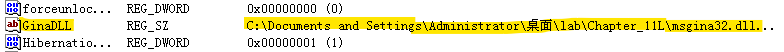

## lab 11-1

> 1811464 郑佶 信息安全单学位

#### 问题1:分析程序对磁盘释放的数据信息

先对`Lab11-01.exe`进行静态分析.

用`Resource Hacker`工具,可以在程序`Lab11-01.exe`中找到资源节`TGAD`

将该资源节保存为`bin`格式文件后,使用`IDA Pro`打开,得到资源节文件的导出函数表找到如下的函数

可知该程序是`Dll`库文件.

接下来使用`IDA Pro`分析程序文件`Lab11-01.exe`,寻找资源文件相关函数的调用,随即可以找到如下的子过程

该重要子过程`sub_401080`流程如下

- 调用`FindResource`、`LoadResource`获得资源句柄
- 调用`LockResource`、`SizeofResource`、`VirtualAlloc`将资源节载入内存
- 调用`_fopen`、`_fwrite`、`_fclose`将内存中的资源节数据写入文件`msgina32.dll`
- 调用`FreeResource`释放资源

总之,该子过程将资源节数据释放到文件`msgina32.dll`.

接着进行动态分析.打开程序监视器`Procmon`,点击`Filter`选择筛选条件为`Process Name = Lab11-01.exe`和`Operation = CreateFile`,点击关闭菜单栏的其他记录类别,仅选择选项`Show File System Activity`记录文件系统活动记录.点击`Clear`删除先前的记录.

点击`Lab11-01.exe`运行该程序,得到如下信息

可以看到文件`msgina32.dll`的创建位置是`Lab11-01.exe`所在的路径.

综上,恶意代码从`TGAD`资源节提取数据到文件`msgina32.dll`,并将该文件创建在恶意代码所在的路径.

#### 问题2:程序的持久化驻留

对程序的持久化驻留,首先考虑服务的创建或是注册表的修改.

打开程序监视器`Procmon`,点击`Filter`选择筛选条件为`Process Name = Lab11-01.exe`和`Operation = RegCreateKey`,点击关闭菜单栏的其他记录类别,仅选择选项`Show Registry Activity`记录注册表修改活动记录.点击`Clear`删除先前的记录.得到如下信息

由此可知唯一创建的注册表键的路径是`HKLM\SOFTWARE\Microsoft\Windows NT\CurrentVersion\Winlogon`.

使用`IDA Pro`分析程序`Lab11-01.exe`的导入函数表中与服务和注册表相关的函数以及该注册表路径的调用位置,得到如下的信息.

上图的子过程`sub_401000`进行了注册表修改,其具体流程如下

- 创建注册表键`HKLM\SOFTWARE\Microsoft\Windows NT\CurrentVersion\Winlogon`
- 添加在上述注册表路径增加下表项`GinaDLL`
- 调用子过程`sub_401299`(实际应为`printf`函数),输出字符串`RI`

为分析注册表中`GinaDLL`项的值,使用`Regedit`打开注册表查看该项,得到如下信息

可以发现`GinaDLL`项的表值刚好是恶意代码释放出的库文件`msgina32.dll`的路径.可以认为这实现了恶意代码的持久化驻留.

综上,恶意代码之持久化驻留的方法是将资源文件释放出的库文件`msgina32.dll`的路径添加到注册表,挂钩`Winlogon`事件,使其重启时被`Winlogon`加载.

#### 问题3: 程序窃取用户凭证的方式

根据`GinaDLL`的注册表键名和`msgina32.dll`的库文件名显然可知,该程序是使用恶意的库文件`msgina32.dll`路径替换原本默认的`system32`文件夹下的`msgina.dll`的路径.

如上,根据课本`P218`的模型,进行`GINA`拦截的恶意`DLL`文件`msgina32.dll`作为`winlogon.exe`和`msgina.dll`之间的拦截器,需要包含`msgina.dll`的所有导出函数,这通过简单调用`msgina.dll`中的函数实现.因此,分析`msgina32.dll`的导出函数表,查看其中不调用`msgina.dll`导出函数的函数,就应该是恶意代码的功能代码.

由于程序运行后才能产生文件`msgina32.dll`,所以事先运行`Lab11-01.exe`后,再使用`IDA Pro`分析`msgina32.dll`.

首先分析`DLLMain`函数,其流程图如下

经分析,其运行流程如下

- 验证参数`fdwReason`值为`DLL_PROCESS_ATTACH`(`0x1`)
  - 参数`fdwReason`指定`DLL`文件调用原因
  - `DLL_PROCESS_ATTACH`指该`DLL`文件第一次被映射到进程地址空间
- 调用函数`DisabledThreadLibraryCalls`禁止线程以参数`DLL_THREAD_ATTACH`、`DLL_THREAD_DETACH`调用`DLLMain`函数
  - `DLL_THREAD_ATTACH`指线程调用进程空间的`DLL`文件映像
  - `DLL_THREAD_ATTACH`指关闭调用`DLL`文件映像的线程
- 调用函数`GetSystemDictionary`得到系统目录`System32`文件夹的路径
- 调用函数`lstrcat`拼接路径字符串,并依此路径为参数调用函数`LoadLibrary`载入原系统库文件`msgina.dll`

根据上述对`DLLMain`函数的分析,可知该程序的确是作为`winlogon.exe`和`msgina.dll`之间的`GINA`证书拦截器.

接着分析`msgina32.dll`,可以发现函数`WlxLoggedOutSAS`其他函数不同,不直接引用`msgina.dll`的函数,所以分析之,其流程图如下

其中值得注意的是如下这个格式化字符串`UN %s DM %s PW %s OLD %s`

其中`PW`显然指的是`Password`,这说明这个函数将截取到的密码等信息使用格式化字符串保存.可以注意到该格式化字符串是函数`sub_10001570`的参数,接下来分析子过程`sub_10001570`,其流程图如下

其中值得注意的是文件名`msutil32.sys`的使用.上述的子过程一开始调用`_vsnwprintf`和`_wfopen`等函数,显然是以格式化字符串的形式向截取到的数据传给文件`msutil32.sys`.

为分析文件`msutil32.sys`,需要重启系统输入用户名密码供程序实行`GINA`拦截.然后可以在`system32`文件夹下找到该文件,如下

得到文件`msutil32.sys`的数据如下(用户名:`Administrator`,密码:`nankai`),这充分说明了这个程序的`GINA`拦截功能.

综上,该恶意代码窃取用户登陆凭证的手段是使用`msgina32.dll`作为`winlogon.exe`和`msgina.dll`之间的`GINA`证书拦截器,以窃取登陆凭证保存到文件`C:\Windows\System32\msutil32.sys`

#### 问题4:对窃取证书的处理

如上,根据`问题3`的分析,程序将窃取的证书信息以格式化字符串的形式保存,即`时间 - UN 用户名 DM 主机名称 PW 密码 OLD 原密码`的格式.

并将其保存到文件`C:\Windows\System32\msutil32.sys`.

#### 问题5: 恶意代码获得用户登陆凭证的方式

根据`问题3`的分析,为得到保存登陆凭证的文件`msutil32.sys`,需要重启系统输入用户名密码供程序实行`GINA`拦截.

总而言之,需要在启动程序后重启系统,并在恶意代码给出的登录框输入密码以登录系统.