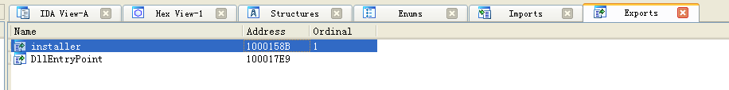
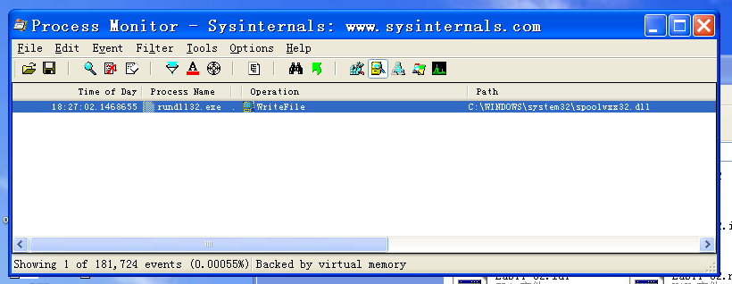
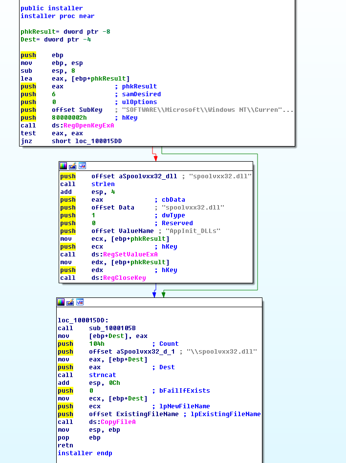
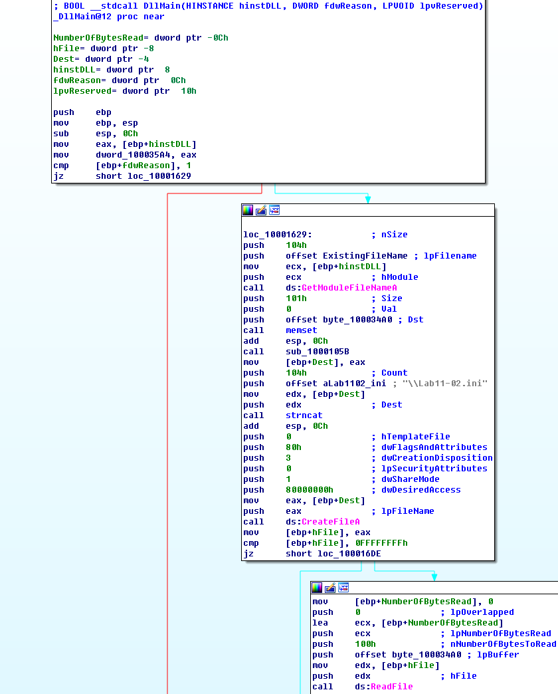
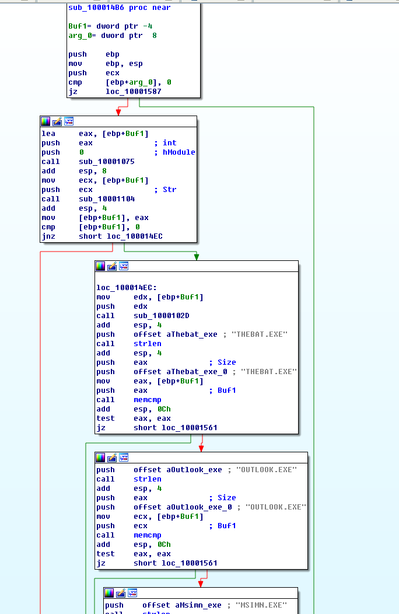
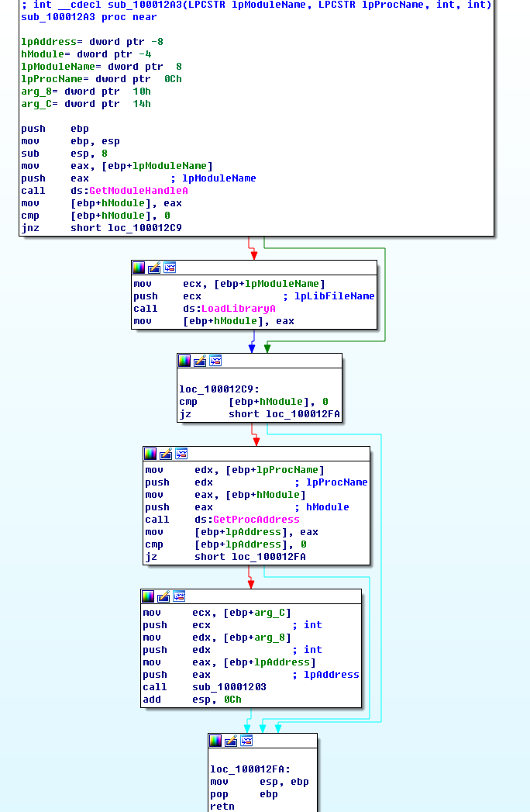
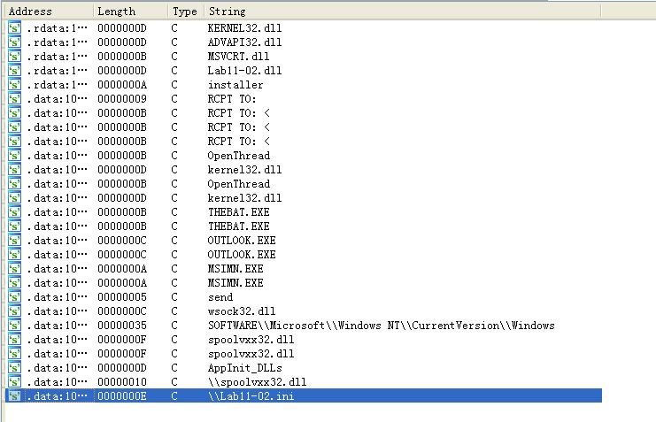
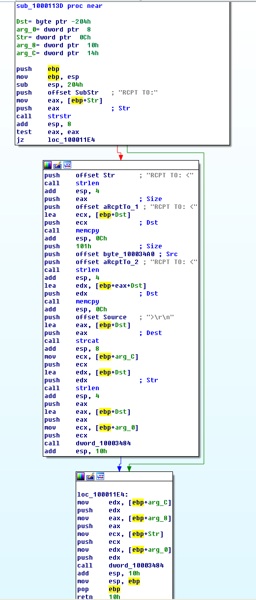
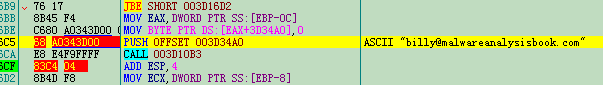

## lab 11-2

> 1811464 郑佶 信息安全单学位

#### 问题1: 分析恶意`DLL`文件的导出数据信息

使用`IDA Pro`查看`Lab11-02.dll`的导出函数表,得到如下信息

由此可知,该`DLL`文件导出了导出函数`installer`

#### 问题2: 使用指定程序运行库文件的结果

> 指定程序:`rundll32.exe`

为分析使用`rundll32.exe`运行`Lab11-02.dll`的结果,使用`Procmon`分析系统获得记录.

打开程序监视器`Procmon`,点击`Filter`选择筛选条件为`Process Name = rundll32.exe`和`Operation = WriteFile`,点击关闭菜单栏的其他记录类别,仅选择选项`Show File System Activity`记录文件系统活动记录.点击`Clear`删除先前的记录.

使用在`cmd`中使用指令`rundll32.exe Lab11-02.dll installer`运行安装恶意代码,得到如下信息

由上可见,该程序创建并写入了文件`spoolvxx32.dll`.

为获得更详细的信息,使用`IDA Pro`分析导出函数`installer`和主函数`DLLMain`.

导出函数`installer`流程图如下

经分析,其主要运行流程如下

- 打开注册表键`HKLM\SOFTWARE\Microsoft\Windows NT\CurrentVersion\Windows`
- 创建注册表项`AppInit_DLLs`,值为`spoolvxx.dll`

- 得到`system32`文件夹路径,和字符串`spoolvxx.dll`拼接
- 使用得到的路径将文件内容复制到`spoolvxx32.dll`

主函数`DLLMain`流程图如下

经过分析,其主要运行流程如下

- 调用函数`GetModuleFile`得到当前文件路径
- 调用子过程`sub_1000105B`得到`System32`文件夹路径,与字符串`Lab11-02.ini`拼接
- 调用函数`CreateFile`打开文件`C:\Windows\System32\Lab11-02.ini`
- 调用函数`ReadFile`读该文件
- 调用子过程`sub_100010B3`,==该子过程问题8中分析==
- 调用子过程`sub_100014B6`,==该子过程问题5中分析==

综上,可知运行代码后会发生

- 导出函数`installer`复制当前文件到`C:\Windows\System32\spoolvxx32.dll`,并修改注册表键增加`AppInit_DLLs`项以永久安装这个恶意代码.
- 主函数`DLLMain`打开文件`C:\Windows\System32\Lab11-02.ini`,但是文件不在该目录下所以打开失败

#### 问题3: 指定文件的安装路径

> 指定文件:`Lab11-02.ini`

根据`问题2`的分析,可知道调用`CreateFile`是的路径是`C:\Windows\System32\Lab11-02.ini`,因此需要将文件`Lab11-02.ini`放在路径`C:\Windows\System32\`.

#### 问题4: 程序驻留的方式

根据`问题2`的分析,导出函数`installer`有如下功能

- 打开注册表键`HKLM\SOFTWARE\Microsoft\Windows NT\CurrentVersion\Windows`
- 创建注册表项`AppInit_DLLs`,值为`spoolvxx.dll`

查询`AppInit_DLLs`的键值的功能,可知该键值指向的库文件会被加载`user32.dll`的进程装载.

所以程序是通过修改注册表,使得恶意代码被所有加载`user32.dll`的进程装载,实现驻留.

#### 问题5 :程序使用的用户态`Rootkit`技术

为研究程序使用的`Rootkit`技术,需要分析主函数`DLLMain`的子过程`sub_100014B6`.

子过程`sub_100014B6`流程图如下

经过分析,其主要运行流程如下

- 调用子过程`sub_10001075`得到指定句柄的绝对路径
  - 子过程调用函数`GetModuleFileName`
- 调用子过程`sub_10001104`通过字符串操作得到指定路径的程序名
- 检查程序名是否为`THEBAT.EXE`或`OUTLOOK.EXE`或`MSIMN.EXE`
- 调用子进程`sub_100013BD`查找当前进程`ID`,然后挂起其他进程
- 调用子过程`sub_100012A3`,==该子过程随后分析==
- 调用子过程`sub_100013BD`查找当前进程`ID`,然后唤醒其他进程

上述子过程调用的子过程`sub_100012A3`的流程图如下

经过分析,其主要运行流程如下

- 调用函数`GetModuleHandle`、`LoadLibrary`加载库文件`wsock32.dll`

- 调用函数`GetProcAddress`找到`socket`的`send`函数的地址

- 调用子过程`sub_10001203`

  - 调用函数`VirtualProtect`取消`send`函数代码区域写保护

  - 修改在`send`函数代码区域的代码,设置挂钩,使`send`函数执行前先跳转调用恶意代码再跳转到原位置继续执行
  - 调用函数`VirtualProtect`恢复写保护

综上,程序使用的用户态`Rootkit`技术是挂钩函数技术

#### 问题6: 挂钩函数的行为

因为该程序使用地址字符串(==详见问题8分析==),且根据`问题5`的分析子过程`sub_100014B6`会判断当前程序是否为邮件程序`thebat`或`outlook`或`msimn`,所以可以推断该程序的挂钩函数的功能应该与邮件有关.

查看`Lab11-02.dll`的字符串视图,得到如下信息

可以发现`RCPT TO:`等字符串.经过查阅资料,可以发现`RCPT TO`是`SMTP`邮件协议的命令,用于指定收件人.可以以此推测,该程序使用挂钩程序修改邮件的收件人信息以实现恶意代码的目的.

查看该字符串的引用位置,可以发现子过程`sub_1000113D`引用了这个字符串.

所以,为研究挂钩函数的行为,需要分析子过程`sub_1000113D`,其流程图如下

上述的子过程功能如下

- 使用`strstr`函数寻找邮件数据中的`RCPT TO:`字符串的位置,找到存储收件人数据信息的位置
- 修改邮件中的收件人信息,添加一个收件人`billy@malwareanalysisbook.com`(==详见问题8分析==)
- 将邮件参数传给`socket`函数

因此挂钩函数的行为是在发送邮件时修改收件人信息,使恶意代码指定的邮箱收到被感染主机发送的邮件.

#### 问题7 :实行恶意攻击的进程

根据`问题5`的分析,子过程`sub_100014B6`会判断当前调用该恶意`DLL`库文件的进程是否为`thebat.exe`或`outlook.exe`或`msimn.exe`以决定程序是否退出.经过查询资料,可以知道`thebat`或`outlook`或`msimn`都是适用于`xp`系统的邮件程序.

综上,恶意代码只在被邮件程序`thebat`或`outlook`或`msimn`的进程空间装载才有效.

#### 问题8: 指定文件的功能

> 指定文件:`Lab11-02.ini`

为分析文件`Lab11-02.ini`的功能,需要`DLLMain`函数的子过程`sub_100010B3`.

为分析子过程`sub_100010B3`,先将`Lab11-02.ini`放到`system32`文件夹下,再使用`Ollydbg`在`sub_100010B3`调用结束后设置断点,得到如下信息

可知该子过程的返回值是邮箱地址字符串`billy@malwareanalysisbook.com`.

静态分析该子过程,可以发现该子过程未调用任何`Windows`功能函数.

由此,可推测该字符串是通过文件`Lab11-02.ini`中乱码`CHMMXaL@MV@SD@O@MXRHRCNNJBNL`经过汇编指令解密的结果.

综上,文件`Lab11-02.ini`的功能是提供邮箱地址密文.

#### 问题9: 使用指定工具捕捉该恶意代码行为的方式

> 指定工具:`Wireshark`

为抓取恶意代码行为,需要按照如下的方法和步骤

- 复制文件`Lab11-02.ini`到`system32`文件夹
- 使用指令`rundll32.exe Lab11-02.dll installer`安装恶意代码

- 打开`Wireshark 1.4.0`(适用于`XP`系统),点击菜单栏的`Capture/Interface`,并点击`start`开始捕获数据包
- 启动`Outlook`客户端,发送邮件
- 使`Wireshark`停止捕捉数据包

