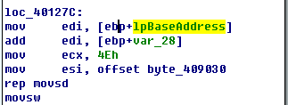

## lab 11-3

> 1811464 郑佶 信息安全单学位

#### 问题1: 静态分析得到的线索

首先使用`IDA Pro`分析`Lab11-03.dll`的字符串信息,得到如下重要的字符串信息

其中值得注意的字符串是`Lab1103dll.dll`、`C:\\Windows\\System32\\kernel64x.dll`、`zzz69806582`.

分析`Lab11-03.exe`的字符串信息,得到如下重要字符串信息

值得注意的字符串有

- 程序名`cmd.exe`、`command.exe`、`cisvc.exe`
- 后缀名`.exe`、`.bat`、`.cmd`
- 文件名`Lab11-03.dll`
- 路径名`C:\\WINDOWS\\System32\\inet_epar32.dll`、`C:\\WINDOWS\\System32\\%s`
- 其他字符串`COMSPEC`、`PATH`、`net start cisvc`、`zzz69806582`

分析`Lab11-03.dll`的导入函数表,得到以下的重要函数的信息

值得注意的函数有

- 函数`GetForegroundWindow`获取系统最前端的窗口

- 函数`GetAsyncKeyState`检查键盘按键输入

综合上述静态分析得到的信息分析,可以如下推测

- 查看`system32`文件夹,可以发现不存在文件`kernel64x.dll`和`inet_epar32.dll`,所以程序应该以某种方式创建文件`kernel64x.dll`、`inet_epar32.dll`
- 根据调用的函数`GetForegroundWindow`、`GetAsyncKeyState`,程序应该是记录了最前端窗口的按键记录

- 字符串`net start cisvc`和程序名`cisvc.exe`说明程序会启动名为`cisvc`的服务

综上,静态分析得到以下结论

- 程序在`system32`文件夹下创建文件`kernel64x.dll`、`inet_epar32.dll`
- 程序记录了最前端窗口的按键记录
- 程序启动服务`cisvc`

#### 问题2: 恶意代码的运行结果

为分析恶意代码的运行结果,使用`Procmon`分析系统获得记录.

打开程序监视器`Procmon`,点击`Filter`选择筛选条件为`Process Name = Lab11-03.exe`和`Operation = WriteFile`,点击关闭菜单栏的其他记录类别,仅选择选项`Show File System Activity`记录文件系统活动记录.点击`Clear`删除先前的记录.

点击运行恶意代码,得到如下信息

可以得知进程`Lab11-03.exe`写入了文件`inet_epar32.dll`,在`system32`目录下找到该文件后可以发现其文件大小为`49152`字节,与文件`Lab11-03.dll`相同,可以推测程序将文件`Lab11-03.dll`复制到`C:\WINDOWS\system32\inet_epar32.dll`.

由于未发现文件`kernel64x.dll`的`WriteFile`操作,可以认为是其他进程写入了该文件.接下来寻找该进程.

修改筛选条件为`Path = C:\WINDOWS\system32\kernel64x.dll`和`Operation = WriteFile`再次使用`Procmon`进行捕捉,得到以下信息

可以发现写入该文件的是进程`cisvc.exe`.查询资料可知`cisvc.exe`功能与索引服务有关.

接下来检查文件`kernel64x.dll`的内容,如下

可以发现其记录的内容是分条的,以`最前端进程名: 键盘输入值ASCII码值`的格式记录了键盘记录.

综上,恶意代码的行为是

- 将文件`Lab11-03.dll`复制到`C:\WINDOWS\system32\inet_epar32.dll`
- 启动索引服务,启动程序`cisvc.exe`

- 进程`cisvc.exe`向文件`C:\WINDOWS\system32\kernel64x.dll`写入键盘记录.

#### 问题3: 库文件长期驻留的方法

为分析使库文件`Lab11-03.dll`长期驻留的方法,我们需要分析`Lab11-03.exe`的运行流程.

`Lab11-03.exe`的`main`函数流程图如下

经过分析,其运行流程如下

- 复制库文件`Lab11-03.dll`到`C:\WINDOWS\system32\inet_epar32.dll`

- 运行子过程`sub_401070`,==随后分析==

- 运行`cmd`指令`net start cisvc`

为分析程序除了库文件复制外的其他功能,需要分析子过程`sub_401070`,其主要运行流程如下

- 调用函数`CreateFile`、`GetFileSize`、`CreteFileMapping`、`MapViewOfFile`将文件`C:\\WINDOWS\\System32\\cisvc.exe`的映射到内存

- 运行大量汇编指令修改映射在内存中的文件
- 结束文件的映射

子过程修改`cisvc.exe`的流程中,如下这段最重要

该子过程中,只有上面这段汇编代码中使用了`rep`指令重复`mov`指令,且`lpBaseAddress`中的地址指向内存中的文件`cisvc.exe`的基地址,这显然是在向该文件中写`shellcode`.

为了分析`cisvc.exe`被修改的具体内容,使用`PEView`分别打开被修改的`cisvc.exe`和原生的`cisvc.exe`,仅在`0x00000E20`处开始发现增加的数据,如下

而且可发现程序`cisvc.exe`的入口点被改到了`0x1A2B`,如下

可以发现程序里被写入了恶意代码库文件的路径`C:\WINDOWS\system32\inet_epar32.dll`和函数名`zzz69806582`.

如上,修改的数据被加到`IMPORT Hint/Names && DLL Names`节后,表明在导入函数表中增加`inet_epar32.dll`的`zzz69806582`函数.

综上,恶意代码长期驻留的方式是

- 复制库文件`Lab11-03.dll`到`C:\WINDOWS\system32\inet_epar32.dll`
- 将恶意代码库文件路径写入`cisvc.exe`中,修改函数入口点,在导入函数信息中增加恶意库文件的导出函数

#### 问题4: 恶意代码感染的文件

根据`问题2`、`问题3`的分析,被感染的文件是`cisvc.exe`,且被修改后加载恶意库文件`inet_epar32.dll`及其导出函数`zzz69806582`.

#### 问题5: 恶意库文件的行为

根据`问题1`、`问题2`的分析,恶意库文件`Lab11-03.dll`的会向文件`C:\WINDOWS\system32\kernel64x.dll`写入键盘记录.接下来结合`IDA Pro`的静态分析深入了解.

由于导出函数仅有`zzz69806582`,故分析之.(`DLLMain`未调用任何函数故忽略)

其流程图如下

该导出函数创建调用函数`StartAddress`的线程.

经过分析,函数`StartAddress`主要运行流程如下

- 打开互斥量`MZ`(成功则程序退出),不存在则创建之
- 打开文件`kernel64x.dll`
- 得到文件指针
- 调用子过程`sub_10001380`,==随后分析==

显然,写入键盘记录的功能在子过程`sub_10001380`中,继续分析之,如下为其流程图.

经过分析,其运行流程如下(该程序==循环执行==)

- 调用子过程`sub_10001030`,可以发现该子过程大量调用函数`GetAsyncKeyState`,可推测功能是记录键盘输入

- 调用函数`_sprintf`,将键盘输入记录以格式化字符串记录,并写入缓冲区
- 调用函数`WriteFile`将缓冲区数据写入文件`kernel64x.dll`
- 休眠`0x0A`毫秒即`0.01`秒
- 从头循环执行

综合上述的静态分析和动态分析的结合,可以得出结论,恶意库文件`Lab11-03.dll`的功能是轮询键盘输入记录并写入文件`kernel64x.dll`

#### 问题6: 窃取数据的存放位置

根据`问题1`、`问题2`、`问题5`的分析,可知道收集的键盘记录信息都存放在`C:\WINDOWS\system32\kernel64x.dll`处

