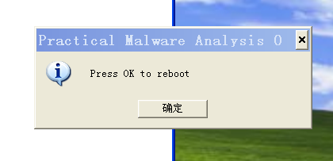
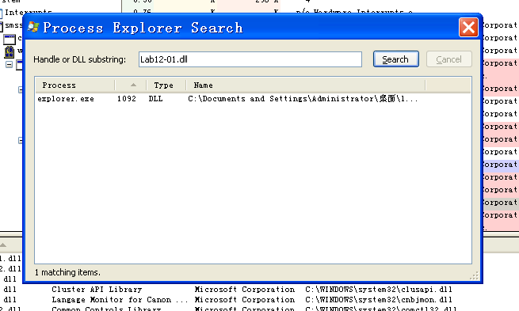
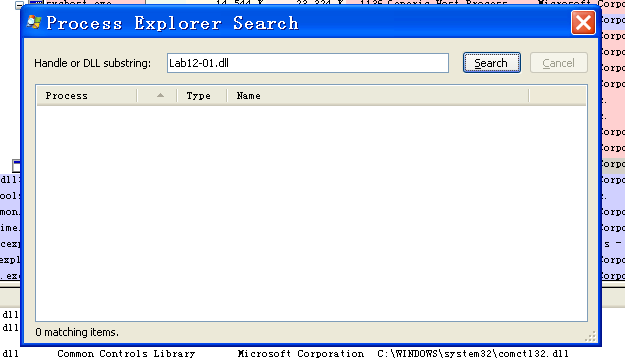
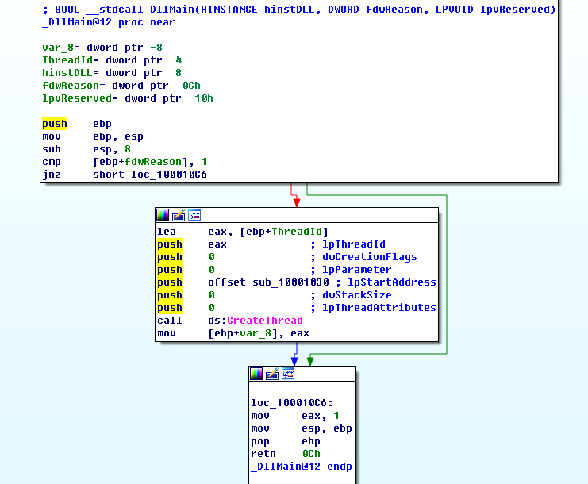
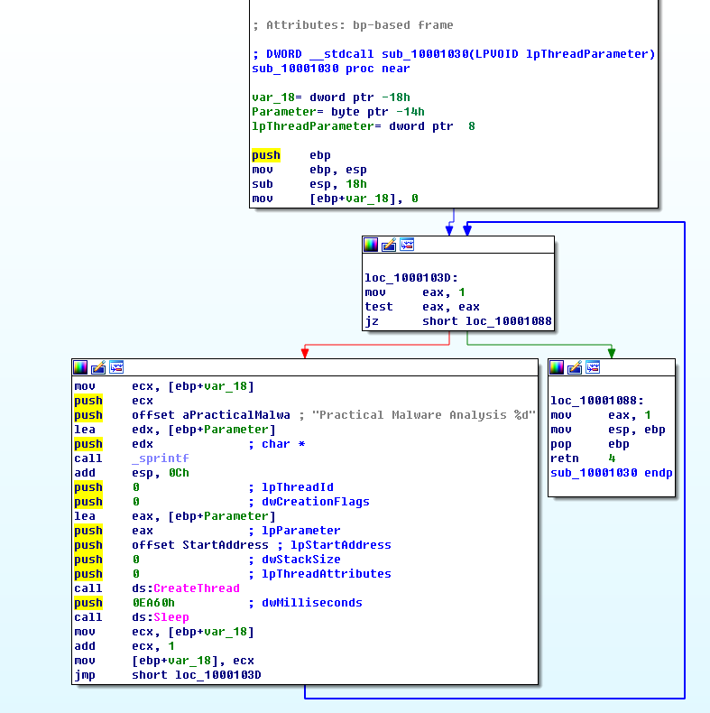
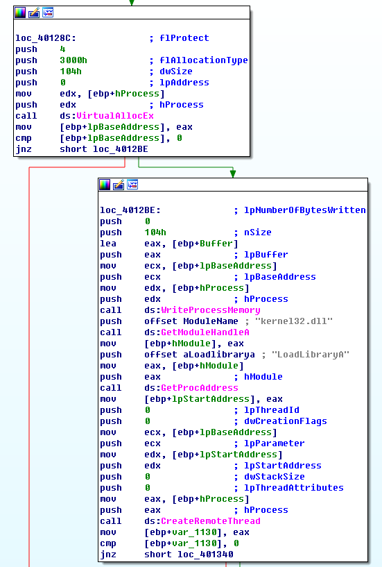

## lab 12-1

> 1811464 郑佶 信息安全单学位

#### 问题1: 运行恶意代码的结果

点击`Lab12-01.exe`运行该程序,弹出如下消息对话框

并且,关闭该对话框或是点击`确定`后,该消息都会每隔一分钟弹出一次,且窗口名`Practical Malware Analysis`后的序号从`0`开始不断自增`1`.

#### 问题2: 被注入的进程

为分析被注入的进程,使用进程浏览器`Process Explorer`分析引用库文件`Lab12-01.dll`的进程.

打开`Process Explorer`后,点击菜单栏的`Find`按钮,查找该`DLL`,得到如下的信息

可以发现进程`explorer.exe`引用了库文件`Lab12-01.dll`.

由此可知,被注入的进程是`explorer.exe`.

#### 问题3: 停止恶意代码运作的方式

由于使用的是进程注入的方式运行恶意代码,所以程序文件应该未被修改.因此,在`Process Explorer`中强制重启`explorer.exe`进程可以停止恶意代码的运行.

进程`explorer.exe`重启后,查找引用库文件`Lab12-01.dll`的进程,得到如下信息

已经不存在引用恶意代码的库文件的进程,经测试,窗口也不再弹出.

总之,停止弹窗的方法是在强制重启`explorer.exe`进程.

#### 问题4: 分析程序运行流程

首先分析实现弹窗功能的库文件`Lab12-01.dll`.使用`IDA Pro`分析其主函数`DLLMain`,其流程图如下

可以发现`DLLMain`创建了调用子过程`sub_10001030`的线程.子过程`sub_10001030`流程图如下

经分析,该子过程运行流程如下

- 设置窗口序号为`0`

- 进入循环
  - 将序号作为格式化字符串`Practical Malware Analysis %d`参数
  - 创建调用函数`StartAddress`的线程
    - 该函数调用`MessageBox`函数调用对话框
    - 对话框标题为上述的格式化字符串
  - 休眠`0xEA60`毫秒,即`60`秒

通过上述对库文件`Lab12-01.dll`的分析,对弹窗功能的实现已经分析完成.接下来分析程序`Lab12-01.exe`,分析程序完成进程替换的流程.

使用`IDA Pro`分析`Lab12-01.exe`的`main`函数,可知其运行流程如下

- 载入库文件`psapi.dll`的`EnumProcessModules`函数、`GetModuleBaseName`函数、`EnumProcesses`函数,并取得这三个函数的内存地址,这些函数与进程信息的枚举相关
- 得到恶意库文件`Lab12-01.dll`的完整路径
- 函数`EnumProcesses`遍历进程`PID`,得到进程数组`dwProcessID`
- 循环比较进程名是否为`explorer.exe`,否则进入下一次循环,是则打开`explorer.exe`进程
- 在打开的`explorer.exe`进程中进行`DLL`代码注入,==下面继续分析==

接下来详细分析上述的代码注入部分的流程,其流程图如下

经过分析,其具体流程如下

- 申请内存,写入`Lab12-01.dll`的路径
- 得到`explorer.exe`的进程地址,将路径信息写入该进程空间
- 函数`CreateRemoteThread`在`explorer.exe`创建远程线程,运行恶意代码

综合上述的分析,已经可以全面的理解恶意代码的工作方式,流程如下

- 程序`Lab12-01.exe`向进程`explorer.exe`注入恶意库文件`Lab12-01.dll`
- `explorer.exe`装载库文件`Lab12-01.dll`时,默认调用`DLLMain`函数实现循环跳出弹窗的恶意功能

