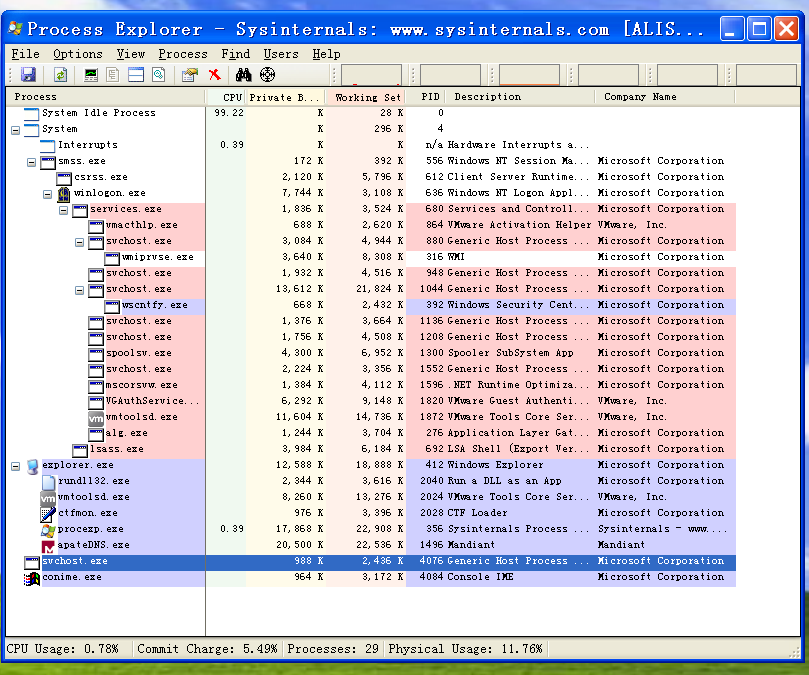
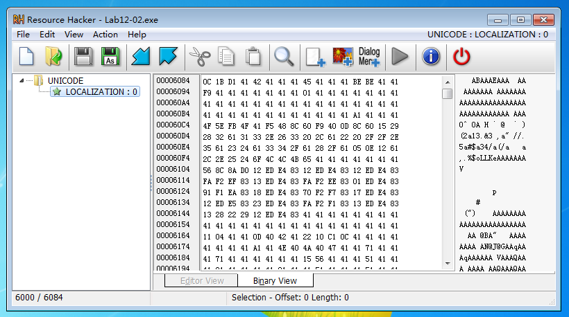

## lab 12-2

> 1811464 郑佶 信息安全单学位

#### 问题1: 分析程序的目的

在分析该程序时,值得注意的是,该程序的`hash`值与`Lab03-03.exe`相同,即程序即是程序`Lab03-03.exe`.

根据参考的`lab3-3实验报告`,使用`Process Explorer`检查程序运行的结果,得到以下这张图

根据`Lab3-3报告`的分析,可知该程序实现进程替换,替换了进程`svchost.exe`,因为这是个孤儿进程,没有常见的父进程`services.exe`.

关于程序的文件操作,使用`Process Monitor`监控文件操作记录,得到以下图片

这说明程序创建了文件`practicalmalwareanalysis.log`并进行读写.

综上,该程序的目的是

- 运行`svchost.exe`孤儿进程(指无父进程)

- 改变`svchost.exe`的功能,运行恶意代码,恶意代码收集系统运行信息存入文件`practicalmalwareanalysis.log`

#### 问题2: 隐蔽执行的方式

为分析程序隐蔽执行的方式,打开`IDA Pro`分析之.

经分析,其运行流程如下

- 检查程序命令行参数个数,个数为`2`时则休眠`60`秒后退出运行

- 获得当前程序句柄
- 调用子过程`sub_40149D`,得到`system32`目录下`svchost.exe`的完整路径
- 调用子过程`sub_40132C`,调用资源节数据并写入内存,判断资源节头两字节是否为`0x4D,0x5A`
  - 开头两字节`0x4D5A`指定程序是`PE`文件
- 调用子过程`sub_4010EA`,==随后分析==
- 释放占用的内存空间,休眠`60`秒后退出运行

值得注意的是`main`函数的子过程`sub_4010EA`,显然该函数是实现隐蔽执行的主要模块,经分析,其主要运行流程如下

- 两次调用`_memset`函数初始化`StartupInfo`结构体

- 以挂起状态打开进程`svchost.exe`
  - 参数`dwCreationFlags`值为`4`
  - 同时填充`StartInfo`结构体
  
- 调用函数`GetThreadContext`得到`svchost.exe`的线程上下文

  - 使用`WinDbg`的`dt ntdll!_CONTEXT`指令可得知上下文结构体`_CONTEXT`的结构

- 读取`svchost.exe`的进程空间,得到`svchost.exe`的`_PEB`结构体中的偏移量为`0x8`的成员
  - 使用`WinDbg`的`dt ntdll!_PEB`指令得知该成员为`ImageBaseAddress`
  
    
  
- 读取`ntdll`模块的`NtUnmapViewOfSection`函数地址,并读取其地址

- 

#### 问题3: 程序的负载位置

使用`ResourceHacker`分析程序的资源节,可以得到以下信息

可以发现存在`UNICODE`型资源节`LOCALIZATION`,由此可知,程序

