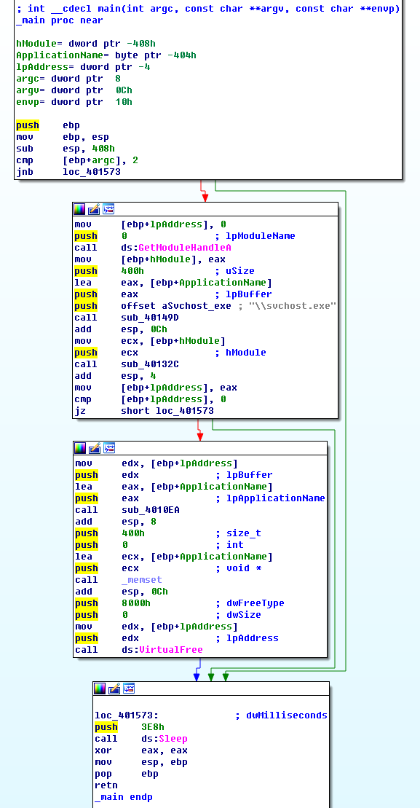
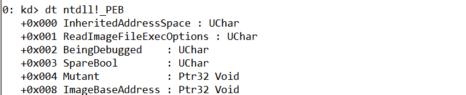

## lab 12-2

> 1811464 郑佶 信息安全单学位

#### 问题1: 分析程序的目的

在分析该程序时,值得注意的是,该程序的`hash`值与`Lab03-03.exe`相同,即程序即是程序`Lab03-03.exe`.

根据参考的`lab3-3实验报告`,使用`Process Explorer`检查程序运行的结果,得到以下这张图

根据`Lab3-3报告`的分析,可知该程序实现进程替换,替换了进程`svchost.exe`,因为这是个孤儿进程,没有常见的父进程`services.exe`.

关于程序的文件操作,使用`Process Monitor`监控文件操作记录,得到以下图片

这说明程序创建了文件`practicalmalwareanalysis.log`并进行读写.

综上,该程序的目的是

- 运行`svchost.exe`孤儿进程(指无父进程)

- 改变`svchost.exe`的功能,运行恶意代码,恶意代码收集系统运行信息存入文件`practicalmalwareanalysis.log`

#### 问题2: 隐蔽执行的方式

为分析程序隐蔽执行的方式,打开`IDA Pro`分析之.

经分析,其运行流程如下

- 检查程序命令行参数个数,个数为`2`时则休眠`60`秒后退出运行

- 获得当前程序句柄
- 调用子过程`sub_40149D`,得到`system32`目录下`svchost.exe`的完整路径
- 调用子过程`sub_40132C`,其功能主要是使用资源节文件,==在问题4中分析==
- 调用子过程`sub_4010EA`,==随后分析==
- 释放占用的内存空间,休眠`60`秒后退出运行

这里,值得注意的是`main`函数的子过程`sub_4010EA`,根据排除法,该函数显然是实现隐蔽执行的主要模块.

经分析,其主要运行流程如下

- 打开进程`svchost.exe`

  - 参数`dwCreationFlags`值为`CREATE_SUSPENDED`=`0x4`,表示打开时挂起主线程
  - 进程信息存放在`StartInfo`、`ProcessInformation`结构体

- 调用函数`GetThreadContext`得到`svchost.exe`的线程上下文,线程上下文存储于结构体`CONTEXT`的结构

- 读取`svchost.exe`的进程空间内存,得到`svchost.exe`的进程上下文`CONTEXT`结构体

  - 寻找`CONTEXT`结构体偏移量为`0xA4`的成员,如下在`WinDbg`中使用指令`dt ntdll!_CONTEXT`得知该成员为`ebx`寄存器值

    

  - 由于在挂起状态的进程的`CONTEXT`的`ebx`寄存器值指向进程块`PEB`,所以寻找`PEB`结构体`0x08`偏移量的成员,如下在`WinDbg`中使用指令`dt ntdll!_PEB`得知该成员为`ImageBaseAddress`,也就是可执行文件`svchost.exe`在内存中映射的起始地址

  

- 读取`ntdll`模块的`NtUnmapViewOfSection`函数地址

- 调用`NtUnmapViewOfSection`卸载内存中映射的`svchost.exe`文件,作为参数的卸载地址为上面得到的`ImageBaseAddress`

- 调用`WriteProcessMemory`在可执行文件`svchost.exe`在内存中映射的起始地址开始写入资源文件数据

- 修改`PEB`结构体中的`ImageBaseAddress`的值,使该值指向可执行文件在内存中映射的起始地址

- 修改`CONTEXT`结构体中`eax`的值,使该值指向当前函数的入口地址

综上,程序隐蔽执行的方法是

- 以挂起的方式打开被害进程,并记录进程信息
- 查找进程信息,卸载被害进程的可执行文件在内存中映射的内存区间
- 在被害进程的可执行文件在内存中映射的内存区间中申请空间,并在该区间写入恶意代码
- 外部唤醒该进程使之解除挂起继续执行

#### 问题3: 程序载荷的存储位置

使用`ResourceHacker`分析程序的资源节,可以得到以下信息

可以发现存在`UNICODE`型资源节`LOCALIZATION`,由此可知,程序将有效载荷存放在资源节中.

#### 问题4: 保护恶意载荷的方式

根据`问题2`的分析,调用资源节的恶意载荷的函数主要是函数`sub_40132C`,其流程图如下

该子过程的运行流程大致可总结为以下的步骤

- 找到资源节并载入资源
- 锁定资源节数据,并申请内存空间将资源节数据载入内存
- 检查资源节的头两字节是否为`MZ`,判断是否为`PE`文件(`MZ`解密后即为`PE`)
- 调用子过程`sub_401000`解密资源节数据

因此,程序保护恶意载荷的方式是加密资源节数据.

#### 问题5: 保护字符串列表的方式

为分析具体加密资源节数据的流程,接下来分析子过程`sub_401000`中解密资源节数据的流程

显然,上述该子过程的运行流程就是循环执行`xor`指令实现异或解密.

为分析异或加密解密的密钥,查看子过程`sub_40132C`中调用子过程`sub_401000`时的参数,如下

如上,可知异或加密的密钥是`0x41`.

综上,程序保护载荷中字符串的方式是使用密钥`0x41`异或加密资源节数据.

