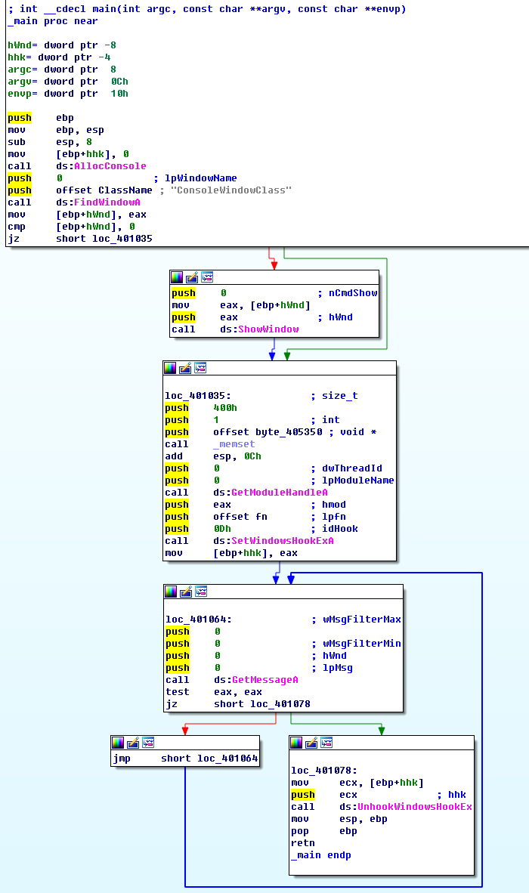
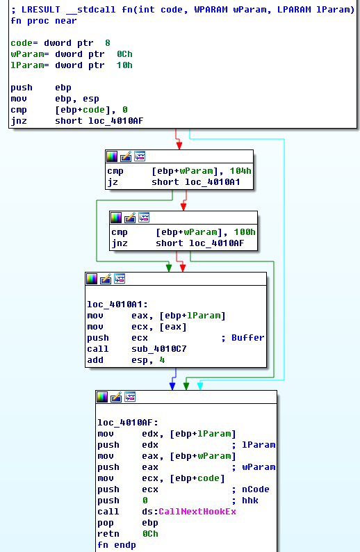

## lab 12-3

> 1811464 郑佶 信息安全单学位

#### 问题1: 程序恶意负载的目的

由于`Lab12-03.exe`是从`Lab12-02.exe`中抽取的恶意代码,由此可大致了解该程序是个击键记录器.

接下来分析该程序,其流程图如下

其运行流程如下

- 调用函数`AllocConsole`被当前进程分配一个控制台
- 调用函数`FindWindow`获得控制台的句柄
- 调用函数`ShowWindow`设置当前控制台为隐藏状态
- 调用函数`GetModuleHandle`得到当前程序的句柄
- 调用函数`SetWindowsHookEx`执行挂钩
  - 参数`lpfn`指定挂钩的函数为`fn`
  - 参数`idHook`指定挂钩方式为`WH_KEYBOARD_LL`=`0x0D`,即键盘事件监控
- 循环调用函数`GetMessage`获得键盘输入,直至收到`WM_QUIT`调用`UnhookWindowsHook`取消该挂钩

综上可知,程序的确是个击键记录器.

#### 问题2: 恶意代码注入自身的方式

根据`问题1`的分析,可知程序调用了`SetWindowsHookEx`进行程序的挂钩,将程序`fn`挂钩在当前程序的句柄上.

总而言之,该程序使用挂钩函数实现恶意代码的注入,以记录击键记录.

#### 问题3: 程序创建的文件

为分析程序创建的文件,需要分析挂钩的函数`fn`实现的功能,其流程图如下

经过分析,可知函数`fn`的运行流程如下

- 检查当前收到的键盘输入是否为`0x104`或`0x100`,否则不处理该输入
  - 键盘输入`0x104`即`WM_SYSKEYDOWN`
  - 键盘输入`0x100`即`WM_KEYFIRST`
- 调用子过程`sub_4010C7`处理键盘输入信息
- 捕捉下一个键盘输入

继续分析处理键盘输入信息的`sub_4010C7`,其流程如下

- 创建文件`practicalmalwareanalysis.log`
- 调用函数`SetFilePointer`得到该文件末尾指针
- 调用函数`GetForegroundWindow`得到最前端窗口的句柄
- 调用函数`GetWindowText`得到最前端窗口信息,包括标题等
- 将最前端窗口标题和键盘输入写入文件`practicalmalwareanalysis.log`

综上,程序创建文件`practicalmalwareanalysis.log`,用以保存击键记录和最前端窗口标题.

