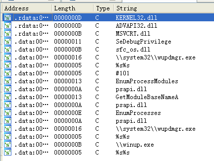

## lab 12-4

> 1811464 郑佶 信息安全单学位

#### 问题1: 分析指定地址的代码功能

> 指定地址:`0x401000`

该地址的代码即子过程`sub_401000`,可找到其调用位置如下

可见该子过程的参数是一个进程的`ID`.子过程`sub_401000`流程图如下

可以看到上述的程序一开始涉及大量的字符串比较,可以使用`IDA Pro`查看这些用于比较的全局变量的值,如下

上述的十六进制值转换成字符串即为`winlogon.exe`和`<not real>`.

程序中还引用了用全局变量表示的函数名,查询这些变量的调用位置,得到如下信息

由此可知全局变量`dword_403128`即`GetModuleBaseName`函数,`dword_40312C`即`EnumProcessModules`函数

经过分析,子过程`sub_401000`运行流程如下

- 使用给定进程`ID`打开进程
- 调用函数`EnumProcessModules`的到进程列表数组
- 调用函数`GetModuleBaseName`获取文件完整路径,取得进程名
- 调用函数`_stricmp`比较进程名字符串,判断是否为`winlogon.exe`

综上,子过程`sub_401000`的功能是根据给出的进程`ID`判断进程名是否为`winlogon.exe`.

#### 问题2: 被注入恶意代码的进程

为分析被注入恶意代码的进程,使用`IDA Pro`打开字符串列表中寻找可疑的文件名,得到如下信息

可找到可疑的文件路径`\\system32\\wupdmgr.exe`、`\\winup.exe`.

