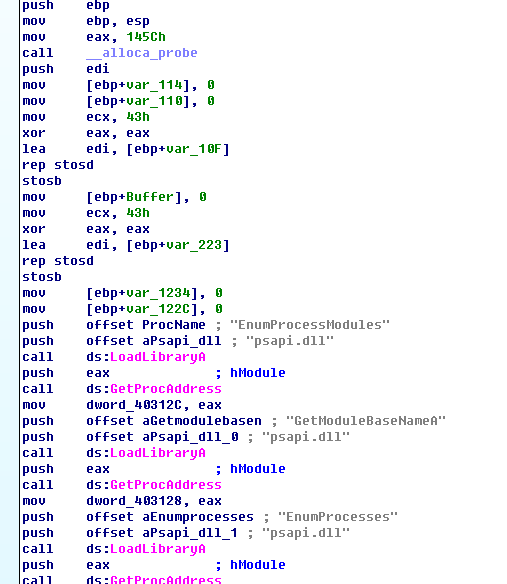
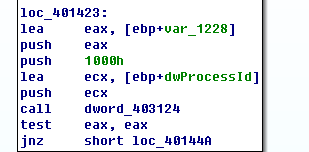

## lab 12-4

> 1811464 郑佶 信息安全单学位

#### 问题1: 分析指定地址的代码功能

> 指定地址:`0x401000`

该地址的代码即子过程`sub_401000`,可找到其调用位置如下

可见该子过程的参数是一个进程的`ID`.子过程`sub_401000`流程图如下

可以看到上述的程序一开始涉及大量的字符串比较,可以使用`IDA Pro`查看这些用于比较的全局变量的值,如下

上述的十六进制值转换成字符串即为`winlogon.exe`和`<not real>`.

程序中还引用了用全局变量表示的函数名,查询这些变量的调用位置,得到如下信息

由此可知全局变量`dword_403128`即`GetModuleBaseName`函数,`dword_40312C`即`EnumProcessModules`函数

经过分析,子过程`sub_401000`运行流程如下

- 使用给定进程`ID`打开进程
- 调用函数`EnumProcessModules`的到指定进程信息数组
- 调用函数`GetModuleBaseName`获取文件完整路径,取得进程名
- 调用函数`_stricmp`比较进程名字符串,判断是否为`winlogon.exe`

综上,子过程`sub_401000`的功能是根据给出的进程`ID`判断进程名是否为`winlogon.exe`.

#### 问题2: 被注入恶意代码的进程

为分析被注入恶意代码的进程,使用`IDA Pro`分析整个`Lab12-04.exe`.

首先分析`main`函数第一部分.

如上的`main`函数第一部分功能主要是取得库文件`psapi.dll`中函数`EnumProcessModules`、`GetModuleBaesName`、`EnumProcesses`的地址并保存.

其次分析`main`函数第二部分.

如上的`main`函数第二部分依次调用了函数`dword_403124`(`EnumProcesses`)、`sub_401000`、`sub_401174`,其功能主要如下

- 调用函数`EnumProcesses`列出当前进程`ID`列表
- 调用函数`sub_401000`,查找进程`winlogon.exe`
- 调用`sub_401174`,==该函数随后分析==

接下来分析上面谈及的`sub_401174`

由此可知,子过程`sub_401174`的功能如下

- 调用子过程`sub_4010FC`提升程序运行权限
- 加载`sfc_os.dll`的第`2`个函数`SfcTerminateWatcherThread`,并得到其地址,该函数用于关闭`Windows`文件保护
- 在`winlogon.exe`创建远程线程`SfcTerminateWatcherThread`关闭文件保护

根据上面的分析,我们可以知道被注入的进程是`winlogon.exe`,在其中注入的远程线程执行`SfcTerminateWatcherThread`函数关闭`Windows`文件保护.

#### 问题3: 程序装载的库文件

如上,根据`问题2`中的分析,可知上述的子进程`sub_401174`装载了`sfc_os.dll`库文件,以调用其中第`2`号导出函数的`SfcTerminateWatcherThread`函数关闭`Windows`文件保护.

#### 问题4: 指定函数被调用时的参数

> 指定函数:`CreateRemoteThread`函数

如上,调用`CreateRemoteThread`时的第`4`个参数`lpStartAddress`是函数`GetProcAddress`的返回值,即`sfc_os.dll`库文件的第`2`号函数`SfcTerminateWatcherThread`的地址.

#### 问题5: 程序释放出的恶意代码

为分析程序释放恶意代码的行为,需要最后分析`main`函数第三部分.

如上的`main`函数第三部分依次调用`GetWindowsDirectory`、`_snprintf`、`MoveFile`函数,其功能主要如下

- 拼接得到`wupdmgr.exe`的完整文件路径`C:\\Windows\\system32\\wupdmgr.exe`
- 拼接得到`winup.exe`的完整文件路径`C:\\Documents and Settings\\Administrator\\Local Settings\\Temp\\winup.exe`
- 将上述`wupdmgr.exe`移动到`winup.exe`的位置
- 调用子进程`sub_4011FC`
  - 载入资源节的`BIN`类型资源`#101`
  - 将资源节内容写入原`wupdmgr.exe`的位置
  - 运行`wupdmgr.exe`

由此可见,子过程`sub_4011FC`涉及了资源节数据的释放.

综上,释放资源节恶意代码的流程如下

- 保存`system32`文件夹下`wupdmgr.exe`到临时文件夹下的`winup.exe`
- 释放资源节的`BIN`类型资源`#101`节到`system32`文件夹下`wupdmgr.exe`
- 执行资源节释放得到的恶意代码`wupdmgr.exe`

#### 问题6: 释放恶意代码的目的

关于恶意代码替换的`wupdmgr.exe`文件,经查询资料,该程序与`Windows`更新相关.

所以综合`问题2`、`问题3`、`问题4`、`问题5`的分析,我们可以对程序释放恶意代码的目的得到以下结论

- 找到`winlogon.exe`进程并用其创建远程线程关闭文件保护
- 在文件保护关闭后,替换`wupdmgr.exe`,污染系统的更新程序,将其成为木马程序

