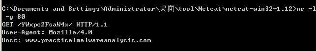

## lab 13-1

> 1811464 郑佶 信息安全单学位

#### 问题1: 分析被加密的元素

首先使用动态分析该程序的网络行为.

首先打开`ApateDNS`的重定向功能,将`DNS`请求重定向至`127.0.0.1`.再使用`netcat`监控`80`端口,随后运行程序`Lab13-01.exe`.

得到如下截获的`DNS`请求.


可见该程序对外发送的请求中包含有字符串`www.practicalmalwareanalysis.com`、`YWxpc2FsaW4tYmQ1`

使用`IDA Pro`分析程序的字符串列表,未发现这些字符串,推测这些字符串是通过加密解密得到.


#### 问题2: 搜索指定字符串以分析加密类型

> 指定字符串:`xor`

使用`IDA Pro`的菜单栏中的`search`栏,选择`text`项,勾选`Find All Occurences`以搜索所有`xor`指令,得到如下信息


首先我们需要知道,对同一寄存器的`xor`指令的作用都是清空寄存器值.

因此,所以上图中被`main`函数调用的汇编语句中,唯一可能用于加密的汇编语句是位于`0x004011B8`处的`xor eax,0x3B`.

查看这个指令调用的位置,得到如下信息


可以看到,这个指令被子过程`sub_401190`调用.

从这个这个子过程的循环结构可以得知,其功能明显是实现循环异或加密.

综上,位于`0x004011B8`处存在用于被子过程`sub_401190`调用的加密异或指令`xor eax,0x3B`.


#### 问题3: 分析加密密钥与加密内容

首先分析这个解密过程使用的密钥,分析汇编指令即可.由于用于解密的异或指令是`xor eax,0x3B`,所以加密的密钥显然是`0x3B`.

接着分析被加密的内容,这一步使用动态分析更为便捷.使用`OllyDbg`分析用于解密的子过程`sub_401190`的运行结果.在`sub_401190`函数调用返回后的位置`0x4013AC`处设置断点.


如上,在程序运行击中断点后,在栈顶的值指向的指针处发现字符串`www.practicalmalwareanalysis.com`.显然,这就是被加密的字符串.

综上,加密密钥为`0x3B`,被加密内容为`www.practicalmalwareanalysis.com`.


#### 问题4: 使用指定静态工具分析加密机制

> 指定静态工具:`FindCrypt2`、`Krypto ANALyzer`、`IDA 熵插件`

如下,在`PEiD`中选择插件`Krypto ANALyzer`


点击运行后,得到如下的信息


可知,在`0x4050E8`处存在`base64`编码表.


如上,在`0x4050E8`处找到`base64`编码表,内容为

```
ABCDEFGHIJKLMNOPQRSTUVWXYZabcdefghijklmnopqrstuvwxyz0123456789+/
```

综上,使用`Krypto ANALyzer`可以发现该程序使用了`Base64`加密,且存在`Base64`编码表.


#### 问题5: 分析发送部分网络数据时使用的加密类型

为分析发送网络数据时使用的加密类型,可以分析`问题1`中拦截到的`DNS`请求,如下


其中,`GET`请求报文的请求头存在一个明显的密文`YWxpc2FsaW4tYmQ1`.

根据`问题4`中得到的`Base64`编码表,推测上述的密文使用`Base64`加密.

上网搜索`Base64`加密解密工具,并尝试解密该密文,得到如下结果


可见,如上的密文的确是`Base64`加密的结果,且明文是`alisalin-bd5`,这疑似虚拟机的主机名.

打开虚拟机的`我的电脑`页面右键点击`属性`,得到如下的信息.


可见主机名为`alisalin-bd5181`,所以`Base64`加密时没有使用完整的主机名作为明文进行加密.

综上,该程序使用`Base64`加密主机名的一部分用以构建`GET`报文的请求头.


#### 问题6: `Base64`编码函数的位置

在`IDA Pro`中查找`Base64`编码表的引用位置,得到如下信息


由此可知,对此编码表的调用位置都位于子过程`sub_401000`中,接下来分析该子过程.

但是分析子过程`sub_401000`时,没有发现循环结构.由于并未发现明显的循环加密过程,考虑到该子过程将`Base64`编码表存入变量中传给父过程的可能,继续分析子过程`sub_401000`的父过程`sub_4010B1`.

可以在`sub_401000`的父过程`sub_4010B1`中发现如下的循环结构


由于这个循环过程在子过程`sub_401000`调用完成后使用了编码表数据,可以认为这就是`Base64`加密过程.

综上,`Base64`加密函数是子过程`sub_4010B1`,函数起始地址是`0x4010B1`.


#### 问题7: 分析`Base64`加密的最大长度与被加密内容

首先,可以根据`问题5`的分析得到大致结论.

主机名为`alisalin-bd5181`,而`Base64`加密时使用的明文是`alisalin-bd5`,长度为`12`.

接下来使用静态分析具体的代码.

由于得到主机名的函数是`gethostbyname`,所以查找`gethostbyname`的调用位置,得到如下信息


可见,在调用`Base64`加密函数`sub_4010B1`前调用了`_strncpy`函数.

由于`_strncpy`函数可以用于格式化复制字符串,所以也可以用于截取字符串,且参数`size_t`的值为`0xC=12`,即截取前`12`个字符.这可以印证上面的推测.

关于加密明文长度的限制,可以结合`Base64`加密的特点和`GET`报文的限制来分析.由于`Base64`加密将每`3`字节明文加密为`4`字节密文,所以将明文长度限制在`12`个字符可以限制密文在`16`个字节的长度,这也是`GET`报文请求头的限制.

综上,可以得到结论,加密内容是被感染主机的主机名的前`12`个字符.


#### 问题8: 分析`Base64`加密数据的填充字符

为测试加密数据中填充字符和明文的关系,修改主机名长度小于`12`字节进行测试.

当修改主机名为`alisalin`时(长度为`8`字节),截获的`DNS`请求如下.


可以发现在末尾填充字符`=`,且经过解密,明文的确为`alisalin`.

当修改主机名为`alisalin1`时(长度为`9`字节),截获的`DNS`请求如下.



可以发现不存在填充字符.

查询资料可知,由于`Base64`加密将每`3`字节明文加密为`4`字节密文,所以当字节长度不为`3`的倍数是显然需要填充字符.

综上,出现填充字符的情形是主机名长度小于`12`字节且长度不能被`3`整除.


#### 问题9: 分析程序的行为

若要分析程序的整体行为,需要分析整个程序的运行流程.


经过分析,`main`函数流程如下

- 调用子过程`sub_401300`,==随后分析==
- 启动`Socket`环境
- 进入循环
  - 休眠`0.5`秒
  - 调用子过程`sub_4011C9`,返回值不为`0`时退出循环
  - 休眠`30`秒
- 关闭`Socket`环境,==随后分析==

接下来分析`sub_401300`、`sub_4011C9`.

首先,可以在子过程`sub_401300`中发现资源节操作函数`FindResource`、`LoadResource`的调用,以及异或解密子过程`sub_401190`的调用.

使用`ResourceHacker`查看资源节数据,得到如下信息


经过在线工具的异或解密,可以得知上述密文解密后即是`www.practicalmalwareanalysis.com`.

由此,可知子过程`sub_401300`完成的是对资源节数据的载入和异或解密.

再分析子过程`sub_4011C9`,其流程图如下


经过分析,该子过程的从网络与`www.practicalmalwareanalysis.com`通信,发送`GET`报文,当收到以`0x6F`开头的报文时退出.

综上,整个程序的行为如下

- 从资源节取出网址密文,进行异或解密,得到恶意代码目标网址
- 构造`GET`报文与该网址进行`HTTP`通信,收到以`0x6F`开头的报文时退出运行

