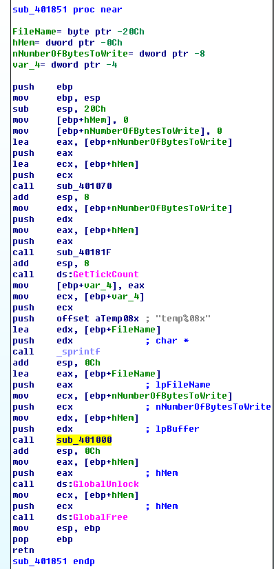
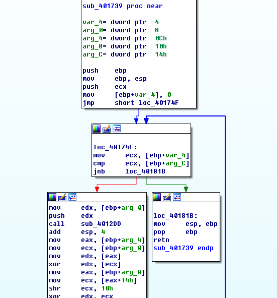
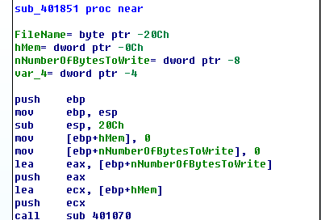
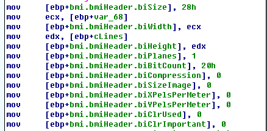
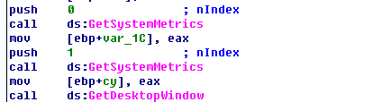
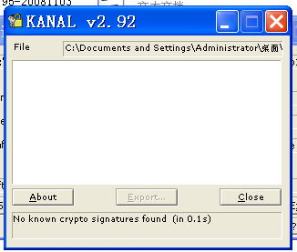
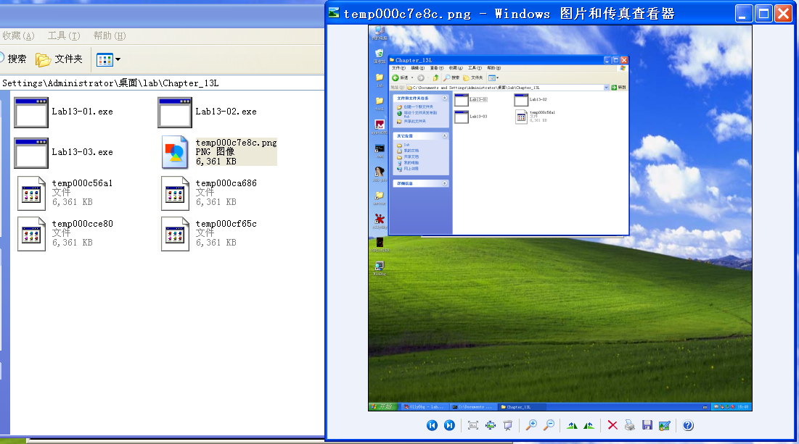

## lab 13-2

> 1811464 郑佶 信息安全单学位

#### 问题1: 动态分析确定程序的创建行为

为分析恶意代码的运行结果,使用`Procmon`分析系统获得记录.

打开程序监视器`Procmon`,点击`Filter`选择筛选条件为`Process Name = Lab13-02.exe`和`Operation = WriteFile`,点击关闭菜单栏的其他记录类别,仅选择选项`Show File System Activity`记录文件系统活动记录.点击`Clear`删除先前的记录.

点击运行恶意代码,得到如下的信息

打开`Lab13-02.exe`所在文件夹,得到如下信息

如上,在文件写入记录中,发现大量的可执行文件`Lab13-02.exe`路径下的创建的新文件写入,这些文件都以`temp`开头.

#### 问题2: 使用指定静态工具分析加密机制

> 指定静态工具:`xor指令搜索`、`FindCrypt2`、`Krypto ANALyzer`、`IDA 熵插件`

使用`IDA Pro`的菜单栏中的`search`栏,选择`text`项,勾选`Find All Occurences`以搜索所有`xor`指令,得到如下信息

首先可知,对同一寄存器的`xor`指令的作用都是清空寄存器值.

所以图中有意义的`xor`指令分别位于`0x004012D6`、`0x0040176F`、`0x00401795`、`0x004017BD`、`0x004017E5`,且均在子过程`sub_40128D`和子过程`sub_401739`中.

而是用其他的方式均未发现线索.

#### 问题3: 用于寻找加密函数的证据

为分析可以作为寻找加密函数的证据的导入函数,需要分析程序的使用的密文的线索.

首先,根据`问题1`的分析,恶意代码创建了大量`temp`开头文件名的恶意文件.使用记事本打开这些文件,可以发现大量乱码,可以推测这些内容为密文.

所以,再将密文写入到文件前必须要调用加密函数以加密写入的内容,而在`Windows`系统中使用`WriteFile`函数向文件写入内容.

综上,`WriteFile`函数可以作为一个寻找加密函数的线索,因为它常在加密函数加密密文完成后调用,用以将密文写入文件.

#### 问题4: 分析加密函数的位置

查找对函数`WriteFile`的引用,可以发现其只在子过程`sub_401000`中被调用.而`sub_401000`的父进程是`sub_401851`,其流程图如下

可以看到,在调用子过程`sub_401000`前还调用了`sub_40181F`、`GetTickCount`、`_sprintf`.

首先可以明白,`GetTickCount`函数的返回值是操作系统启动所经过的毫秒数.而后调用的`_sprintf`将这个毫秒数和格式化字符串`temp%08x`作为参数.所以可以推测,这两个函数的功能应该是得到以`temp`开头的文件名.

再往前看子过程`sub_40181F`,其在调用`memset`初始化内存区间后就简单调用了`sub_401739`.

如上可见,该子过程中有明显的循环结构和`xor`指令的调用,可以得知这是用于循环加密的函数.

综上,加密函数是`sub_40181F`.

#### 问题5: 分析原始加密内容

根据`问题4`的分析,为分析原始加密内容,可以查看子过程`sub_401851`在调用加密函数`sub_40181F`前的行为.

可以看到,在调用加密函数前,程序只调用了子过程`sub_401070`.分析该子过程,得到以下信息

可以看到,子过程`sub_401070`中存在对`BMI`结构体的操作.查询资料,可知`BMI`结构体是`位图`结构体.

再分析子过程`sub_401070`得到`位图`结构体方式,得到如下信息

可以看见,这里两次调用了`GetSystemMetrics`函数.参数为`SM_CXSCREEN`=`0`时获得系统屏幕的`x轴`分辨率,参数为`SM_CYSCREEN`=`1`时获得系统屏幕的`y轴`分辨率.所以可以推测,这里的位图应该是系统屏幕截图.

综上,被加密的原始内容那个应该是屏幕截图的位图.

#### 问题6: 分析加密算法和解密方式

使用`PEiD`的`KANAL`工具分析该程序中可能存在的加密方式,得到如下信息

使用其他工具得到相似结果,都无法识别到标准的加密算法.

由此可见,`sub_40181F`的加密方式不是标准的加密算法.

所以,解密的方法是使用`OllyDbg`等调试工具运行程序,并使加密函数`sub_40181F`无法正常执行以获得未加密内容.

#### 问题7: 使用解密工具恢复出原始文件

可以选择解密工具`OllyDbg`修改程序汇编代码实现.

修改汇编代码的方式是将子过程`sub_40181F`的位于`0x0040181F`处的第一个汇编指令修改为`retn`使其不运行.

然后运行修改后的程序,查看创建的`temp`开头文件名的文件,修改后缀名为`png`即可得到截图文件.操作成功结构如下

如上,经过上述的解密操作,得到的图片文件的确是当前的屏幕截图.证明恢复出了原始文件.