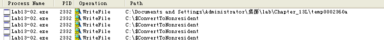
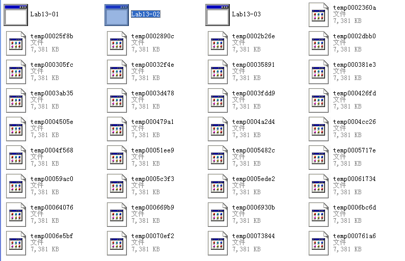
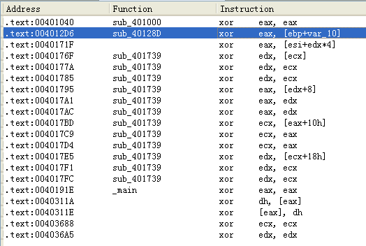

## lab 13-2

> 1811464 郑佶 信息安全单学位

#### 问题1: 动态分析确定程序的创建行为

为分析恶意代码的运行结果,使用`Procmon`分析系统获得记录.

打开程序监视器`Procmon`,点击`Filter`选择筛选条件为`Process Name = Lab13-02.exe`和`Operation = WriteFile`,点击关闭菜单栏的其他记录类别,仅选择选项`Show File System Activity`记录文件系统活动记录.点击`Clear`删除先前的记录.

点击运行恶意代码,得到如下的信息

打开`Lab13-02.exe`所在文件夹,得到如下信息

如上,在文件写入记录中,发现大量的可执行文件`Lab13-02.exe`路径下的创建的新文件写入,这些文件都以`temp`开头,文件名长度都为`12`个字符.

#### 问题2: 使用指定静态工具分析加密机制

> 指定静态工具:`xor指令搜索`、`FindCrypt2`、`Krypto ANALyzer`、`IDA 熵插件`

使用`IDA Pro`的菜单栏中的`search`栏,选择`text`项,勾选`Find All Occurences`以搜索所有`xor`指令,得到如下信息

首先可知,对同一寄存器的`xor`指令的作用都是清空寄存器值.

所以图中有意义的`xor`指令分别位于`0x004012D6`、`0x0040176F`、`0x00401795`、`0x004017BD`、`0x004017E5`,且均在子过程`sub_40128D`和子过程`sub_401739`中.

而是用其他的方式均未发现线索.

#### 问题3: 用于寻找加密函数的证据

为分析可以作为寻找加密函数的证据的导入函数,需要分析程序的使用的密文的线索.

首先,根据`问题1`的分析,恶意代码创建了大量`temp`开头文件名的恶意文件.使用记事本打开这些文件,可以发现大量乱码,可以推测这些内容为密文.

所以,再将密文写入到文件前必须要调用加密函数以加密写入的内容,而在`Windows`系统中使用`WriteFile`函数向文件写入内容.

综上,`WriteFile`函数可以作为一个寻找加密函数的线索,因为它常在加密函数加密密文完成后调用,用以将密文写入文件.

#### 问题4: 分析加密函数的位置

