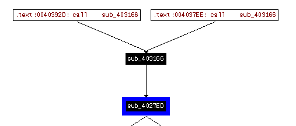

## lab 13-3

> 1811464 郑佶 信息安全单学位

#### 问题1: 分析被加密的元素

为分析程序的动态字符串信息,可以考虑使用`netcat`监听数据包和运行程序得到直接的字符串输出.

由于运行该程序未得到直接的字符串输出,考虑使用`netcat`监听.打开`ApateDNS`的重定向功能,将`DNS`请求重定向至`127.0.0.1`.再使用`netcat`监控`8910`端口,随后运行程序`Lab13-03.exe`.

但使用`netcat`监听`80`和`443`端口时,未得到截获的数据包,考虑使用其他端口通信的可能.

使用`IDA Pro`查看程序中对`htons`、`connect`等`socket`通信函数的调用,得到如下信息

可以看到`htons`函数的参数为`0x22CE`=`8910`.该函数用于将`x86`字节序转变为网络字节序.该返回值作为`connect`函数的`sockaddr`型变量`name`的低`16`位.说明该值是网络端口号为`8910`.

切换端口为`8910`得到如下截获的`DNS`请求.

可以发现大量的类似乱码的数据,无法分辨这些数据的内容.这些数据无法在静态分析中得到,所以程序中可能存在加密算法.

#### 问题2: `xor`指令搜索分析加密类型

使用`IDA Pro`的菜单栏中的`search`栏,选择`text`项,勾选`Find All Occurences`以搜索所有`xor`指令,得到如下信息

可以发现多次数组`Rijndael`加密和解密常量的数组的使用.其中`Te`指加密常量,`Td`指解密常量.

具体的调用情况如下

- `sub_40223A`:`12`个调用加密常量的`xor`语句
- `sub_4027ED`:`12`个调用解密常量的`xor`语句
- `sub_402DA8`:`3`个调用加密常量的`xor`语句
- `sub_403166`:`3`个调用解密常量的`xor`语句

这表示程序中使用了`Rijndael`(`AES`)加密算法相关的常量.

综上,使用`xor`指令搜索可以发现`AES`加密算法的使用.

#### 问题3: 使用指定静态工具分析加密类型

> 指定静态工具:`FindCrypt2`、`Krypto ANALyzer`(`KANAL`)、`IDA 熵插件`

如下,在`PEiD`中选择插件`KANAL`,得到如下信息

如上,`S`指代`Rijndael`算法加密常量,`S-inv`指代`Rijndael`算法解密常量.这表明程序中存在对`Rijndael`算法加密常量的两次调用和对`Rijndael`算法解密常量的两次调用.

结合`问题2`中的分析,可以发现存在加密算法的地址区域,同样可以找到`xor`指令的使用.

综上,使用指定的静态工具可以发现`AES`加密算法的使用.

#### 问题4: 确定使用的加密算法

根据`问题2`的分析,可以使用`xor`指令搜索在程序中能找到`AES`加密算法相关常量的使用.根据`问题3`的分析,使用`KANAL`工具可以确认疑似`AES`加密算法存在.

根据`问题2`中得知的调用情况,可知子过程`sub_40223A`和`sub_402DA8`存在对`AES`加密常量的调用,子过程`sub_4027ED`和`sub_403166`存在对`AES`解密常量的调用.这些函数的交叉引用情况如下

如上是调用加密常量的函数,使用`IDA Pro`可以大致得知以下信息

- 子过程`sub_4015B7`调用管道、进程、线程相关函数
- 子过程`sub_40132B`调用文件读写相关函数
- 子过程`sub_40352D`存在循环结构和异常报错信息

所以,显然子过程`sub_40352D`为`AES`加密函数.

如上时调用解密常量的函数.与子过程`sub_40352D`类似,子过程`sub_403166`也存在循环结构和异常报错信息,所以`sub_403166`为`AES`解密函数.

根据上述的判断,可以确定`AES`加密算法的存在.

关于`Base64`算法的使用,使用`IDA`分析字符串时,可以得到如下信息

如上,能在程序中找到`Base64`编码表,这暗示`Base64`加密函数存在的可能.由于该编码表不是标准的`Base64`编码表,所以可以认为这是未被`KANAL`等静态工具识别出来的原因.

根据`问题3`的分析,可以使用`IDA Pro`的字符串子视图找到`Base64`编码表的使用.查看这个编码表的引用位置,

