## lab 13-3

> 1811464 郑佶 信息安全单学位

#### 问题1: 分析被加密的元素

为分析程序的动态字符串信息,可以考虑使用`netcat`监听数据包和运行程序得到直接的字符串输出.

由于运行该程序未得到直接的字符串输出,考虑使用`netcat`监听.打开`ApateDNS`的重定向功能,将`DNS`请求重定向至`127.0.0.1`.再使用`netcat`监控`8910`端口,随后运行程序`Lab13-03.exe`.

但使用`netcat`监听`80`和`443`端口时,未得到截获的数据包,考虑使用其他端口通信的可能.

使用`IDA Pro`查看程序中对`htons`、`connect`等`socket`通信函数的调用,得到如下信息

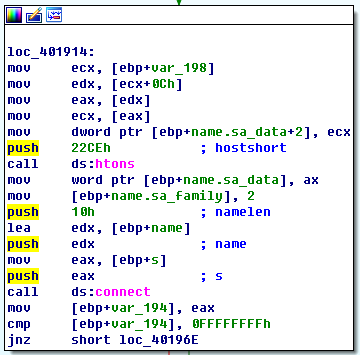

可以看到`htons`函数的参数为`0x22CE`=`8910`.该函数用于将`x86`字节序转变为网络字节序.该返回值作为`connect`函数的`sockaddr`型变量`name`的低`16`位.说明该值是网络端口号为`8910`.

切换端口为`8910`得到如下截获的`DNS`请求.

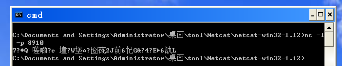

可以发现大量的类似乱码的数据,无法分辨这些数据的内容.这些数据无法在静态分析中得到,所以程序中可能存在加密算法.


#### 问题2: `xor`指令搜索分析加密类型

使用`IDA Pro`的菜单栏中的`search`栏,选择`text`项,勾选`Find All Occurences`以搜索所有`xor`指令,得到如下信息

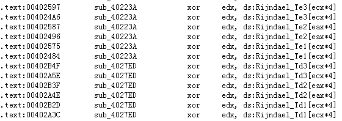

可以发现多次数组`Rijndael`加密和解密常量的数组的使用.其中`Te`指加密常量,`Td`指解密常量.

具体的调用情况如下

- `sub_40223A`:`12`个调用加密常量的`xor`语句
- `sub_4027ED`:`12`个调用解密常量的`xor`语句
- `sub_402DA8`:`3`个调用加密常量的`xor`语句
- `sub_403166`:`3`个调用解密常量的`xor`语句

这表示程序中使用了`Rijndael`(`AES`)加密算法相关的常量.

综上,使用`xor`指令搜索可以发现`AES`加密算法的使用.


#### 问题3: 使用指定静态工具分析加密类型

> 指定静态工具:`FindCrypt2`、`Krypto ANALyzer`(`KANAL`)、`IDA 熵插件`

如下,在`PEiD`中选择插件`KANAL`,得到如下信息

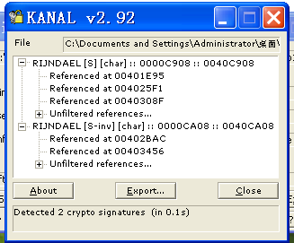

如上,`S`指代`Rijndael`算法加密常量,`S-inv`指代`Rijndael`算法解密常量.这表明程序中存在对`Rijndael`算法加密常量和解密常量的多次调用.

结合`问题2`中的分析,可以发现加密解密常量被调用的地址区域,正是`xor`指令所在地址.

综上,使用指定的静态工具可以发现`AES`加密算法的使用.

#### 问题4: 确定使用的加密算法

根据`问题2`的分析,可以使用`xor`指令搜索在程序中能找到`AES`加密算法相关常量的使用.根据`问题3`的分析,使用`KANAL`工具可以确认疑似`AES`加密算法存在.

根据`问题2`中得知的调用情况,可知子过程`sub_40223A`和`sub_402DA8`存在对`AES`加密常量的调用,子过程`sub_4027ED`和`sub_403166`存在对`AES`解密常量的调用.这些函数的交叉引用情况如下

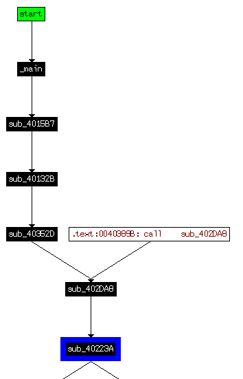

如上是调用加密常量的函数,使用`IDA Pro`可以大致得知以下信息

- 子过程`sub_4015B7`调用管道、进程、线程相关函数
- 子过程`sub_40132B`调用文件读写相关函数
- 子过程`sub_40352D`存在循环结构和异常报错信息

所以,显然子过程`sub_40352D`为`AES`加密函数.根据上述的判断,可以确定`AES`加密算法的存在.

另外,还可以确认到`Base64`加密算法的使用.使用`IDA`分析字符串时,可以得到如下信息

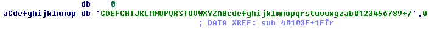

如上,能在程序中找到`Base64`编码表,这暗示`Base64`加密函数存在的可能.由于该编码表不是标准的`Base64`编码表,所以可以认为这是未被`KANAL`等静态工具识别出来的原因.

根据`问题3`的分析,可以使用`IDA Pro`的字符串子视图找到`Base64`编码表的使用.查看这个编码表的引用位置,如下

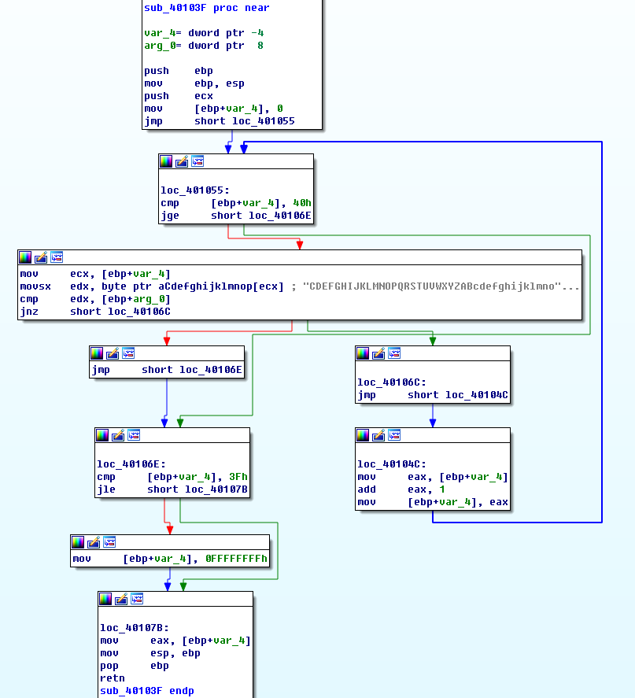

显然,这个引用编码表的子过程`sub_40103F`中存在循环结构,而这个循环结构的功能是将`Base64`编码表的值取出并保存.由于该子过程显然未实现加密功能,所以加密函数可能为其父过程,接下来分析这个子过程的交叉引用关系

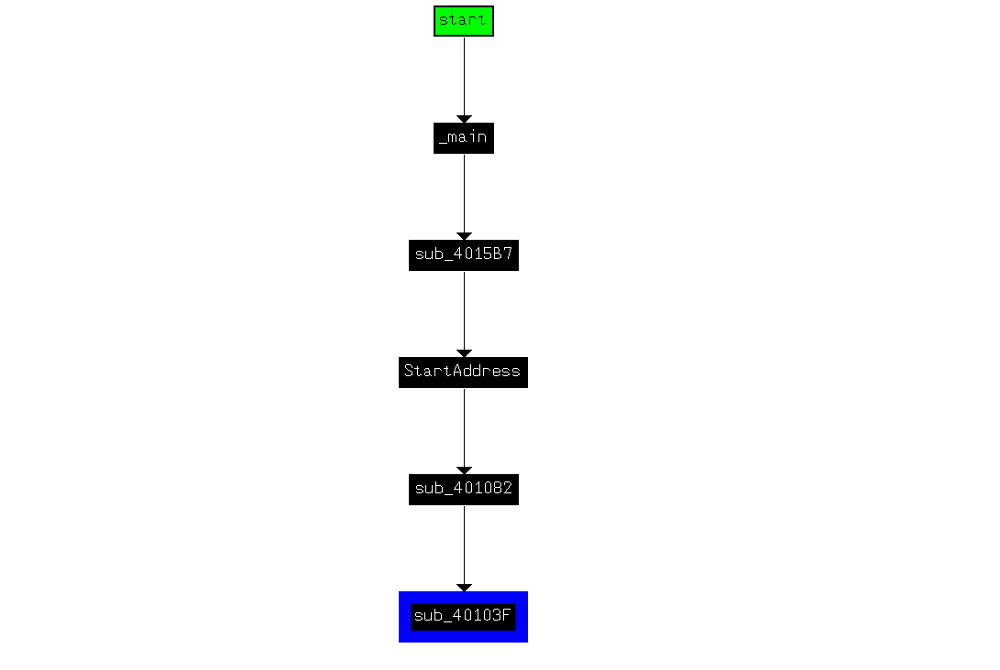

依次分析其父过程,得到如下几步结论

- 父过程`sub_401082`存在循环结构和复杂的汇编指令,但没有对`Windows API`的调用
- 父过程`StartAddress`调用文件操作函数和字符串操作函数进行文件读写操作

所以,显然父过程`sub_401082`是`Base64`加密函数.由此,可以确认`Base64`加密函数的调用.

综上,程序中存在`AES`加密算法和`Base64`加密算法.


#### 问题5: 两种加密算法的密钥

根据`问题4`的分析`AES`加密函数为子过程`sub_40352D`,`Base64`加密函数为`sub_401082`.

查询资料可知,`AES`加密的密钥长度为`128`、`192`、`256`位,即`16`、`24`、`32`个字.使用`IDA Pro`查询字符串信息,得到符合长度的字符串如下


其作为子过程`sub_401AC2`的参数被调用,如下

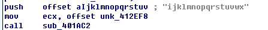

而且可在子过程`sub_401AC2`中发现如下的异常处理函数.

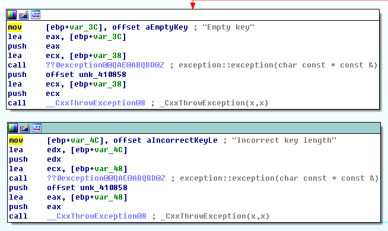

`Empty key`与`Incorrect key length`等报错信息表明该子过程功能是判断密钥是否合法.所以参数`ijklmnopqrstuvwx`显然是`AES`加密算法的密钥.

另外,而经过`问题4`的分析,可以在字符串列表中找到`Base64`编码表.

综上,`AES`加密密钥为`ijklmnopqrstuvwx`,`Base64`编码表如下

```
CDEFGHIJKLMNOPQRSTUVWXYZABcdefghijklmnopqrstuvwxyzab0123456789+/
```


#### 问题6: 分析加密算法的可靠性与额外所需信息

首先分析`AES`加密算法.

查询资料可知,`AES`加密算法存在五种工作模式,即`ECB`(密码本)模式、`CBC`(密码分组链接)模式、`CTR`(计算器)模式、`CFB`(密码反馈)模式、`OFB`(输出反馈)模式.因此,加密和解密时需要使用同一种工作模式.另外,`AES`加密的密钥长度有`128`、`192`、`256`位三种模式.如果使用密钥生成算法则需要初始化向量`iv`作为参数.

总而言之,`AES`算法的实现存在密钥之外的变化量,目前程序中实现的`AES`算法不够可靠.

其次分析`Base64`加密算法.

由于在`Base64`加密算法中,一个给定的编码表已经能够完整定义一个相对可靠的`Base64`加密算法,所以不需要额外的信息.


#### 问题7: 分析恶意代码行为

为分析恶意代码`Lab13-03.exe`的行为,需要从`main`函数开始分析,`main`函数运行流程大致如下

- 调用子过程`sub_401AC2`,参数为`AES`密钥
- 调用`Windows API`创建到主机`www.practicalmalwareanalysis.com`、端口为`8910`的`socket`连接
- 调用子过程`sub_4015B7`,参数为`socket`对象

先分析子过程`sub_401AC2`.因为子过程`sub_401AC2`以`AES`密钥为参数,因此其与`AES`加密相关.

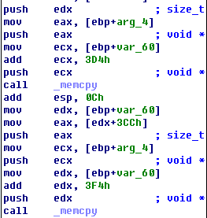

如上,可以在该子过程中发现对`memset`函数的调用.但是在该子过程中没有明文作为参数,因此该子过程没有进入加密的环节,但在内存中申请了空间,由此可以推测其功能是在内存中初始化一个`AES`加密器.

其次分析子过程`sub_4015B7`,其主要实现以下功能

- 调用函数`CreatePipe`创建管道,得到其句柄
- 调用函数`CreateProcess`创建`cmd`的`shell`进程
- 调用函数`CreateThread`创建`Base64`解密线程、`AES`加密线程
- `Base64`解密线程的输入从远程`socket`读取
- `AES`加密线程的输出从`cmd`进程的`shell`输出

总而言之,程序通过`Base64`解密从远程`socket`读取的指令,并从`cmd`传出`AES`加密过的`shell`指令


#### 问题8: 构造代码解密密文

假定存在`Base64`加密内容`BInaEi==`,则可编写`base64`解密代码如下

```python
import string
import base64

s=""
tab="CDEFGHIJKLMNOPQRSTUVWXYZABcdefghijklmnopqrstuvwxyzab0123456789+/"
b64="ABCDEFGHIJKLMNOPQRSTUVWXYZabcdefghijklmnopqrstuvwxyz0123456789+/"

ciphertext="BInaEi=="

for ch in ciphertext:
    if (ch in tab):
        s += b64[string.find(tab,str(ch))]
    elif (ch == '='):
        s += '='
print base64.decodestring(s)
```

运行结果如下,解密内容为`shell`指令`dir`

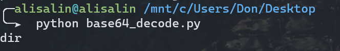

假如,存在`AES`加密内容如下

```
37 f3 1f 04 51 20 e0 b5  86 ac b6 0f 65 20 89 92
4f af 98 a4 c8 76 98 a6  4d d5 51 8f a5 cb 51 c5
cf 86 11 0d c5 35 38 5c  9c c5 ab 66 78 40 1d df
4a 53 f0 11 0f 57 6d 4f  b7 c9 c8 bf 29 79 2f c1
ec 60 b2 23 00 7b 28 fa  4d c1 7b 81 93 bb ca 9e
bb 27 dd 47 b6 be 0b 0f  66 10 95 17 9e d7 c4 8d
ee 11 09 99 20 49 3b df  de be 6e ef 6a 12 db bd
a6 76 b0 22 13 ee a9 38  2d 2f 56 06 78 cb 2f 91
af 64 af a6 d1 43 f1 f5  47 f6 c2 c8 6f 00 49 39
```

则可编写`base64`解密代码如下

```python
from Crypto.Cipher import AES
import binascii

raw =   '37 f3 1f 04 51 20 e0 b5  86 ac b6 0f 65 20 89 92' + \
        '4f af 98 a4 c8 76 98 a6  4d d5 51 8f a5 cb 51 c5'+ \
        'cf 86 11 0d c5 35 38 5c  9c c5 ab 66 78 40 1d df'+ \
        '4a 53 f0 11 0f 57 6d 4f  b7 c9 c8 bf 29 79 2f c1'+ \
        'ec 60 b2 23 00 7b 28 fa  4d c1 7b 81 93 bb ca 9e'+ \
        'bb 27 dd 47 b6 be 0b 0f  66 10 95 17 9e d7 c4 8d'+ \
        'ee 11 09 99 20 49 3b df  de be 6e ef 6a 12 db bd'+ \
        'a6 76 b0 22 13 ee a9 38  2d 2f 56 06 78 cb 2f 91'+ \
        'af 64 af a6 d1 43 f1 f5  47 f6 c2 c8 6f 00 49 39'
ciphertext= binascii.unhexlify(raw.replace(' ',''))
obj = AES.new('ijklmnopqrstuvwx',AES.MODE_CBC,16*b' ')
print 'Plaintext is:\n'+obj.decrypt(ciphertext)
```

运行结果如下,得到的解密内容是建立的反向`shell`

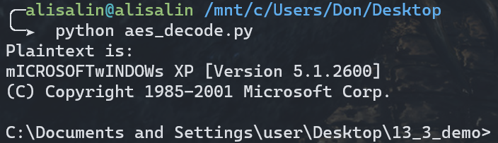

