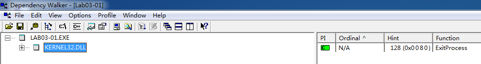
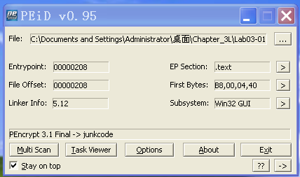
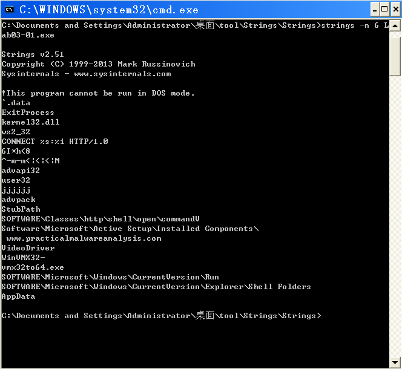
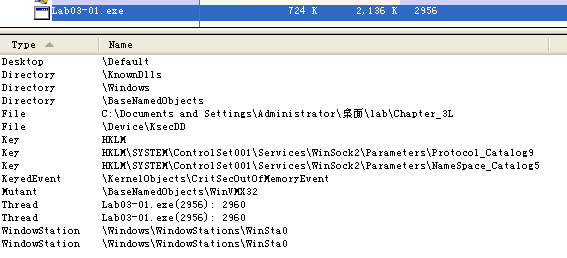
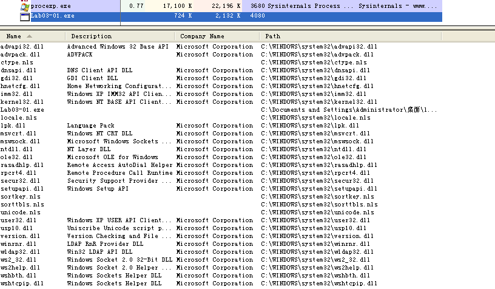
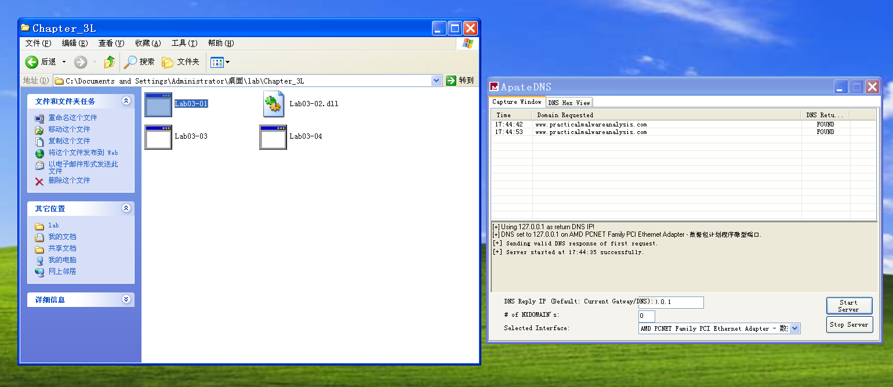
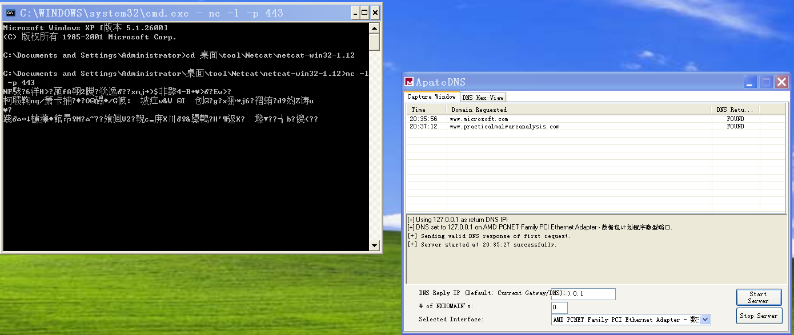

## lab 3-1

> 1811464 郑佶 信息安全单学位

#### 问题1:分析导入函数与字符串

首先分析导入函数,使用`Dependency Walker`打开该程序

只能找到一个导入函数`ExitProcess`,这个程序明显是加壳程序,接下来是使用`PEiD`打开该文件,得到如下信息

可见,加壳处理程序为`PEncrypt 3.1 Final`

其次分析字符串,使用`strings`指令处理该文件,得到以下信息

由此,我们得到了大量明文字符串,但是加壳程序出现如此多的明文字符串并不常见.

重要的包括像是程序名和依赖库名的`WinVMX32`、`VideoDriver`、`vmx32to64.exe`,

以及注册表路径名称`SOFTWARE\Classes\http\shell\open\commandV`、`SOFTWARE\Microsoft\Active Setup\Installed Components\`、`SOFTWARE\Microsoft\Windows\CurrentVersion\Run`、`SOFTWARE\Microsoft\Windows\CurrentVersion\Explorer\Shell Folder`,

以及网址`www.practicalmalwareanalysis.com`.

总之,这说明该程序可能实现联网通信功能,并且修改注册表以修改启动项.

#### 问题2:基于主机的感染迹象特征

同时启动`ApateDNS`和`Process Explorer`分析该程序,可在`dll`视图下得到以下信息

可以发现,该程序的确加载了网络功能相关的库,如`ws2_32.dll`

接下来切换到`handle`视图,得到以下信息

可见,恶意代码在注册表修改创建了三个键值,创建了一个互斥变量`WinVMX32`,而且进行了文件操作.

使用`Process Monitor`分析进程得知,文件写入位置为`System32`文件夹的大量库文件

#### 问题3:重要网络特征及其分析

在打开程序前使用`ApateDNS`服务准备捕捉`DNS`请求,可以得到以下信息

我们可以发现这个程序的确对网址`www.practicalmalwareanalysis.com`发起了`DNS`请求

接下来,同时启动`ApateDNS`和`netcat`,监听443端口,得到以下信息

可见该程序正在通过网络浏览端口向网络传播随机数据,目前无法解析