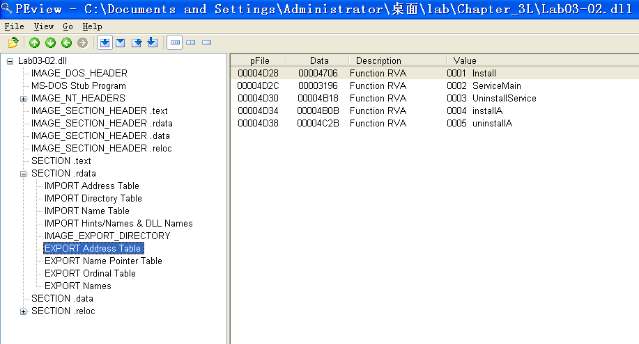
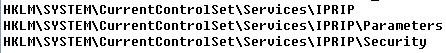
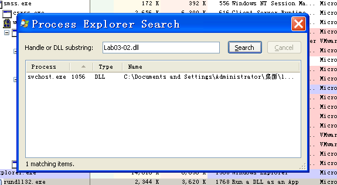
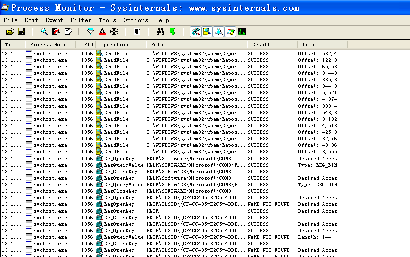
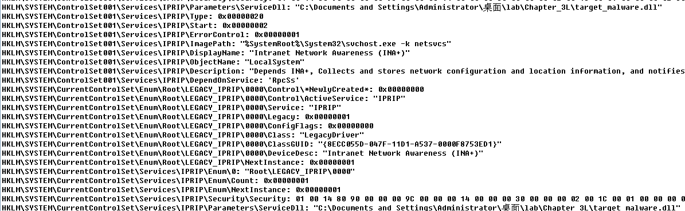
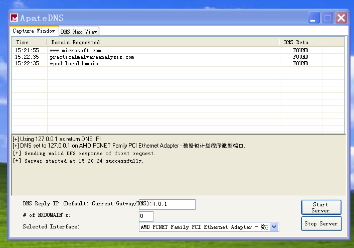
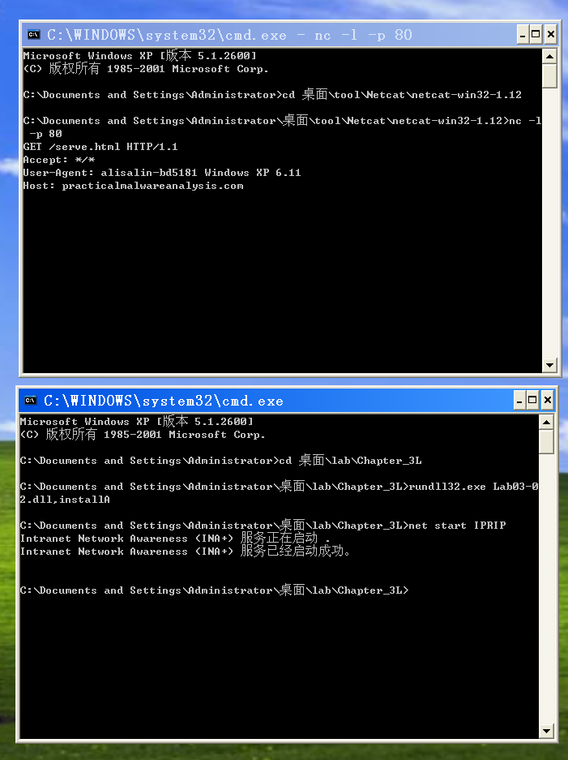

## lab 3-2

> 1811464 郑佶 信息安全单学位

#### 问题1:恶意代码的自行安装

由于`lab03-02.dll`是`dll`库文件无法直接运行,需要借助`rundll32.exe`运行,命令格式为`rundll32.exe lab03-02.dll,导出函数名`.

为得到实现程序安装功能的导出函数,使用`PEview`打开`lab03-02.dll`,打开`SECTION .rdata/EXPORT Address Table`项目即导出函数表,得到以下信息

从这里给出的导出函数表可知,一共有5个导出函数,从导出函数名`ServiceMain`可知,恶意代码会以服务的形式实现功能.

经过`regshot`的比对,发现指令`rundll32.exe lab03-02.dll,installA`是有效的安装指令

#### 问题2:恶意代码的运行

为得到实际的服务名以运行服务,使用`regshot`软件进行软件安装前后注册表快照的变化比对,在改变的键值中,得到如下与服务有关的信息

如上,新增加的服务的服务名为`IPRIP`,因此,启动指令为`net start IPRIP`.

#### 问题3:寻找恶意代码的所属进程

使用指令`rundll32.exe lab03-02.dll,installA`与`net start IPRIP`注册并启动该服务,在`Process Explorer`中寻找载入库文件`Lab03-02.dll`的进程,得到如下结果

可知,所属进程为`svchost.exe`,可得到此时该进程的`PID`为`1056`

#### 问题4:筛选恶意代码相关信息的进程监视器的过滤条件

使用`svchost.exe`的`PID`作为筛选条件,可以得到以下信息

#### 问题5:基于主机的感染迹象特征

更改该`dll`文件的文件名为`target_malware.dll`,并使用`rundll32.exe target_malware.dll,installA`与`net start IPRIP`注册并启动该服务

可使用`regshot`软件进行软件安装前后注册表快照的变化比对,在改变的键值中,得到以下信息

在比对文件中截取的首行与末行中,都有该库文件的载入记录,证明该文件对注册表有修改,这是感染的迹象之一

#### 问题6:重要网络特征及其分析

为捕捉网络特征,我们可以使用`ApateDNS`进行网络模拟,捕捉`DNS`请求,注册并启动该服务,在服务启动一段时间后,得到如下的信息

捕捉到对网址`practicalmalwareanalysis.com`的`DNS`请求

其次,注册并启动该服务,使用`netcat`监听`80`端口的通信,得到以下信息

可见,从`80`端口捕捉到对网址`practicalmalwareanalysis.com`的`DNS`请求,这也是重要的网络特征