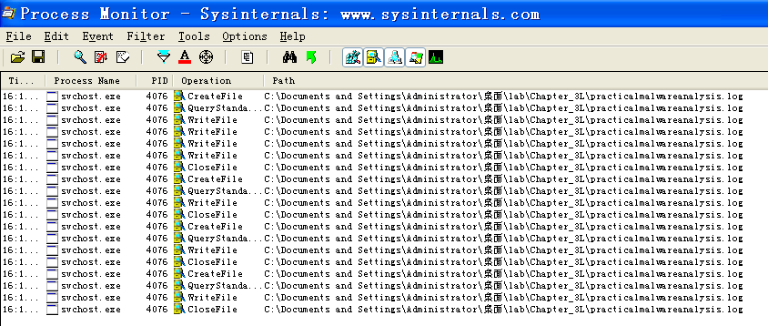

## lab 3-3

> 1811464 郑佶 信息安全单学位

#### 问题1:`Process Explorer`的监视结果

为分析监视结果,首先打开`ApateDNS`模拟网络环境,并打开`Process Explorer`.准备好后,运行`Lab03-03.exe`,得到如下结果

发现一个`PID`为`4076`的孤儿进程,且父进程不为通常的`services.exe`,所以可能`svchost.exe`遭到替换

#### 问题2:恶意软件的内存修改行为

判断`svchost.exe`的进程可能有异常,于是打开该进程的`Properties/String`项目,选择内存中的字符串,得到以下信息

出现了显然不该出现的字符串信息,文件名`practicalmalwareanalysis.log`,而且与硬盘中的镜像的字符串数据差距较大,判断可能遭到进程的替换,内存遭到修改

#### 问题3:基于主机的感染迹象特征

在得知该进程可能创建一个名为`practicalmalwareanalysis.log`的文件后,使用`Process Monitor`进行监视,筛选与该进程相关的信息,得到以下信息

发现该进程在不断的在`lab03-03.exe`同路径下对文件`practicalmalwareanalysis.log`进行读写操作,这是明显的感染特征

#### 问题4:恶意代码目的分析

在打开该程序后,打开`开始菜单/运行`,输入`cmd`,发现文件`practicalmalwareanalysis.log`的最下面两行增加了两条记录,即下图的末两行

由此可见,该程序可能是对键盘输入进行记录的恶意软件