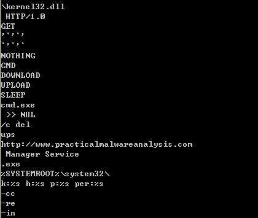

## lab 3-4

> 1811464 郑佶 信息安全单学位

#### 问题1:文件的运行过程分析

点击该程序后,程序`Lab03-04.exe`会删除自身.

首先,使用`Strings`指令处理程序,得到以下重要字符串

我们发现`-cc`,`-re`,`-in`这三个类似命令行参数的字符串,这可能是程序运行的条件之一.

字符串网址`www.practicalmalwareanalysis.com`,以及明显是`UPLOAD`,`GET`,`HTTP/1.0`等`HTTP`报文的关键词,再加上明显的函数名`SLEEP`,说明这个程序可能是一个联网通信的后台程序

但是动态分析由于程序会自删而无法进行

#### 问题2:动态分析失效原因

程序的自删,引起动态分析失败

自删的原因,可能是缺失参数错误,或是必要的库文件,或是没有正确的运行环境

#### 问题3:恶意代码的其他的运行方式

尝试使用`Strings`指令得到的参数`-cc`,`-re`,`-in`来运行该程序,但是仍然引起程序的自删,目前无法找到程序的正确运行方式