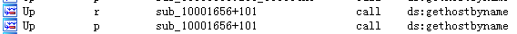

## lab 5-1

> 1811464 郑佶 信息安全单学位

#### 问题1:定位指定函数地址

> 指定函数:`DLLMain`

使用`IDA Pro`的文本视图打开`Lab05-01.dll`,可找到`DLLMain`的位置,如下

由此可知,`DLLMain`的地址在`.text`节的`0x1000D02E`处

#### 问题2:定位指定导入函数位置

> 指定导入函数:`gethostbyname`

打开`IDA Pro`的`import`子视图浏览导入函数,找到导入函数`gethostbyname`如下

由此可知,导入函数`gethostbyname`的地址某节的`0x100163CC`处

双击该函数.进入导入函数`gethostbyname`的文本视图,得到以下信息

由此可知,该函数位于`idata`节,地址为`0x100163CC`

#### 问题3:调用指定导入函数函数的函数个数

> 指定导入函数:`gethostbyname`

在导入函数`gethostbyname`的文本视图下,点击函数位置使用`ctrl+x`查看引用情况,得到信息如下

可发现,在`Address`栏中,有`5`组相同的函数基址,`9`组相同的函数地址

可知,导入函数`gethostbyname`被`5`个函数调用了`9`次

#### 问题4:指定函数调用的分析

> 指定地址:`0x10001757`

位于`0x10001757`的对导入函数`gethostbyname`的调用,即如下位置的调用

点击该函数调用位置,进入该位置的文本视图,得到如下信息

可知,在调用函数前压栈的参数`off_10019040+OxD`即是给出的参数的位置.

由于导入函数`gethostbyname`的参数应该是一个代表网址的字符串,所以该位置应该是一个字符串

双击偏移量`off_10019040`,跳转到字符串所在位置,得到如下信息

由此可知,该字符串的值为`[This is RDO]pics.practicalmalwareanalysis.com`,而此次函数调用发起的`DNS`请求也正是对网址`pics.practicalmalwareanalysis.com`发起的请求

#### 问题5:指定地址子过程的局部变量个数

> 指定地址:`0x10001656`

在`IDA Pro`中点击`G`键,进入地址跳转页面,输入指定地址`0x10001656`,得到以下信息

可以看出,`IDA Pro`一共识别出了`23`个局部变量.

#### 问题6:指定地址子过程的参数个数

> 指定地址:`0x10001656`

图同问题5,`IDA Pro`一共识别出了`1`个参数`lpThreadParameter`.

#### 问题7:定位指定字符串

> 指定字符串:`\cmd.exe /c`

通过菜单栏中的`View/Open Subviews/Strings`打开`String`窗口,得到以下信息

可知,该字符串位于`0x10095B34`处

#### 问题8:分析引用指定字符串位置的行为

> 指定字符串:`\cmd.exe /c`

字符串在内存中的位置如下,在`0x10095B34`位置

点击字符串跳转到该字符串的调用位置,如下

可知,该字符串是作为函数`strcat`的参数`Source`被压栈的,也就是源字符串值,而写入的地址是`ebp+CommandLine`,与控制台相关

初步判断,`cmd.exe`是`windows xp`系统的控制台程序,所以该调用与控制台程序有关.

但是可以在调用`strcat`函数前的`0x100100A3`位置,发现对函数`sprintf`的调用,而作为参数的源字符串值如下

可以发现字符串`Encrypt Magic Number For This Remote Shell Session`,指的是远端`shell`,这与控制台程序相关联

据此推测,该位置的功能应该是调用远端`shell`

#### 问题9:指定地址使用的指定变量的设置方式

> 指定变量:`dword_1008E5C4`/指定地址:`0x100101C8`

使用地址跳转界面跳转到变量指定地址,得到如下信息

点击变量名,跳转到内存中所在位置,键入`ctrl+x`,查看对指定变量的交叉引用情况,得到如下信息

显然,其中的`mov`指令是为该变量赋值,点击跳转到这个引用的位置,得到如下信息

可以发现,赋给指定变量的值来源于`eax`寄存器,而这个寄存器存储的是函数`sub_10003695`的返回值,点击该函数,调转到函数主体位置,得到以下信息

显然,这个函数的功能是判断版本以及平台信息,并将版本相关信息返回.

为判断该位置分支跳转具体情况,用空格键跳转到图形视图,得到如下信息.

可知,该位置通过判断指定变量的值来决定为函数`strcat`压入的参数字符串是`\\cmd.exe /c`还是`\\command.exe /c`.

经过上网查资料可知,`command,exe`是`Windows 9x`等系统的控制台程序,而因为`cmd.exe`是`windows xp`等系统的控制台程序,所以此变量是根据系统版本调用不同的控制台程序,说明函数`sub_10003695`的功能是获取系统版本信息.

综上,该指定变量的值是根据系统版本信息设置的.

#### 问题10:指定函数中与指定字符串比较结果为真时的行为

> 指定函数:`memcmp`/指定字符串:`robotwork`

可以在指定的地址`0x1000FF58`附近找到`loc_0x10010444`代码块,得到以下信息,正是调用的指定字符串的位置

从函数`sub_100052A2`的形式可以看出,该函数唯一调用的参数是`SOCKET`类型参数`s`.根据压栈的参数`s`未被赋值的情况,可以判断其为引用参数,也就是赋值对象.可以判断函数`sub_100052A2`最后将查询到的值返回给了`SOCKET`型参数`s`.

其中,当`memcmp`函数比较结果为真时,会调用函数`sub_100052A2`.点击该函数,跳转到该函数主体部分,调整到图形视图,得到如下信息

可以看到,在地址`0x100052F1`处,函数`sub_100052A2`调用了函数`RegOpenKeyEx`.

经过查询资料,发现函数`RegOpenKeyEx`的功能是打开指定的注册表键,而在此语句前的`5`个`push`语句压栈的值就是该函数的`5`个参数.作为参数的主键名`hKey`值为`80000002`,经查询资料,代表的值是`HKEY_LOCAL_MACHINE`.其中子键名,即字符串`offset aSoftwareMicros`的值`SOFTWARE\\Microsoft\\Windows\\CurrentVersion`.总之,函数`RegOpenKeyEx`查询了注册表中的`HKEY_LOCAL_MACHINE\\SOFTWARE\\Microsoft\\Windows\\CurrentVersion`位置打开了键,并返回值.经查询资料,返回值表示的是打开键的结果,打开成功为`0`,打开不成功为非零值.

在图形界面中,接着可以发现,在注册表子键打开成功后,函数会跳转到`loc_10005309`,具体信息如下

可见,接下来调用了函数`RegQueryValueEx`,功能是查询项目值,其中第二个参数项目名的具体值是字符串`WorkTime`,这是查询的具体项目的名字.

总而言之,此处的行为是查询注册表项目`HKEY_LOCAL_MACHINE\\SOFTWARE\\Microsoft\\Windows\\CurrentVersion\\WorkTime`后将查询的信息返回参数`SOCKET`类型参数`s`.

#### 问题11:指定导出函数的行为

> 指定导出函数:`PSLIST`

打开`IDA Pro`的`Export`视图,查询导出函数表,可得到以下信息

点击函数地址`0x10007025`,并切换到图形视图查看,得到以下信息

可知,该函数的第一次分支判断条件依赖于函数`sub_100036C3`的返回值,点击函数`sub_100036C3`了解该函数主体,得到以下信息

该函数调用了`GetVersionEx`函数取得系统版本信息,并根据得到的版本信息决定返回值.由此可知函数`PSLIST`的第一次分支依赖于系统版本信息.

另外,在函数`PSLIST`第二次分支中,函数`sub_10006518`与函数`sub_1000664C`中都调用了函数`CreateToolhelp32Snapshot`,该函数用于建立进程及其相关信息的快照.与其中函数`sub_1000664C`调用了`SOCKET`类型变量`s`.由此推测,该函数通过某些判断将进程信息快照赋给变量`s`

