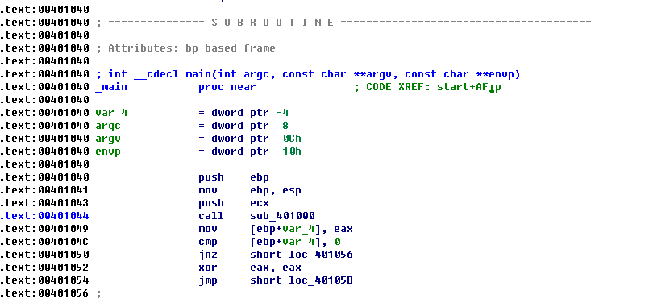
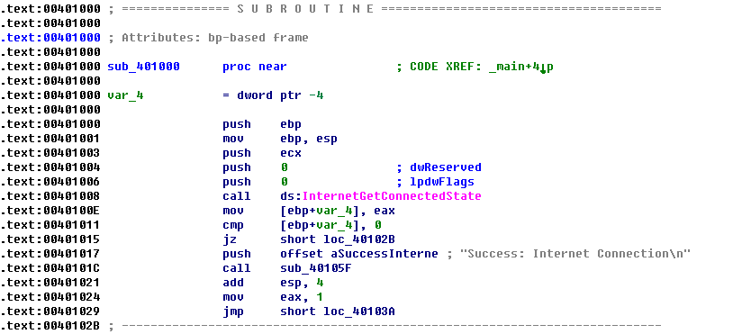
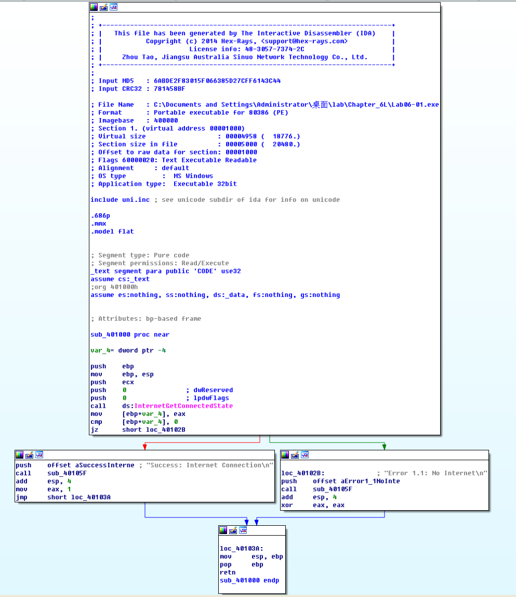

## lab 6-1

> 1811464 郑佶 信息安全单学位

#### 问题1:指定函数的调用的子过程主要代码结构

> 指定函数:`main`函数

使用`IDA Pro`打开程序`Lab06-01.exe`,点击左侧的函数列表的`_main`函数,得到如下信息

可见,唯一一次调用的子过程是`0x00401044`处的函数`sub_401000`.

点击跳转到函数`sub_401000`位置进行分析,得到如下信息

在这段代码中,调用函数`InternetGetConnectedState`,并根据其返回值决定分支跳转结果.根据`0x00401011`与`0x00401015`处的`cmp`指令和`jz`指令,说明这是一个`if`语句.

#### 问题2:指定地址调用的子过程分析

> 指定地址:`0x40105F`

切换到函数`sub_401000`图形视图,得到如下信息

可见,该函数的两条分支都调用了函数`sub_40105F`.

在调用函数`sub_40105F`时,压栈的参数都是一个格式化字符串,而且函数的返回值未被使用,由此推测,该函数应该是`printf`函数.

#### 问题3:分析程序目的

经查询,函数`InternetGetConnectedState`的功能是检查是否有可以网络连接.综合该程序调用的函数`printf`,可以大致判断程序的主要功能是检查网络连接并打印网络连接信息相关的字符串.