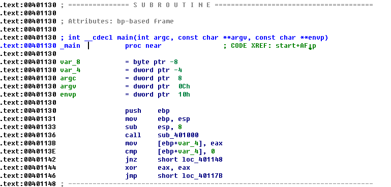
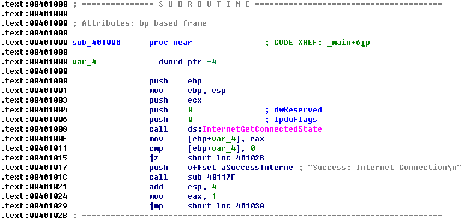
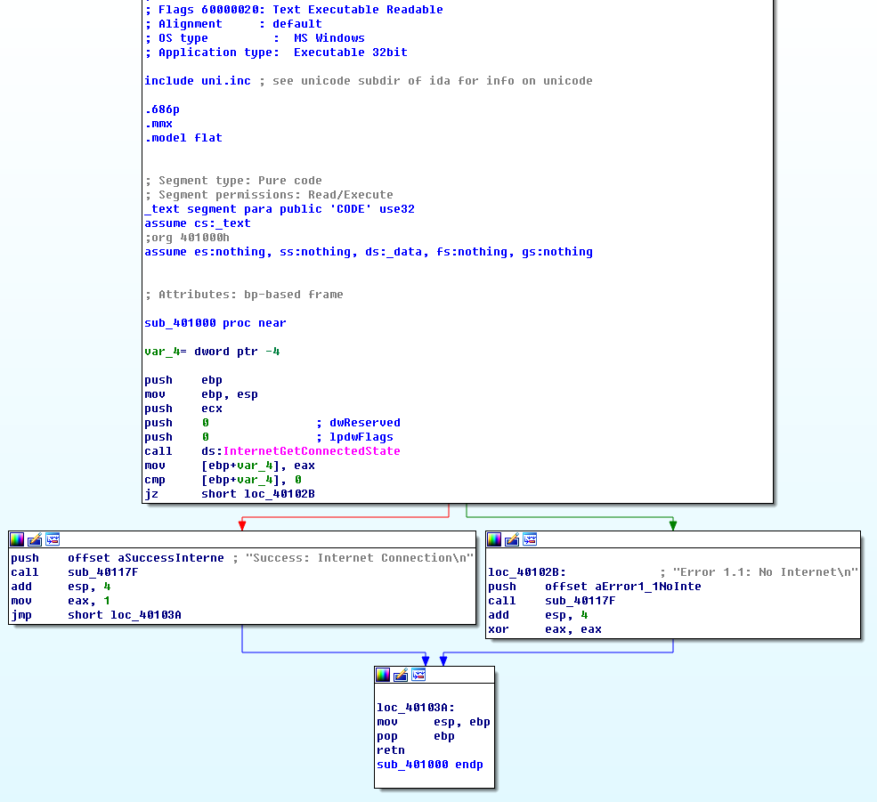
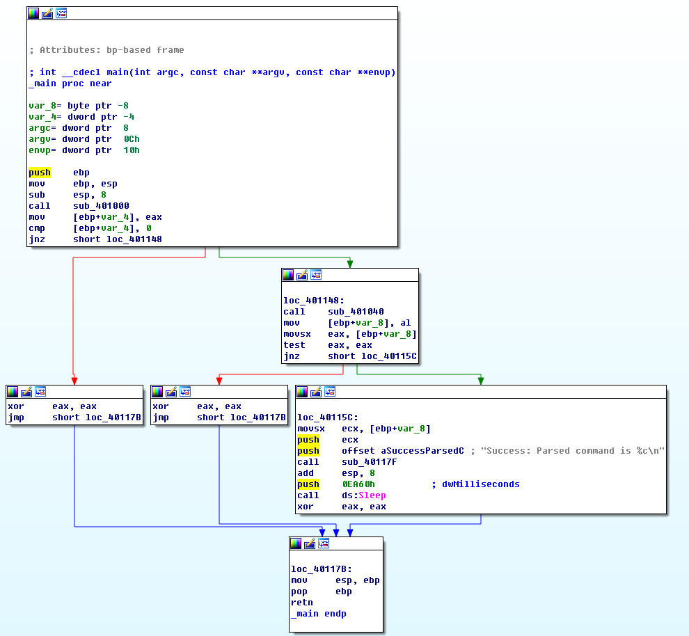
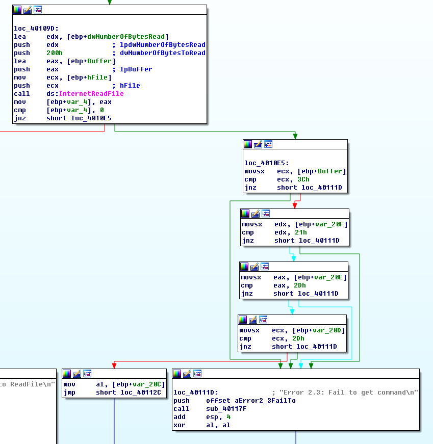
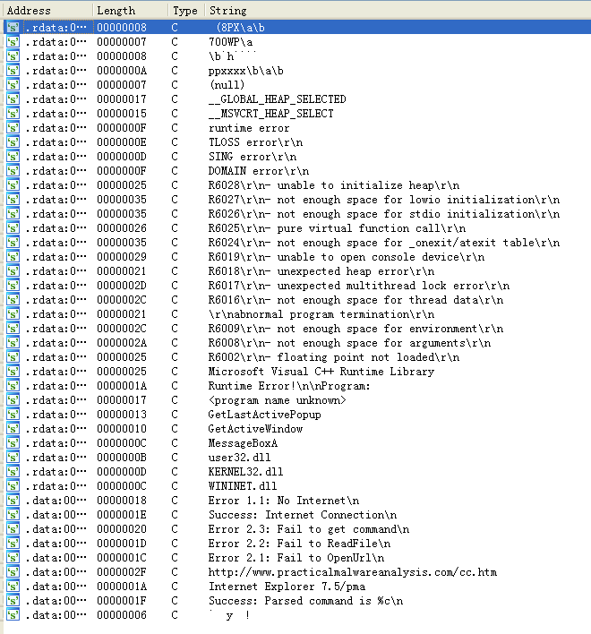

## lab 6-2

> 1811464 郑佶 信息安全单学位

#### 问题1:分析指定函数的调用的子过程操作

> 指定函数:`main`函数

使用`IDA Pro`打开程序`Lab06-02.exe`,点击左侧的函数列表的`_main`函数,按空格跳转到文本视图,得到如下信息

可知,调用的第一个子过程是函数`sub_401000`,点击该函数跳转到其函数主体,得到如下信息

可知,和`lab6-1`类似,在这段代码中,调用函数`InternetGetConnectedState`,并根据其返回值决定分支跳转结果.根据`0x00401011`与`0x00401015`处的`cmp`指令和`jz`指令,说明这是一个`if`语句.

#### 问题2:指定地址调用的子过程分析

> 指定地址:`0x40117F`

切换到函数`sub_401000`图形视图,得到如下信息

与`lab6-1`相同,在调用函数`sub_40117F`时,压栈的参数都是一个格式化字符串,而且函数的返回值未被使用,由此推测,子过程函数`sub_40117F`应该是`printf`函数.

#### 问题3:分析指定函数的调用的子过程行为

> 指定函数:`main`函数

切换到函数`main`图形视图,得到如下信息

可知,调用的第二个子过程是函数`sub_401040`,分析其使用的参数字符串的分析,可以知道以下信息

- 调用函数`InternetOpen`时压栈了参数字符串`Internet Explorer 7.5/pma`以确定浏览器版本
- 调用函数`IntenetOpenUrl`时压栈了参数字符串`http://www.practicalmalwareanalysis.com/cc.htm`以解析网址

- 调用函数`printf`时压栈了格式化的参数字符串`Error 2.1: Fail to OpenUrl\n`、`Error 2.2: Fail to ReadFile\n`、`Error 2.3: Fail to get command\n`,用于输出错误信息

大致可以知道该子过程的功能应该涉及浏览器打开、网页打开、网址解析等功能.

经过分析,该子过程的功能应该是打开网页``http://www.practicalmalwareanalysis.com/cc.htm``的网页文件及其错误处理.

#### 问题4:指定子过程代码结构分析

> 指定子过程:函数`sub_401040`

子过程函数`sub_401040`的重要数据结构相关流程如下

由上可知,函数`InternetReadFile`压入了四个参数.查询资料可知

- 取得的数据会存入参数`lpBuffer`指向位置的字符数组即`[ebp+Buffer]`
- 最大接受长度为`dwNubmberOfbytesToRead`即`0x200`

首先查询资料可知,`HTML`注释以`<!--`开头.而调用函数`InternetReadFile`后的四次分支比较,则是将字符数组的前四个字符依次与字符`<`(`0x3C`)、`!`(`0x21`)、`-`(`0x2D`)、`-`(`0x2D`)相比较.若任何一次比较失败,就会使用`printf`函数输出错误信息`Fail to get command`.若四次比较全部成功,就会将`<!--`后的一个字符存入`al`寄存器,并完成该子过程.

综上,该子过程使用了一个字符串数组的数据结构以保存从`Internet`下载的`HTML`文件数据,判断其格式是否合法,并取得`HTML`注释信息中的字符数据.

#### 问题5:分析相关网络信息指示

首先打开`IDA Pro`的`String`子视图,可以得到以下信息

其中与网络相关的重要的字符串信息如下

- 字符串1:`http://www.practicalmalwareanalysis.com/cc.htm`
- 字符串2:`Internet Explorer 7.5/pma`

查询资料和分析函数`sub_401040`的图形视图,可得知这两个字符串用处为

- 函数`InternetOpen`将字符串2作为参数`szAgent`,用于在发送`HTTP`请求时来填充请求头的`User-Agent`段信息,以限定`IE 7.5`浏览器解析网页
- 函数`InternetOpenUrl`将字符串1作为参数`szUrl`,作为目标网络资源

#### 问题6:该程序的目的

主要根据对子过程`sub_401000`和子过程`sub_401040`的分析,可得到程序的运行流程如下

- `sub_401000`检查网络连接状态
- `sub_401040`依次下载`HTML`文件数据,输出`HTML`注释字符并休眠

因此该程序的目的是

- 检验网络连接
- 取得指定的`HTML`文件数据并输出指定字符信息