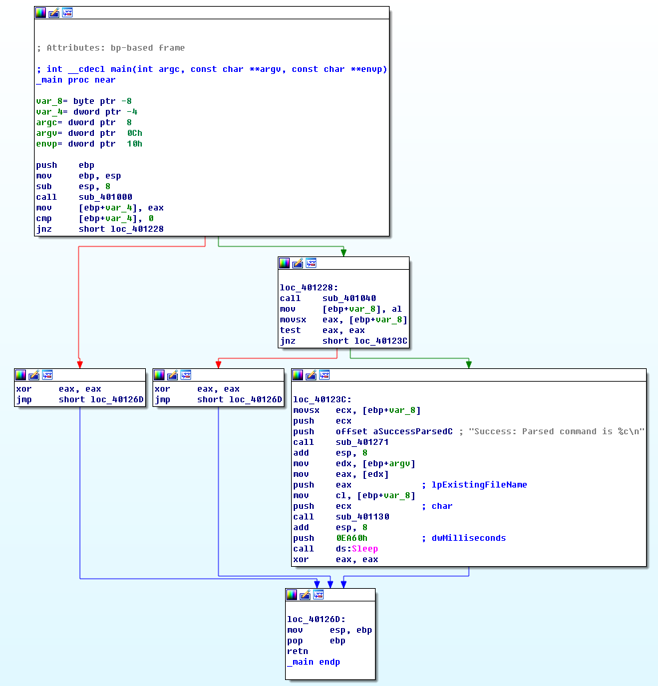
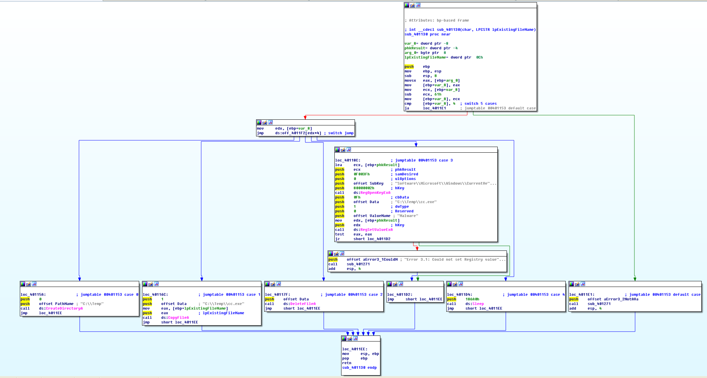
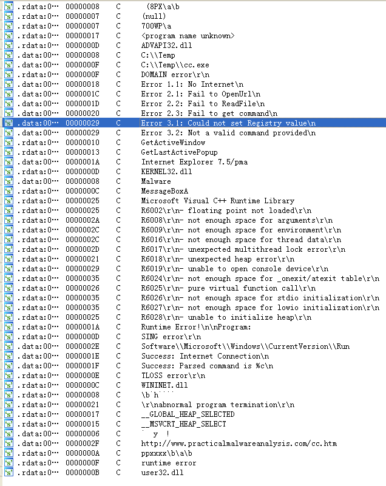

## lab 6-3

> 1811464 郑佶 信息安全单学位

#### 问题1:指定函数调用的区别

> 指定函数:`lab 6-2`与`lab 6-3`中的`main`函数

使用图形视图分析`lab 6-3`的`main`函数,得到如下信息

根据图形界面,与程序`lab 6-2`相比,可知

- 子过程`sub_401000`都用于是检验网络连接
- 子过程`sub_401040`都用于下载`HTML`文件并处理
- 子过程`sub_401271`为`printf`函数
- 新调用了子过程`sub_401130`

#### 问题2:指定函数的参数

> 指定函数:函数`sub_401130`

根据对`main`函数图形视图的分析,可以得知函数`sub_401130`压栈的参数在压栈前分别存在于`[ebp+var_8]`与`[ebp+argv]`中.

根据`lab 6-2`的分析,可知`[ebp+var_8]`存储的是函数`sub_401040`所返回得到的`HTML`注释中的字符数据.

由于当前的函数为`main`函数,所以`[ebp+argv]`存放的是`main`函数的第一个参数,即程序名.

#### 问题3:指定函数的主要代码结构

> 指定函数:函数`sub_401130`

使用图形视图分析该函数,得到如下信息

总体上来看,该函数实现了根据`edx`的值,使用位于`off_4011F2`的跳转表跳转至`5`个不同位置中的某个位置.

#### 问题4:指定函数功能

> 指定函数:函数`sub_401130`

该函数的跳转表的跳转位置是由参数`[ebp+arg0]`决定的,即`HTML`注释中的字符数据.目标分支在跳转表中的偏移量为该参数与`0x61`的差.

根据该函数的图形视图,该函数有以下5个功能分支

- 使用函数`CreateDirectory`创建文件夹`C:\\Temp`
- 使用函数`CpoyFile`将本文件复制到文件`C:\\Temp\\cc.exe`
- 使用函数`DeleteFile`将文件`C:\\Temp\\cc.exe`删除
- 
  - 使用函数`RegOpenKeyEx`打开注册表的键`Software\\Microsoft\\Windows\\CurrentVersion\\Run`
  - 使用函数`RegSetValueEx`给该注册表键创建一个`Malware`的项,赋给值`C:\\Temp\\cc.exe`
  - 注册表修改失败时打印错误信息`Error 3.1: Could not set Registry value\n`

- `5`:使用函数`Sleep`休眠`100000`毫秒

#### 问题5:该程序的恶意代码本地特征

打开该程序的`Strings`子视图,得到如下信息

从中可以到的恶意代码的本地特征有

- 本地文件夹路径`C:\\Temp`、`C:\\Temp\\cc.exe`
- 注册表路径`Software\\Microsoft\\Windows\\CurrentVersion\\Run`
- 调用的`dll`库文件名`ADVAPI32.DLL`、`KERNEL32.DLL`、`WININET.DLL`、`user32.dll`
- 文件相关的报错信息`Error 2.2: Fail to ReadFile\n`
- 注册表相关的报错信息`Error 3.1: Could not set Registry value\n`

#### 问题6:该程序的目的

主要综合根据`lab 6-2`和对子过程`sub_401130`的分析,可得到程序的运行流程如下

- `sub_401000`检查网络连接状态
- `sub_401040`依次下载`HTML`文件数据,输出`HTML`注释字符并休眠
- `sub_401130`根据注释字符的值,决定创建文件夹/复制文件/删除文件/修改注册表/休眠

因此该程序的目的是

- 检验网络连接
- 取得指定的`HTML`文件数据并输出指定字符信息
- 根据取得的字符信息决定创建文件夹/复制文件/删除文件/修改注册表/休眠