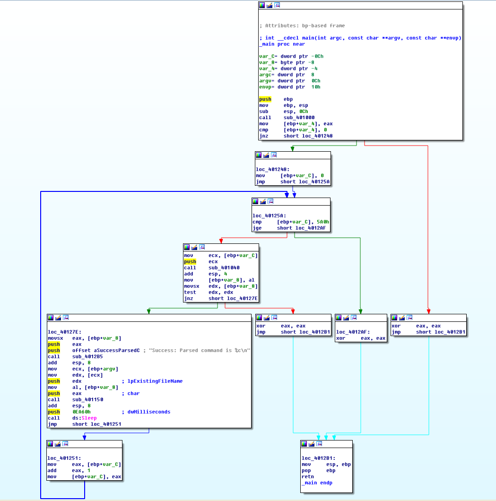
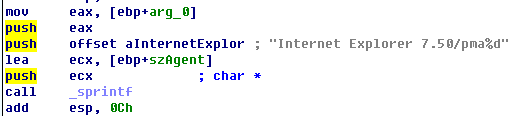
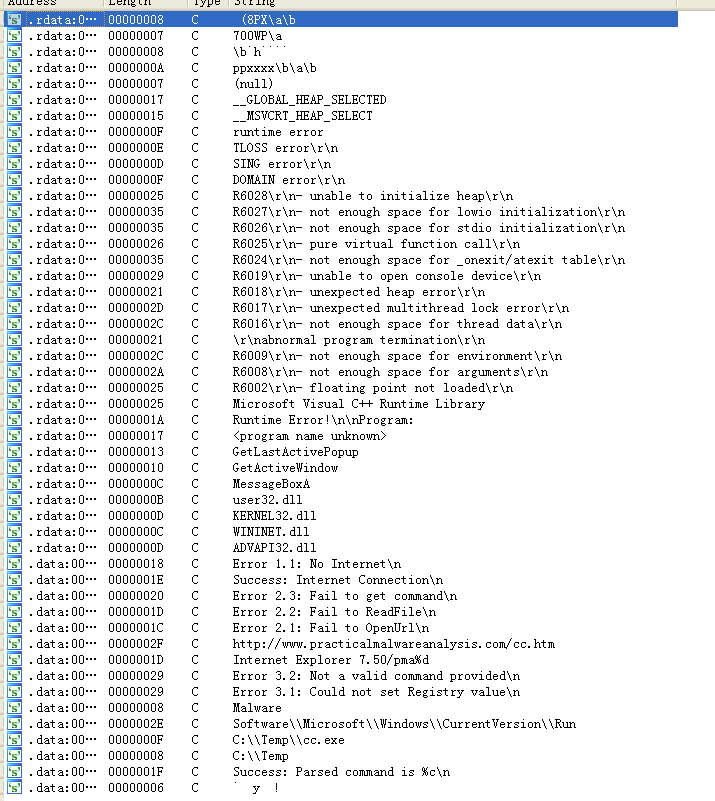

## lab 6-4

> 1811464 郑佶 信息安全单学位

#### 问题1:指定函数调用的区别

> 指定函数:`lab 6-3`与`lab 6-4`中的`main`函数

使用图形视图分析`lab 6-4`的`main`函数,得到如下信息

根据图形界面,与程序`lab 6-3`相比,可知

- 子过程`sub_401000`都用于检验网络连接
- 子过程`sub_401040`都用于下载`HTML`文件并处理
- 子过程`sub_4012B5`为`printf`函数
- 子过程`sub_401150`与`lab 6-3`的子过程`sub_401130`相同,功能是根据注释字符的值,决定创建文件夹/复制文件/删除文件/修改注册表/休眠

#### 问题2:指定函数的新代码结构

> 指定函数:`main`函数

根据`main`函数的图形视图,可以明显看到程序中添加了循环结构.

这个循环的循环变量为`[ebp+var_C]`,当循环变量的值大于`1440`时或是子过程`sub_401040`未取得注释中的字符指令时停止.

由于每次循环都会休眠`60000`毫秒,且循环内其他指令运行时间相对可以忽略不计,所以该循环变量就是程序运行的分钟数

#### 问题3:指定子过程的区别

> 指定子过程:函数`sub_401040`

区别只要在与`lab 6-4`的程序的子过程`sub_401040`在运行前多调用了函数`sprintf`,如下

可以看到,函数`sprintf`将参数`[ebp+arg0]`加到字符串中`Internet Explorer 7.50/pma`后,并将新字符串赋给指针`[ebp+szAgent]`

根据`问题2`中的分析,可以知道这个参数`[ebp+arg0]`是`main`函数中的`ebp+var_C`,也就是程序运行的分钟数

根据程序的下文,可以得知字符串指针`[ebp+szAgent]`的值是作为函数`InternetOpen`的参数,即用于在发送`HTTP`请求时来填充请求头的`User-Agent`段信息,以限定浏览器类型

#### 问题4:程序运行时间

由于程序连接到互联网,所以不考虑子过程`sub_401000`的错误分支和循环中子过程`sub_401040`未取得注释中的字符指令的特殊情况

因此,程序会运行到循环变量`[ebp+var_C]`的值大于`1440`时停止,且该循环变量实际上是程序运行分钟数

所以程序运行时间为`1440`分钟

#### 问题5:该程序的恶意代码网络特征

打开该程序的`Strings`子视图,得到如下信息

从中可以到的恶意代码的网络特征有

- 网址`http://www.practicalmalwareanalysis.com/cc.htm`

- 浏览器相关信息`Internet Explorer 7.50/pma%d`,作为`HTTP`报文的`user-agent`段的值,实际上使得`HTTP`报文中发送了恶意程序运行时间
- 网络相关的报错信息`Error 1.1: No Internet\n` 、`Error 2.1: Fail to OpenUrl\n`

#### 问题6:该程序的目的

主要综合根据`lab 6-2`和对子过程`sub_401130`的分析,可得到程序的运行流程如下

- `sub_401000`检查网络连接状态
- 进入循环
- 验证运行时间是否大于`1440`分钟,否则退出循环
  - `sub_401040`依次下载`HTML`文件数据,输出`HTML`注释字符并休眠
  - 验证是否取得了注释字符,否则退出循环
  - `sub_401130`根据注释字符的值,决定创建文件夹/复制文件/删除文件/修改注册表/休眠
- 循环结束

因此该程序的目的是

- 检验网络连接
- 程序循环运行`1440`分钟,不断解析`HTTP`报文的注释字符指令,根据取得的字符信息决定创建文件夹/复制文件/删除文件/修改注册表/休眠
- 当无法解析到`HTTP`报文的注释字符指令或`1440`分钟结束时程序结束运行