## lab 7-1

> 1811464 郑佶 信息安全单学位

#### 问题1:程序持久化驻留方法

考虑到程序的持久化驻留,首先考虑恶意代码安装服务的可能性.

使用`IDA Pro`打开该程序的导入函数表,得到如下的信息

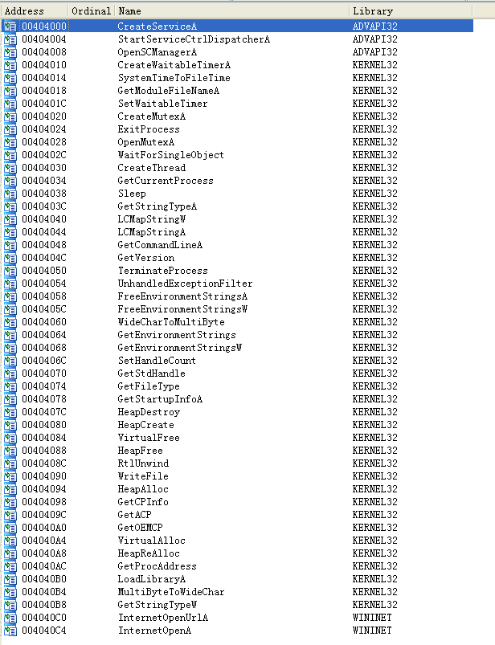

可以看到`3`个与服务相关的导入函数,经过查询,其功能如下

- `CreateService`:创建一个服务对象，并将其添加到指定的服务控制管理器数据库,返回该服务的句柄
- `StartServiceCtrlDispatcher`:将服务进程的主线程连接到服务控制管理器，该线程将作为调用过程的服务控制分派器线程
- `OpenSCManager`:建立了一个到服务控制管理器的连接，并打开指定的数据库,返回一个服务控制管理器数据库的句柄

其中,函数`CreateService`创建服务,函数`StartServiceCtrlDispatcher`与`OpenSCManager`用于启动和控制服务.

由此可知,所以创建的服务名应该是函数`CreateService`的参数.跳转到调用位置,得到如下信息

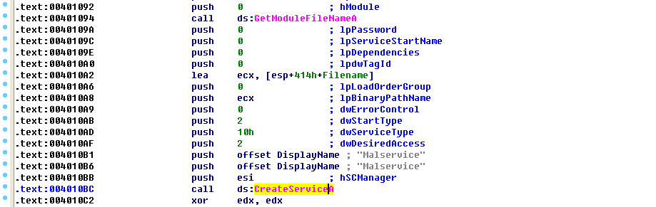

而查阅资料,该函数的参数表如下

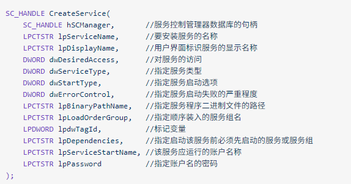

由此可知参数`lpServiceName`和`lpDisplayName`表示服务的原名称和显示名称,值均为字符串`Malservice`.这显然提示该服务为恶意代码所创建.

因此可知,恶意代码创建了名为`Malware`的服务,并以此持久化驻留在受感染主机中.

#### 问题2:程序使用互斥量的原因

其次根据`问题1`中得到的导入函数表,我们可以发现创建互斥量的函数`CreateMutex`.跳转到该函数的调用位置,得到如下信息

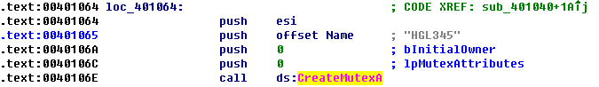

由此可知互斥量名称为`HGL345`.

在函数`sub_401040`图形视图下观察该互斥量的使用,得到如下信息

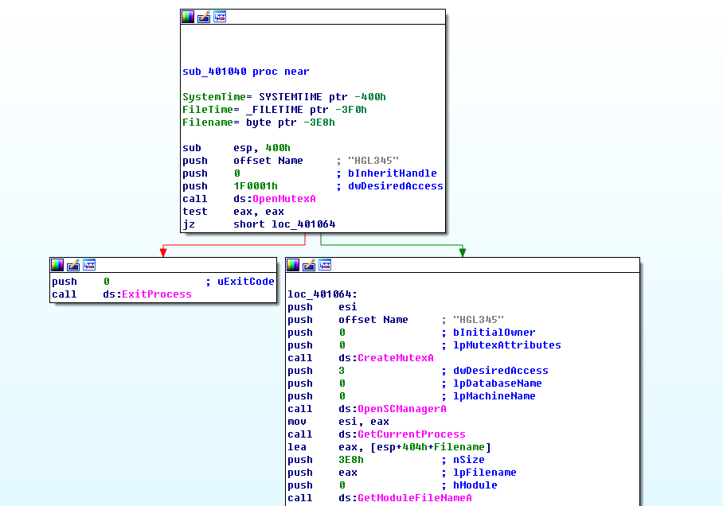

由此可见,函数`OpenMutex`根据该互斥量是否创建,决定函数是否继续运行.

如果互斥量`HGL345`已创建,则该程序退出运行.

如果互斥量`HGL345`未创建,则创建互斥量`HGL345`并进行服务和进程相关操作.

综上,该互斥量的功能是只允许同时有一个该程序运行.

#### 问题3:基于主机的感染线索

根据`问题1`、`问题2`的分析,可以得知该程序将创建服务`Malservice`和互斥量`HGL345`.

为分析这些基于主机的感染线索,可以使用`Process Explorer`进行动态分析.而为模拟网络服务,需要提前启动`apateDNS`进行`DNS`服务的重定向.

使用`Process Explorer`的句柄视图查看创建的互斥量,可得到如下的创建的互斥量列表

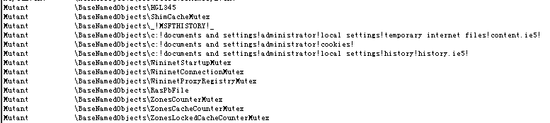

使用系统自带注册表编辑工具`regedit`打开服务所在的注册表位置`HEKY_LOCAL_MACHINE\\SYSTEM\\CurrentControlSet\\Service`,可以发现了恶意服务`Malservice`的注册表文件,如下

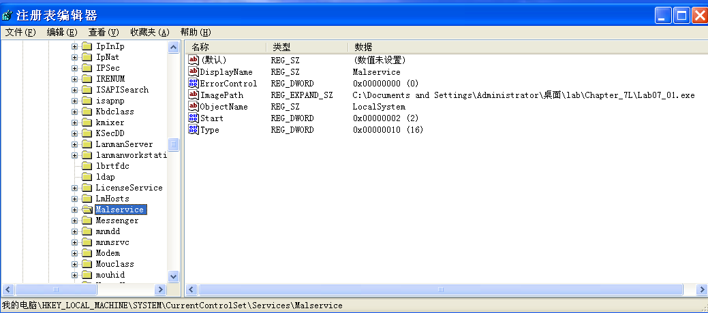

#### 问题4:基于网络的感染线索

为分析这些基于网络的感染线索,可以使用`apateDNS`进行`DNS`服务的重定向和`DNS`服务的捕捉.

直接运行该程序后可捕捉到如下的`DNS`请求.

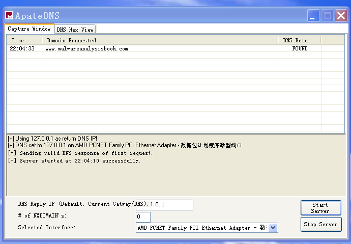

这可以作为基于网络的感染线索

#### 问题5:分析程序目的

为分析程序的目的,首先分析整个程序的运行流程.

`main`函数主体部分如下

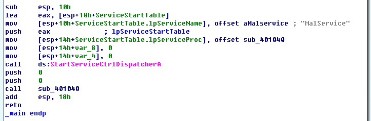

可知程序先运行函数`StartServiceCtrlDispatcher`,将服务`Malservice`连接到进程调度器.

其次运行主要子过程`sub_401040`,全过程如下

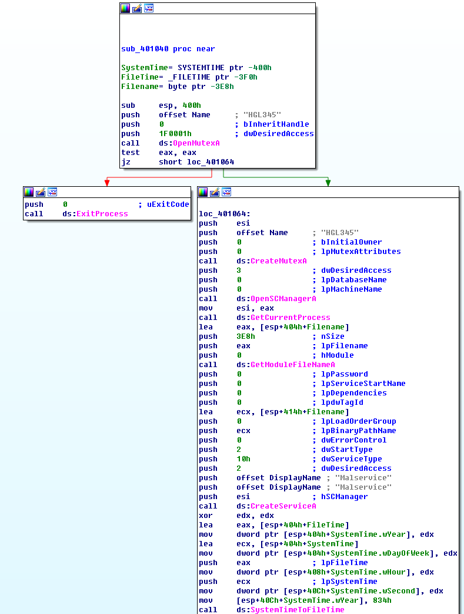

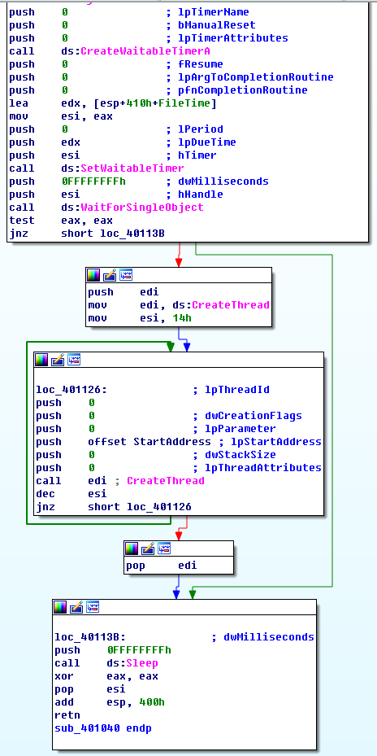

可以归纳子过程`sub_401040`大致的运行流程,如下

- 打开互斥量`HGL345`
  - 打开成功时直接退出运行
  - 打开失败程序继续运行

- 创建互斥量`HGL345`
- 函数`OpenSCManager`连接到服务控制管理器
- 函数`GetCurrentProcess`获取当前进程伪句柄

- 函数`GetModuleFileName`获取当前程序所在目录

- 创建服务`Malservice`
- 获取系统时间,创建计时器,设置计时器,等待到指定时间(`2100`年)

- 使用函数`StartAddress`创建`20`个重复线程
  - `StartAddress`:
    - 调用函数`InternetOpen`将`IE 8.0`设为`HTTP`请求的`user-agent`段信息
    - 无限循环调用函数`InternetOpenUrl`函数,向网址`http://www.malwareanalysisbook.com`发送`HTTP`请求
  - 实际上是对该网址发动`DDoS`攻击
- 程序休眠后关闭

综上,该程序的目的如下

- 创建互斥量唯一同时运行
- 创建服务永久驻留
- 在指定时间(`2100`年)对指定网址`www.malwareanalysisbook.com`发起`DDoS`攻击

#### 问题6:程序完成运行时间

由于函数`StartAddress`创建的`20`个重复线程实际上没有停止运行条件,所以该程序不会停止运行