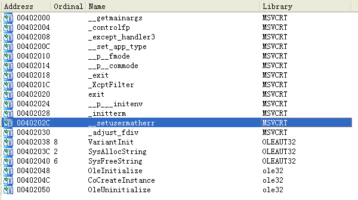
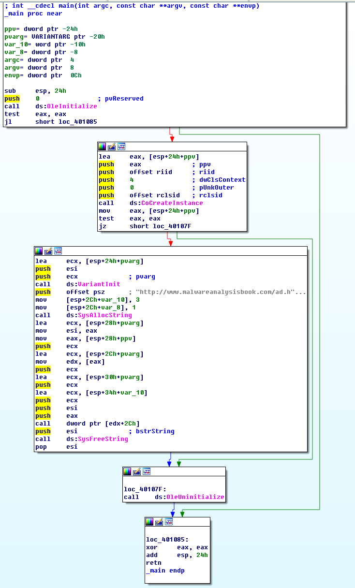

## lab 7-2

> 1811464 郑佶 信息安全单学位

#### 问题1:程序持久化驻留方法

考虑到程序的持久化驻留,首先考虑恶意代码安装服务的可能性

使用`IDA Pro`打开该程序的导入函数表,得到如下的信息,其中并没有发现与服务相关的函数

其次考虑该程序进行文件操作的可能性,但由于没有发现与文件操作相关的函数,认为该程序未实现持久化驻留

#### 问题2:分析程序目的

为分析程序的目的,首先分析整个程序的运行流程.

`main`函数主体部分如下

可以归纳程序大致的运行流程,如下

- 函数`OleInitialize`初始化`Ole`运行环境
  - 初始化成功,程序继续运行
  - 初始化失败,程序停止运行

- 函数`CoCreateInstance`创建`COM`对象
  - 创建成功,程序继续运行
  - 创建失败,程序调用函数`OleUninitialize`关闭`Ole`运行环境,程序退出运行

- 函数`VariantInit`初始化`Ole`环境中的`Variant`结构
- 使用`SysAllocString`创建字符串`http://www.malwareanalysisbook.com/ad.html`

- 调用函数`[edx+2Ch]`
- 使用`SysFreeString`清空字符串
- 调用函数`OleUninitialize`关闭`Ole`运行环境,程序退出运行

显然,其中最重要的功能是函数`[edx+2Ch]`,接下来需要分析该函数的调用.

首先,该函数与`edx`的值相关.

`edx`的值取自`[esp+28h+ppv]`指向的地址,该地址存储`COM`对象的地址.

查看函数`CoCreateInstance`调用的参数,可以知道该`COM`对象的`riid`值为`D30C1661-CDAF-11D0-8A3E-00C04FC9E26E`,其`rclsid`值为`0002DF01-0000-0000-C000-000000000046`

打开注册表编辑器`regedit`,查询得到以下结果

- 路径`\HKEY_CLASSES_ROOT\Interface\{D30C1661-CDAF-11D0-8A3E-00C04FC9E26E}`下,有一项目值为`IWebBrowser2`,名称为`默认`
- 路径`\HKEY_CLASSES_ROOT\InternetExplorer.Application\CLSID`下,找到一项目值为该`rclsid`,名称为`默认`

由此可知,该`COM`对象调用的是`IE`浏览器的`IWebBrowser2`接口.根据课本`P147`,该接口偏移`2Ch`出的函数是函数`Navigate`.

综上,函数`[edx+2Ch]`即函数`Navigate`,功能为导航指定网址`http://www.malwareanalysisbook.com/ad.html`

总而言之,该程序的目的如下

- 初始化`Ole`环境,创建`COM`对象
- 使用`COM`对象调用`Navigate`函数导航指定网址

- 关闭`Ole`环境

#### 问题3:该程序完成执行时间

由于该程序没有调用循环结构和`Sleep`函数等使程序时间延长的程序部分,因此该程序将在导航完成指定网址并关闭`Ole`执行环境后直接结束执行