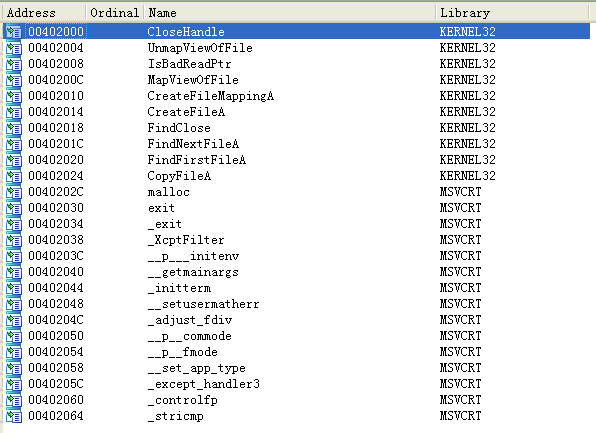

## lab 7-3

> 1811464 郑佶 信息安全单学位

#### 问题1:程序持久化驻留方法

考虑到程序的持久化驻留,首先考虑恶意代码安装服务的可能性.

使用`IDA Pro`打开该程序的导入函数表,得到如下的信息,其中并没有发现与服务相关的函数.

其次考虑该程序进行文件操作的可能性,由于该程序调用了文件操作函数`MapViewOfFile`、`CreateFileMapping`、`CreateFile`、`FindNextFile`、`FindFirstFile`、`CopyFile`,由此认为程序可能以此实现持久化驻留