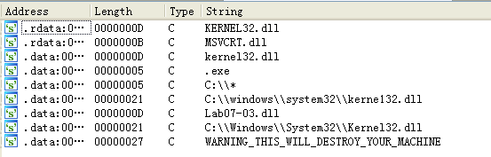
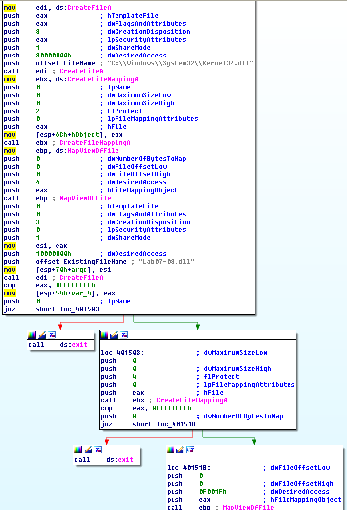
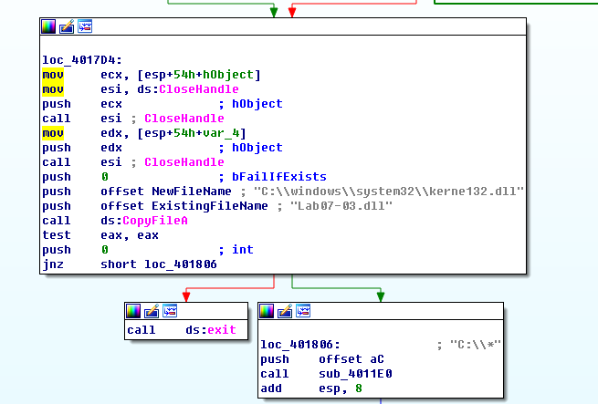
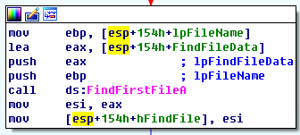
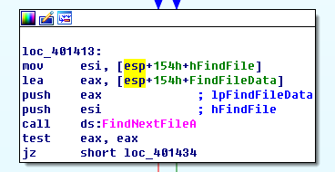
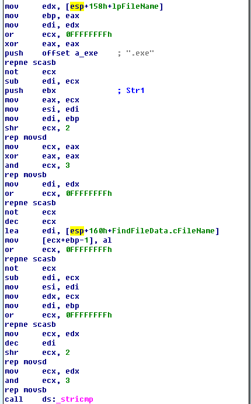
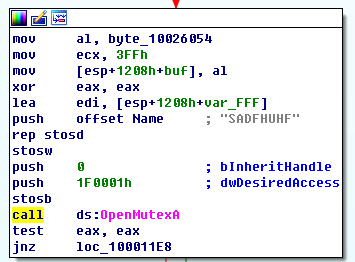
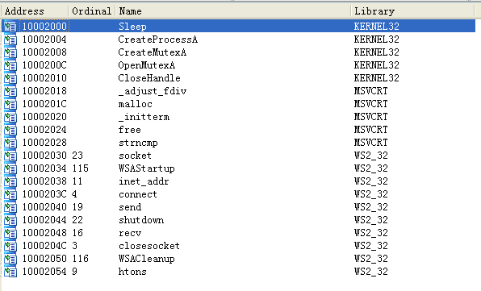
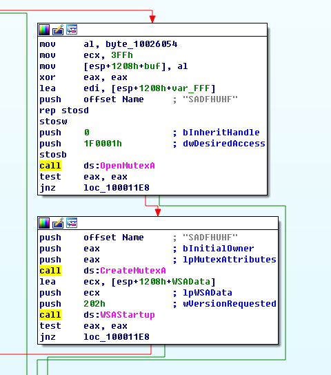

## lab 7-3

> 1811464 郑佶 信息安全单学位

#### 问题1:程序持久化驻留方法

考虑到程序的持久化驻留,首先考虑恶意代码安装服务的可能性.

使用`IDA Pro`打开该程序的导入函数表,得到如下的信息,其中并没有发现与服务相关的函数.

其次考虑该程序进行文件操作的可能性,由于该程序调用了文件操作函数`MapViewOfFile`、`CreateFileMapping`、`CreateFile`、`FindNextFile`、`FindFirstFile`、`CopyFile`,由此认为程序可能以文件形式实现持久化驻留,接下来从文件操作角度分析`Lab07-03.exe`

在`Lab07-03.exe`的字符串信息如下

从中查找到可疑文件名`C:\\windows\\system32\\kerne132.dll`,其中`kerne132.dll`是对重要库文件`kernel32.dll`的混淆

在`Lab07-03.exe`的函数图形视图中找到如下的部分流程

该流程依次调用`CreateFile`、`CreateFileMapping`、`MapViewOfFile`函数,建立了两个文件`C:\\Windows\\System32\\Kernel32.dll`和 `Lab07-03.dll`及其在内存中的映射.这显然是要对这两个文件文件操作

如上,流程的最后调用了`CopyFile`函数,这次调用将`Lab07-03.dll`复制到新文件`C:\\Windows\\System32\\kerne132.dll`

而且,文件`Lab07-03.dll`复制成功后,以路径`C:\\*`为参数调用子过程`sub_4011E0`

查看子过程`sub_4011E0`的开头部分,发现路径`C:\\*`是作为函数`FindFirstFile`的参数调用,并将返回值装载进变量`hFindFile`,该返回值是路径`C:\\*`第一个文件的句柄

在图形视图下查看`sub_4011E0`,可以知道该子过程中间部分是一个循环结构

如上,可以在子过程`sub_4011E0`循环体中发现函数`FindNextFile`调用变量`hFindFile`作为参数

如上,可以在子过程`sub_4011E0`循环体中发现调用函数`_stricmp`进行字符串比较,并引用常量字符串`.exe`

依此可以推测子过程`sub_4011E0`使用句柄`hFindFile`遍历路径`C:\\*`下的文件,筛选其中后缀为`.exe`的文件进行文件操作

综上,该程序持久化驻留的方法是将指定恶意代码库文件`kerne132.dll`复制到`System32`文件夹,并修改在`C:\\`路径下相关的`exe`文件

#### 问题2:两个基于主机的感染迹象特征

根据`问题1`的分析,程序`Lab07-03.exe`会在路径`C:\\Windows\\System`路径下创建恶意代码文件`kerne132.dll`

如上图,在`Lab07-03.dll`中,可以发现调用了操作互斥量`SADFHUHF`的迹象

综上,两个基于主机的感染迹象特征分别是文件`C:\\Windows\\System\\kerne132.dll`与互斥量`SADFHUHF`

#### 问题3:分析程序目的

为分析程序的目的,需要分析导入`System32`目录的`kerne132.dll`.

首先分析其导入函数表,如下

可以看见创建和使用互斥量的函数,网络连接相关的函数.

在图形视图下,寻找互斥量使用的位置,得到如下的信息

可以看到这里调用了互斥量相关函数与`socket`相关函数

这里的互斥量`SADFHUHF`与`Lab07-01.exe`使用的互斥量`HGL345`使用方式相似,都用于同一程序同时唯一的运行

调用的`WSAStartup`函数,以及接下来调用的`send`、`recv`函数,可以知道这个`dll`库文件会使用`socket`进行通信.而`socket`连接常常被用与接收恶意主机的远程控制命令

由此推测,该程序的目的如下

- 在`System32`文件夹下安装恶意文件`kerne132.dll`
- 修改相关`exe`文件,使其调用库文件`kerne132.dll`
- 调用库文件`kerne132.dll`,创建唯一后门来接受远程主机的控制命令

#### 问题4:移除恶意代码的方法

由于这个恶意代码对文件系统做了如下更改

- 在路径`C:\\Windows\\System`下增加文件`kerne132.dll`
- 修改路径`C:\\`下所有的调用`kernel32.dll`的`exe`文件

因此移除恶意代码的方式如下

- 扫描路径`C:\\`下所有的调用`kernel32.dll`的`exe`文件,将相关文件恢复原备份或是将对库文件`kerne132.dll`的调用删除
- 删除文件`C:\\Windows\\System\\kerne132.dll`