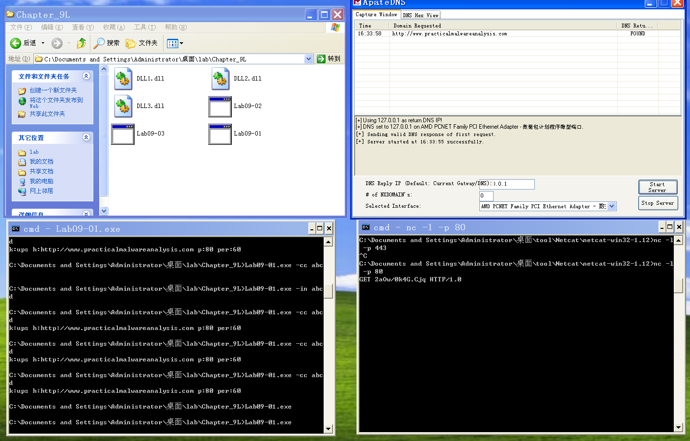

## lab 9-1

> 1811464 郑佶 信息安全单学位

#### 问题1:程序自我安装途径

考虑到程序的自我安装,首先考虑程序作为一个服务进行安装.

使用`Dependency Walker`分析程序,得到如下信息

可见,该程序导入了与服务相关的库文件`advapi32.dll`,且调用了如下的服务相关的函数

- `ChangeServiceConfig`:配置服务的属性信息,包括服务的类型、启动时间、显示名、执行路径等
- `OpenService`、`CloseServiceHandle`、`CreateService`、`DeleteService`:开启、关闭、创建、删除服务
- `OpenSCManager`:连接到服务控制管理器，并打开指定的数据库

其中与创建服务相关的函数是`CreateService`,使用`IDA Pro`查看其调用参数,可知服务名为` Manager Service`

使用`IDA Pro`查询相关函数的交叉引用,可知如下信息

- 创建服务的函数`CreateService`的调用只位于子过程`sub_402600`
- 控制服务的其他函数位于子过程`sub_402600`和`sub_402900`

如上,对子过程`sub_402600`的调用发生在代码段`loc_402B3F`.跳转到代码段`loc_402B3F`的两次跳转条件分别是

- 命令行参数大于一个
- 子过程`sub_402510`的返回值不为`0`
  - 其参数为最后一个命令行参数
  - 其参数的值为字符串`abcd`时返回值不为`0`

而在代码段`loc_402B3F`中,调用子过程`sub_402600`的条件是

- 第二个命令行参数为为`-in`,命令行参数有`3`个,能取得程序当前路径
- 第二个命令行参数为为`-in`,命令行参数有`4`个

因此,实现调用函数`CreateService`的必要条件是`main`函数有`3`个或`4`个命令行参数且第二个命令行参数为`-in`,这也是就是程序在命令行下安装自身的条件.

#### 问题2:命令行参数分析

我们可以结合`问题1`,对这个程序的命令行选项进行分析.`问题1`对函数运行流程的分析中,可以发现某些跳转条件与命令行参数相关,比如

- 验证第二个参数是否为`-in`
- 检查参数的个数
- 最后一个参数是否为`abcd`

检查程序的常量字符串,得到以下比较重要的信息

可以在`.data`段发现明显的命令行参数`-cc`、`-re`、`-in`、`-c`

`main`函数主流程如下

根据`问题1`的分析,可知`-in`参数的功能是安装服务

`-re`即字符串`byte_40C16C`.当确认参数是`-re`后,主要子分支都会调用子过程`sub_402900`.子过程`sub_402900`的流程分析如下

- 调用`OpenSCManager`和`OpenService`寻找打开服务,并调用`DeleteService`删除服务
- 调用`ExpandEnvironmentStrings`根据系统变量名`%SYSTEMROOT%\\system32\\`查询完整程序路径,并调用`DeleteFile`删除指定路径下的`.exe`后缀文件

`-c`即字符串`byte_40C168`.当确认参数是`-c`后,再确认参数数量为`7`后,流程如下

- 压栈第`3`、`4`、`5`、`6`个命令行参数

- 调用`RegCreateKeyEx`创建注册表键`SOFTWARE\\Microsoft \\XPS`
- 调用`RegSetValueEx`更改键值为`Configuration`

`-cc`即字符串`aCc`,当确认参数为`-cc`后,在雪人参数数量为`3`后,流程如下

- 调用子过程`sub_401280`
  - 调用`RegOpenKeyEx`打开注册表键`SOFTWARE\\Microsoft \\XPS`
  - 调用`RegQueryValueEx`查询注册表信息
- 压栈格式化字符串`k:%s h:%s p:%s per:%s\n`
- 调用函数`sub_402E7E`,即`printf`函数,以格式化输出注册表信息

另外,当参数格式错误时,会调用子过程`sub_402410`.子过程`sub_402410`的流程分析如下
  - 调用`GetModuleFileName`、`GetShortPathName`函数取得当前程序短路径
  - 将字符串`/c del`、程序路径、字符串`>> NUL`组合,组成删除该文件的`DOS`指令
  - 并调用`ShellExecute`启动`cmd`程序,执行上述`DOS`指令删除程序自身

综上,命令行参数的功能依次如下

- `-in`:安装服务

- `-re`:删除程序安装的服务和程序文件

- `-c`:更新程序的注册表信息

- `-cc`:输出程序的注册表信息

- 错误参数:程序自删

而命令行的密码,显然是`abcd`,原因如下

- 程序参数数量大于`1`时,一定调用子函数`sub_402510`
- 子函数`sub_402510`要求最后一个命令行选项(显然是密码)为`abcd`,否则跳转到调用`sub_402410`的分支,导致程序自删

#### 问题3:`OllyDbg`修改代码以跳过密码验证

根据`问题2`的分析,可知判断密码的子过程为`sub_402510`,因此,只要跳过验证阶段即可

使用`OllyDbg`打开该子过程,如下

对该子过程从`0x00402510`开始的头两条指令的修改要求如下

- 返回值为`1`
- 跳转到最后`0x004025A4`的指令`retn`

因此,应该修改方式如下

#### 问题4:基于系统的感染线索

使用`regshot`分别在运行指令`Lab09-01.exe -in abcd`的前后做两个注册表快照,得到比较结果,重要的部分如下

使用`regedit`打开路径,可以查询到该新建的注册表键`HKLM\\SOFTWARE\\Microsoft \\XPS\\Configuration`

这就是基于系统主机的感染线索

#### 问题5:基于网络命令的操作

因为恶意代码传输网络指令一般通过`socket`实现,所以可以根据`socket`相关函数的调用分析网络指令的使用.

另外,根据`IDA Pro`的字符串分析,可以在子过程`sub_402020`中找到指令字符串`SLEEP`、`UPLOAD`、`DOWNLOAD`、`CMD`、`NOTHING`.为分析指令的作用,需要分析子过程`sub_402020`.

在该子过程中,当参数为字符串`SLEEP`时,跳转到`loc_4020D2`代码段,如下

可见其调用了`sleep`函数,压栈的参数为`ecx*0x3E8`即`1000*ecx`,所以`ecx`即休眠的秒数

当参数为字符串`UPLOAD`时,跳转到`loc_402186`代码段,如下

该段调用子过程`sub_4019E0`,由于存在`lpFileName`和`hostshort`参数,推测与文件操作与网络通信相关.

根据分析,子过程`sub_4019E0`主要流程如下

- 调用函数`sub_401640`创建`socket`
- 调用`CreateFile`创建文件句柄
- 调用`recv`函数,创建数据接收缓冲区,与`socket`连接
- 调用`WriteFile`将缓冲区数据写入文件

总之子过程`sub_4019E0`的功能就是从网络上下载文件

当参数为字符串`DOWNLOAD`时,跳转到`loc_40223A`代码段,如下

这流程与`UPLOAD`的操作类似,子过程`sub_401870`也与文件操作与网络通信相关.

根据分析,子过程`sub_401870`的主要流程如下

- 调用函数`sub_401640`创建`socket`
- 调用`CreateFile`创建文件句柄
- 调用`ReadFile`函数,创建发送缓冲区并写入数据
- 调用`send`将缓冲区数据通过`socket`发出

总之子过程`sub_401870`的功能就是向网络上传文件

当参数为字符串`CMD`时,跳转到`loc_402330`代码段,如下

值得注意的时函数`_popen`的调用,该函数使用管道形式调用命令行,可以同时执行指令和得到返回的文本输出.其中参数`rb`指代以二进制形式打开,且返回的文本输出流可读.

总之`_popen`函数的功能就是执行`shell`指令.

当参数为字符串`NOTHING`时,并无特殊操作

综上,各指令的功能如下

- `SLEEP`:休眠指定的秒数
- `UPLOAD`:下载网络文件
- `DOWNLOAD`:上传网络文件
- `CMD`:执行`shell`指令
- `NOTHING`:无操作

#### 问题6:基于网络的感染迹象

首先运行`Lab09-01.exe -in abcd`安装程序,再运行`Lab09-01.exe -cc abcd`验证程序安装完成.最后运行`Lab09-01.exe`运行程序,执行默认行为.

为拦截程序默认行为中的网络通信,先使用`apateDNS`重定向`DNS`请求,再使用`netcat`监听`80`端口,得到以下的结果

可以发现

- 向网址`http://www.practicalmalwareanalysis.com`发送了`DNS`请求
- `netcat`在`80`端口监听到了`HTTP`的`GET`报文请求头,内容为`GET 2aOw/0k4G.Cjq HTTP/1.0`

综上,这些就是基于网络的感染线索