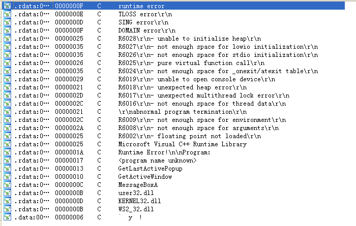
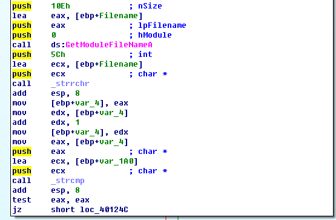
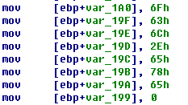
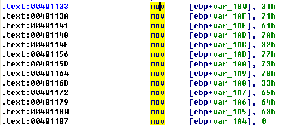
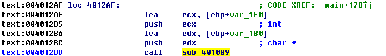
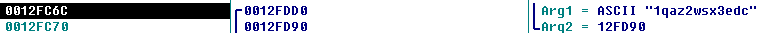
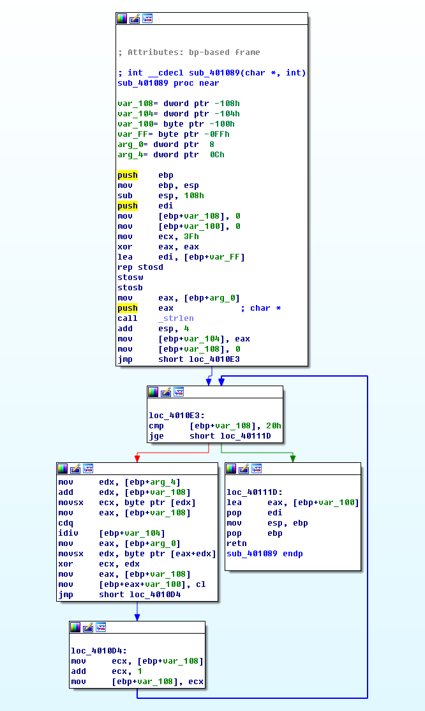
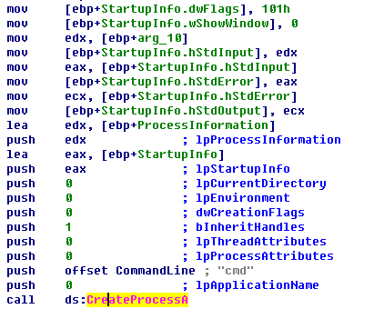
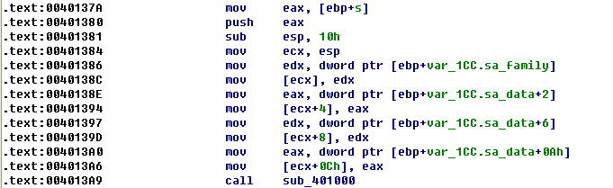

## lab 9-2

> 1811464 郑佶 信息安全单学位

#### 问题1:字符串分析

使用`IDA Pro`的`Strings`子视图,可得到静态字符串如下

包括常见的与`ws2_2.dll`网络报错信息和与`kernel32.dll`相关的内存和系统报错信息

此外,有`3`个来自`user32.dll`的函数名`GetLastActivePopup`和`GetActiveWindow`、`MessageBox`,这些与用户界面相关

#### 问题2:运行程序的后果

为检查程序的运行,事先打开`Process Explorer`,接着再运行程序.

但是`Process Explorer`未捕捉到新的进程,说明该程序在启动后,仅运行片刻,即在被捕捉到前马上停止运行

#### 问题3:使载荷运行的方法

由于程序仅运行片刻,可推测是程序内部的判断分支,使得程序马上退出运行.因此接下来用`IDA Pro`分析函数的执行流程

于是可以发现一条是程序跳过大部分流程的执行路径

如上,这条路径就是上述代码段中`_strcmp`函数比较结果为假时的执行路径

为此我们需要分析比较的过程,如下

- 调用`GetModuleFileName`得到当运行的程序完整路径

- 调用`_strrchr`从右向左扫描这个完整路径直到字符`\\`为止,实际上得到的就是文件名
- 调用`_strcmp`将文件名与`var_1A0`相比较

根据如上的`mov`语句,我们可以知道`var_1A0`指向的字符串为`0x6F、0x63、0x6C、0x2E、0x65、0x78、0x65`,即字符串`ocl.exe`

综上,要使程序的载荷正常运行,需要将文件名改为`ocl.exe`

#### 问题4:指定地址的运行过程

> 指定地址:`0x00401133`

在这个位置,有大量`mov`指令以在栈上创建一个字符串,如下

根据如上的`mov`语句,我们可以知道该字符串为`0x31、0x71、0x61、0x7A、0x32、0x77、0x73、0x78、0x33、0x65、0x64、0x63`,即字符串`1qaz2wsx3edc`,应该没有实际含义

#### 问题5:指定地址的子例程的参数

> 指定地址:`0x00401089`

根据函数的交叉引用关系,可以知道该子例程直接由`main`函数调用,调用位置如下

使用`OllyDbg`的单步执行功能,在`0x004012BD`处添加断点,可得到栈中的数据如下(`0x0012FC6C`即栈顶)

可知第一个参数`var_1B0`即字符串`1qaz2wsx3edc`,第二个参数`var_1F0`值为`0x0012FD90`,指向栈中的变量字符串

#### 问题6:恶意代码的域名使用

由于域名的使用与网络函数相关,所以可以在导入函数表中查找`WS2_2.DLL`中的使用域名为参数的函数.经过查找,可以发现函数`gethostbyname`符合要求.

使用`IDA Pro`的交叉引用情况分析,找到其调用位置为`0x004012CC`.

使用`OllyDbg`的单步执行功能,在`0x004012CC`处添加断点,可得到栈中的数据如下(`0x0012FC70`即栈顶)

由此可知,`gethostbyname`调用的域名参数即`www.practicalmalwareanalysis.com`

综上,恶意代码使用的域名是`www.practicalmalwareanalysis.com`

#### 问题7:混淆域名的方法

由于`gethostbyname`调用的域名参数即子过程`sub_401089`的返回值,接下来分析该子过程

经过分析,上述大致流程如下

- 调用`strlen`得出密钥字符串`1qaz2wsx3edc`的长度为`20`

- 进入循环,将密文和密钥执行`idiv`和`xor`指令解析字符

- 返回解密结果

综上,混淆域名的方法,是需要通过密钥和密文通过除法操作和异或操作,才能得到正确域名

#### 问题8:指定地址调用指定函数的目的

> 指定地址:`0x0040106E`/指定函数:`CreateProcess`

因为函数`CreateProcess`的功能是创建进程,为分析其目的,需要分析其调用的参数.

如上,命令行参数为`cmd`,`StartupInfo`结构体的`hstdInput`、`hstdOutput`、`hstdError`得知都来自参数`arg_10`

如上,可以发现`CreateProcess`函数调用发生的`sub_401000`被`main`函数直接调用.并且,参数`arg_10`的赋值语句为`mov eax,[ebp+s];push eax;`,也就是将`socket`的句柄赋给参数`arg_10`.

综上,这个调用的目的是将`cmd`这个命令行指令绑定在`socket`上用于创建远程`shell`