## lab 9-3

> 1811464 郑佶 信息安全单学位

#### 问题1:导入库文件分析

使用`Dependency Walker`进行静态导入库分析

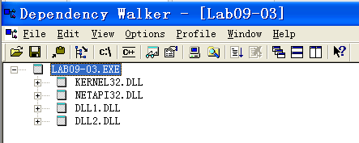

如上,静态分析得到导入库文件有`kernel32.dll`、`netapi32.dll`、`dll1.dll`、`dll2.dll`

使用`Process Explorer`进行动态导入库分析

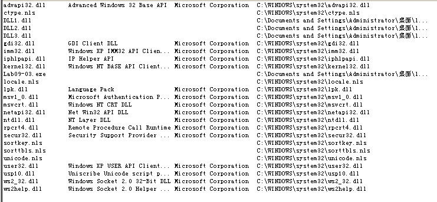

如上,除了`kernel32.dll`、`netapi32.dll`、`dll1.dll`、`dll2.dll`与其间接调用的库文件外,还调用了`user32.dll`、``dll3.dll`

综上,导入的库文件有`kernel32.dll`、`user32.dll`、`netapi32.dll`、`dll1.dll`、`dll2.dll`、``dll3.dll`

#### 问题2:指定库文件的基地址

> 指定库文件:`dll1.dll`、`dll2.dll`、``dll3.dll`

使用`PEditor`查看`dll1.dll`的基地址,如下

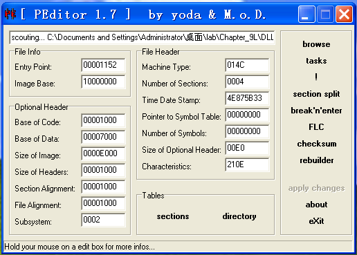

可知`dll1.dll`的基地址即`Image Base`为`0x10000000`

同样可得`dll2.dll`、`dll3.dll`的基地址都为`0x10000000`

#### 问题3:动态调试中指定库文件的基地址

由于动态导入库文件需要调用函数`LoadLibrary`,所以需要到程序运行完这个函数后才能在内存映射中找到所有导入的库文件

使用`IDA Pro`,可以得知函数`LoadLibrary`在`0x00401041`处调用.使用`OllyDbg`在该处设置断点,并在遇到断点后单步执行.

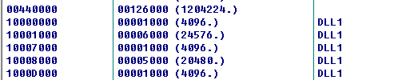

如上,使用`OllyDbg`的内存映射视图,即可得到`dll1.dll`的导入济地址为`0x10000000`.

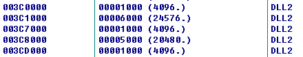

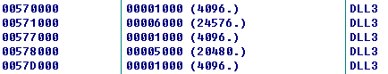

如上同样可得,`dll2.dll`、`dll3.dll`的导入基地址为`0x003C0000`、`0x00570000`

#### 问题4:调用指定库文件的导入函数时的行为

> 指定库文件:`dll1.dll`

使用`IDA Pro`分析`dll1.dll`的导出函数表,可以得到导出函数仅有`DLL1Print`.

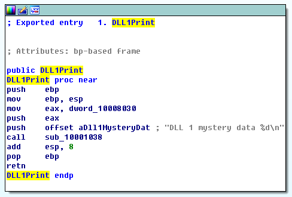

如上,`DLL1Print`函数以格式化字符串`DLL 1 mystery data %d\n`和全局变量`dword_10008030`为参数调用函数`sub_10001038`.

由于在运行该程序时,我们可以在命令行中看到字符串`DLL 1 mystery data`的输出,由此可以推测函数`sub_10001038`类似`printf`函数

调查全局变量`sub_10008030`的交叉引用情况,可以发现如下信息

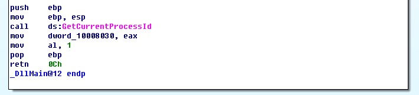

由上可知,全局变量`sub_10008030`是函数`GetCurrentProcessId`的返回值,即当前进程`PID`

综上,这个`dll1.dll`中的`DLL1Print`函数被调用后,会打印`DLL 1 mystery data x`,其中`x`是当前进程`PID`

#### 问题5:调用指定函数时写入的文件名

> 指定函数:`WriteFile`函数

使用`IDA Pro`查看`Lab09-03.exe`中`WriteFile`函数的调用,可以发现如下信息

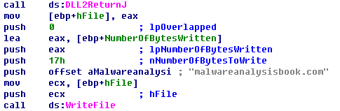

由上可知,`WriteFile`函数的参数`hFile`即文件句柄是函数`DLL2ReturnJ`的返回值.使用`IDA Pro`查看`dll2.dll`中的导出函数`DLL2ReturnJ`,得到如下信息

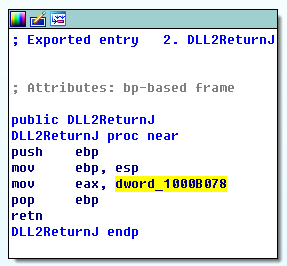

可知函数`DLL2ReturnJ`的功能仅是返回全局变量`dword_1000B078`.查看全局变量`dword_1000B078`的交叉引用情况,可以得知如下信息

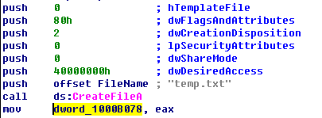

由上可知全局变量`dword_1000B078`即函数`CreateFile`的返回值,即文件`temp.txt`的句柄

综上,调用`WriteFile`函数时写入的文件名为`temp.txt`

#### 问题6:调用指定函数创建指定类型对象时获取指定参数的方式

> 指定函数:`NetScheduleJobAdd`函数
>
> 指定类型:`job`
>
> 指定参数:`NetScheduleJobAdd`函数的第二个参数

在`IDA Pro`中查找到函数`NetScheduleJobAdd`的调用位置,得到如下信息

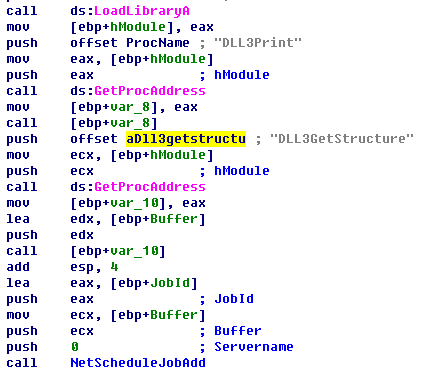

可知,`NetScheduleJobAdd`函数的第二个参数是缓冲区`Buffer`.而在将这个参数压栈前,调用了函数`[ebp+var_10]`将其初始化.

而函数`[ebp+var_10]`是调用`GetProcAddress`函数得到的返回值,即库文件`dll3.dll`中的`DLL3GetStructure`函数

综上,`NetScheduleJobAdd`函数获得的第二个参数是经过函数`DLL3GetStructure`初始化的缓冲区.

#### 问题7:打印数据的意义

根据`问题4`的分析,第`1`条神秘数据是打印当前进程的`PID`

使用`IDA Pro`分析第`2`条神秘数据的来源`DLL2Print`函数,得到如下信息

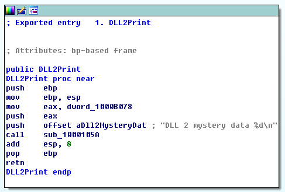

可知神秘数据来自全局变量`dword_1000B078`.根据`问题5`的分析,全局变量`dword_1000B078`即函数`CreateFile`的返回值,即文件`temp.txt`的句柄

使用`IDA Pro`分析第`3`条神秘数据的来源`DLL3Print`函数,得到如下信息

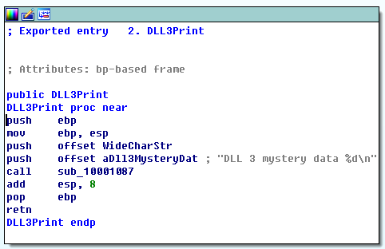

可知第`3`条神秘数据来自变量`WideCharStr`.查看变量`WideCharStr`的交叉引用情况,可以得知如下信息

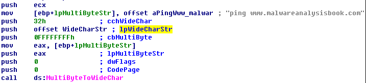

由上可知,`WideCharStr`是调用`MultiByteToWideChar`函数将字符串`ping www.malwareanalysisbook.com`转换为宽字符后,新字符串所在的内存地址

#### 问题8:使指定库文件与`OllyDbg`加载地址匹配

> 指定库文件:`dll2.dll`

由于`OllyDbg`中库文件`dll2.dll`的基地址为`0x003C0000`,

使用`IDA Pro`打开`dll2.dll`,并在打开界面勾选`manual load`,即下列第四项

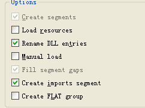

如上,使用`IDA Pro`打开`dll2.dll`,并在打开界面勾选`manual load`,即上述第四项

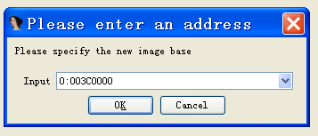

如上,构建后要求给出装载基地址,写入`0x003C0000`即可

修改完成后,在`IDA Pro`的文本视图中可以发现代码从`0x003C0000`开始,如下

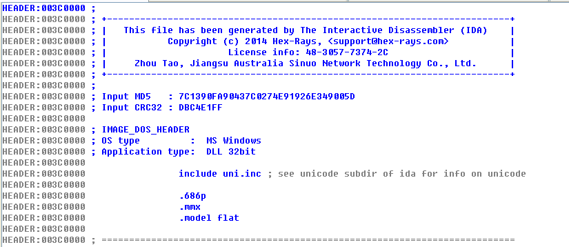

此时库文件的装载基地址位置与`OllyDbg`的加载地址相匹配

