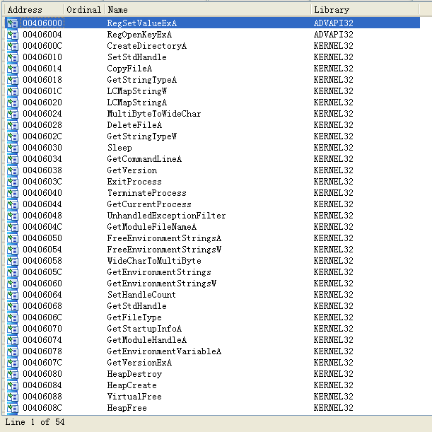

## `IDA`使用报告

> 小组成员: 梁潇潇 刘天硕 贾彬 郑佶 陈鸿运 陈秋序

### `IDA`概述

`IDA`即`IDA Pro`,全称`Interactive Disassembler Professional`(交互式反汇编器专业版),是一款交互式的、可编程的、可扩展的、多处理器、多平台的的常用的静态反编译软件,是恶意软件攻击研究领域的重要分析工具

### `IDA`功能

#### 主界面分析

如上是`IDA`的主界面,可以分为以下分区:

- 工具菜单栏:位于顶部,功能包括文件操作(`File`),视图选项(`Options`),调试器选项(`Debugger`),以及子视图(`View`)等功能按键
- 函数窗口:位于中部左侧,列出该程序的识别出的函数的函数名列表
- 图形视图概览:位于中部左侧,显示当前程序缩略的全局图形视图

- 视图界面:位于中部右侧,由若干个子视图界面的标签页组成
- 输出界面:位于底部,用于程序调试等过程中输出文本信息

#### 主要视图分析

##### 1.反汇编窗口(`IDA View`)——文本视图

反汇编窗口是操作和分析二进制文件的主要工具,该视图通过反汇编分析表示程序中的每一条详细指令.

其中,视图左侧有跳转箭头,无条件跳转使用实线箭头,条件跳转使用虚线箭头

可以使用空格键与反汇编窗口图形视图进行切换

##### 2.反汇编窗口(`IDA View`)——图形视图

图形视图通过流程图的形式,表示程序运行的流程.

在默认情况下,无条件跳转使用蓝色箭头,`true`分支跳转使用绿色箭头,`false`分支使用红色箭头.

可以使用空格键与反汇编窗口文本视图进行切换

##### 3.字符串子视图(`Strings window`)

字符串子视图列出程序中所有`Unicode`、`ASCII`字符串.

点击右键菜单的`Setup`选项,可以设置筛选字符串的条件,包括字符串的类型与长度等条件

可在通过菜单工具栏的`View`/`Open subviews`/`Strings`打开.

##### 4.十六进制视图(`Hex View`)

十六进制视图是未经过反汇编分析的窗口,直接以十六进制的代码表示程序的二进制码.

可在通过菜单工具栏的`View`/`Open subviews`/`Hex Dump`打开.

##### 5.导入函数表(`Imports`)

导入函数表将函数中所有识别出的导入函数列出,并确定其所在的库文件名

可在通过菜单工具栏的`View`/`Open subviews`/`Imports`打开.

##### 6.导出函数表(`Exports`)

导出函数表将函数中所有识别出的导出函数列出,一般在分析`dll`库文件时使用,而`exe`程序文件导出函数较少.

可在通过菜单工具栏的`View`/`Open subviews`/`Exports`打开.

##### 7.交叉引用视图(`xref chart`)

交叉引用视图可以分析指定函数的对其他函数的调用以及被调用的情况.

在查询该视图前,通过以下的设置界面确定目标函数和最大引用层次的信息

可在通过菜单工具栏的`View`/`Graphs`/`User xrefs chart`打开.

#### 主要快捷键

##### 1.`ctrl+X`键

可以调出交叉引用界面,用于查询光标所在位置的函数的引用情况

##### 2.`G`键

可以调出地址跳转界面,用于输入并跳转到指定地址

##### 3.空格键

用于在反汇编界面图形视图和文本视图间切换