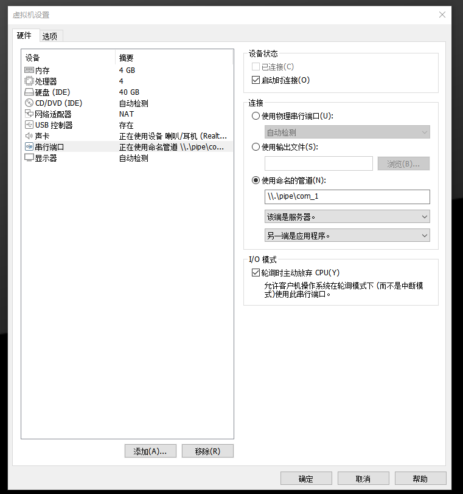
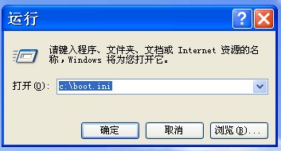
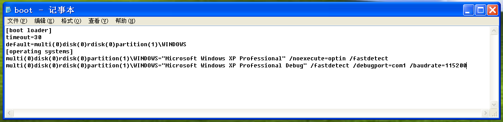
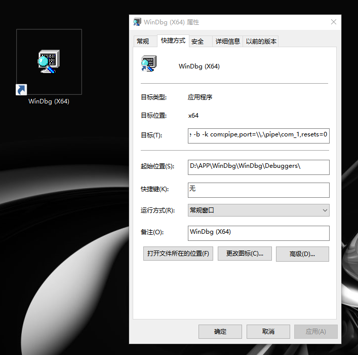
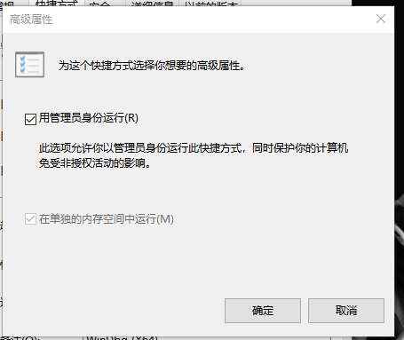
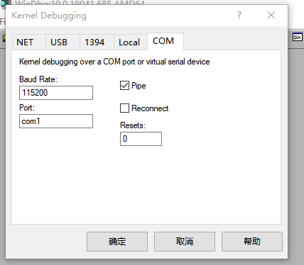
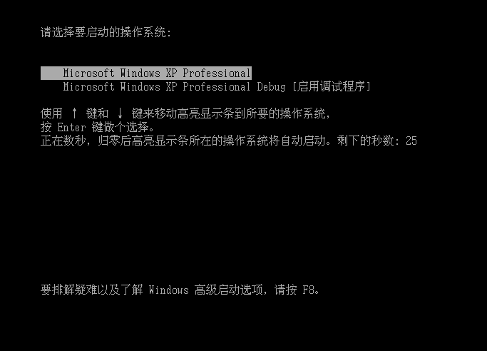

# `WinDbg`运行环境搭建与使用

## `WinDbg`概述

`WinDbg`是在`Windows`平台的,支持`x86`、`IA64`、`amd64`等指令集的,可以进行用户模式和内核模式调试的调试工具.

`WinDbg`是微软公司免费调试器调试集合中的`GUI`的调试器,支持源码模式和汇编式两种模式的调试.`WinDbg`不仅可以调试应用程序，还可以进行内核调试.结合微软的`Symbol Server`,可以获取系统符号文件,便于应用程序和内核的调试.

`WinDbg`提供图形界面操作,可运行调试命令,一般情况会结合`GUI`和命令行进行操作.常用的视图有:局部变量、全局变量、调用栈、线程、命令、寄存器、白板等.

## `WinDbg`运行环境搭建

> 环境要求:
>
> - 客户机版本:`Windows XP SP3`
> - 宿主机版本:`Windows 10 20H2`
> - `WinDbg`版本:`10.0.19041.685`
> - `VMWare`版本:`16.0.0`

### `vmware`软件设置

打开宿主机的设置选项



删除硬件中的`打印机`,解除对串行端口的占用.

创建一个串行端口,使用命名管道,命名管道名称为`\\.\pipe\com_1`

选择`另一端是应用程序`、`轮询时自动放弃CPU`等选项

### 客户机设置

使用`运行`软件,打开客户机的启动设置文件`C:\\boot.ini`



在最后一行后重起一行,添加内容



如上,添加的内容为

```
multi(0)disk(0)rdisk(0)partition(1)\WINDOWS="Microsoft Windows XP Professional Debug" /fastdetect /debugport=com1 /baudrate=115200
```

表示新创建一个启动项`Microsoft Windows XP Professional Debug`,调试端口为`com1`,波特率为`115200`

### `WinDbg`安装和配置

从微软官方网站`https://developer.microsoft.com/zh-cn/windows/downloads/windows-10-sdk/`下载程序`winsdksetup.exe`

点击程序`winsdksetup.exe`,依次选择默认选项,在宿主机上安装该程序.

选择程序`WinDbg(x64)`,在桌面上创建快捷方式



在目标一栏的文件路径后添加参数`-b -k com:pipe,port=\\.\pipe\com_1,resets=0`.

点击`高级`选项,选择使用管理员身份运行



点击`WinDbg(x64)`运行该程序,选择菜单栏中的`File`选项,打开`Kernel Debug`选项卡,修改`COM`对象的波特率为`115200`,端口为`com1`,勾选`pipe`选项



## `WinDbg`的使用

### 调试器连接

启动客户机,选择开机选项为`Microsoft Windows XP Professional Debug (启用调试程序)`



随后马上点击`WinDbg(x64)`的启动程序打开调试器