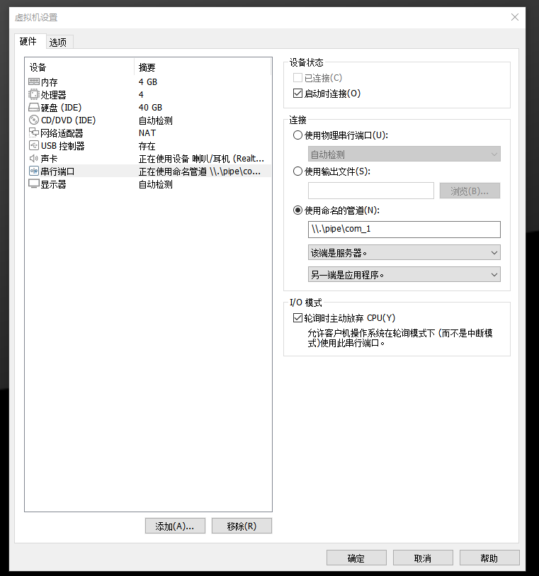
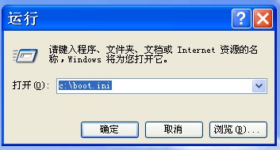
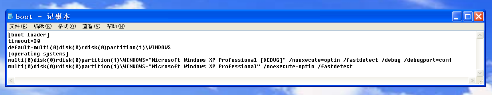
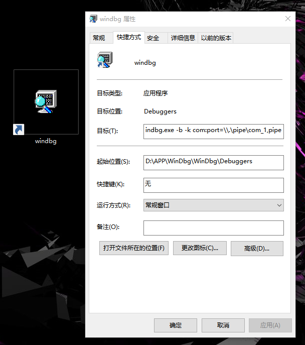
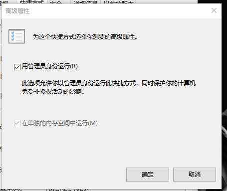
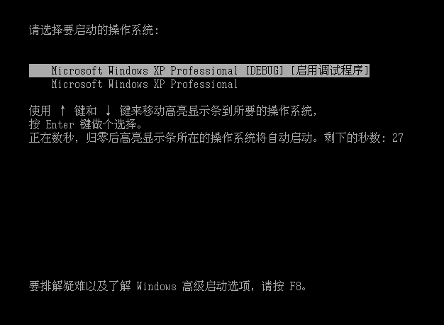
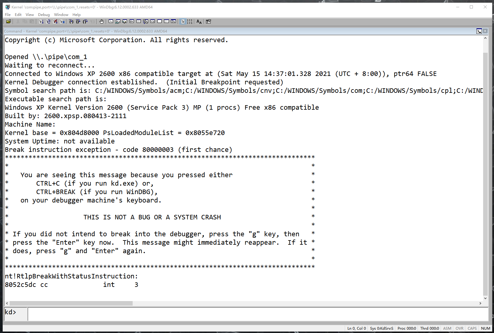

# `WinDbg`运行环境搭建与使用

## `WinDbg`概述

`WinDbg`是在`Windows`平台的,支持`x86`、`IA64`、`amd64`等指令集的,可以进行用户模式和内核模式调试的调试工具.

`WinDbg`是微软公司免费调试器调试集合中的`GUI`的调试器,支持源码模式和汇编式两种模式的调试.`WinDbg`不仅可以调试应用程序，还可以进行内核调试.结合微软的`Symbol Server`,可以获取系统符号文件,便于应用程序和内核的调试.

`WinDbg`提供图形界面操作,可运行调试命令,一般情况会结合`GUI`和命令行进行操作.常用的视图有:局部变量、全局变量、调用栈、线程、命令、寄存器、白板等.

## `WinDbg`运行环境搭建

> 环境要求:
>
> - 客户机版本:`Windows XP SP3`
> - 宿主机版本:`Windows 10 20H2`
> - `WinDbg`版本:`7.1.0`
> - `VMWare`版本:`16.0.0`

### `vmware`软件设置

打开宿主机的设置选项



删除硬件中的`打印机`,解除对串行端口的占用.

创建一个串行端口,使用命名管道,命名管道名称为`\\.\pipe\com_1`

选择`另一端是应用程序`、`轮询时自动放弃CPU`等选项

### 客户机设置

使用`运行`软件,打开客户机的启动设置文件`C:\\boot.ini`



在启动列表里添加一个启动项



添加的内容为

```
multi(0)disk(0)rdisk(0)partition(1)\WINDOWS="Microsoft Windows XP Professional [DEBUG]" /noexecute=optin /fastdetect /debug /debugport=com1
```

表示新创建一个启动项`Microsoft Windows XP Professional Debug`,调试端口为`com1`,为调试模式

### `WinDbg`安装和配置

下载程序安装包`GRMWDK_EN_7600_1.iso`,解压该安装包,点击程序`KitSetup.exe`,依次选择默认选项,在宿主机上安装该程序.

选择程序`WinDbg`,在桌面上创建快捷方式



在目标一栏的文件路径后添加参数`-b -k com:port=\\.\pipe\com_1,pipe`.

点击`高级`选项,选择使用管理员身份运行



另外,可以使用同一安装包和同一安装方法在`Windows XP`虚拟机中安装`WinDbg`,但是不需要配置命名管道、快捷方式、管理员权限,这里不赘述

### 符号包安装和系统变量设置

由于微软不对`Windows XP`系统的符号表做出支持,所以需要手动下载`Windows XP SP3`系统的符号表文件安装程序`WindowsXP-KB936929-SP3-x86-symbols-full-ENU.exe`安装符号包并配置环境变量.

安装的`Windows XP SP3`符号包默认路径为`C:/Windows/Symbols`.需要添加系统环境变量`_NT_SYMBOL_PATH`,该环境变量值如下

```
C:/WINDOWS/Symbols/acm;C:/WINDOWS/Symbols/cnv;C:/WINDOWS/Symbols/com;C:/WINDOWS/Symbols/cpl;C:/WINDOWS/Symbols/dic;C:/WINDOWS/Symbols/dll;C:/WINDOWS/Symbols/drv;C:/WINDOWS/Symbols/exe;C:/WINDOWS/Symbols/iec;C:/WINDOWS/Symbols/ime;C:/WINDOWS/Symbols/ocx;C:/WINDOWS/Symbols/scr;C:/WINDOWS/Symbols/sys;C:/WINDOWS/Symbols/tpl;C:/WINDOWS/Symbols/tsp;C:/WINDOWS/Symbols/wpc;symsrv*symsrv.dll*C:/mysymbol*http://msdl.microsoft.com/download/symbols
```

## `WinDbg`的使用

### 调试器连接

启动客户机,选择开机选项为`Microsoft Windows XP Professional [Debug] (启用调试程序)`



随后马上点击`WinDbg`的启动程序打开调试器,成功进入调试界面



